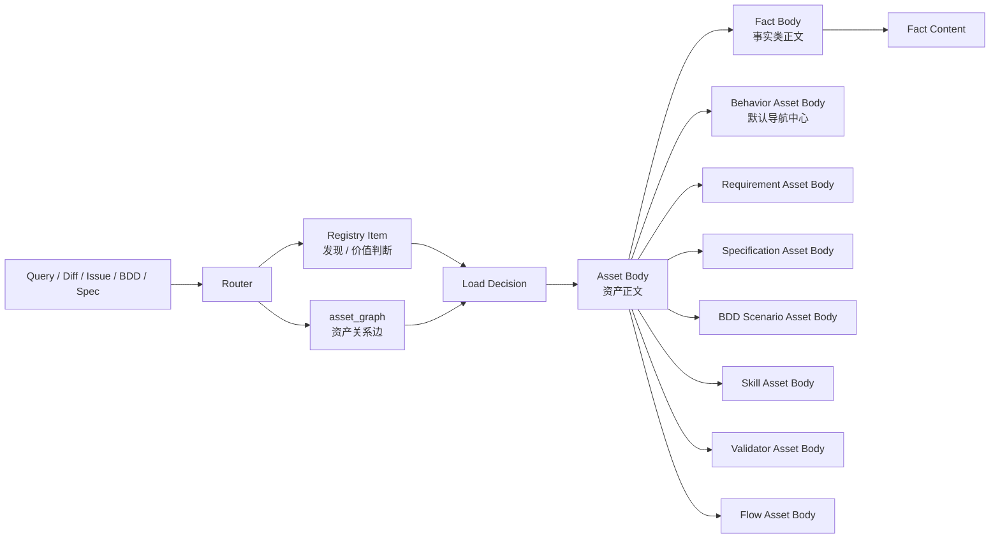
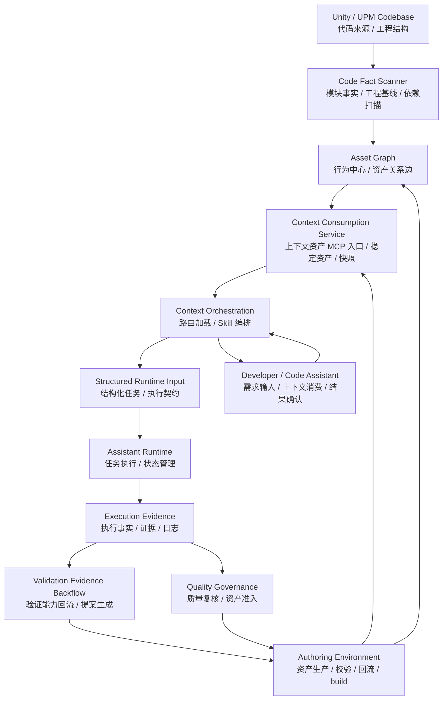
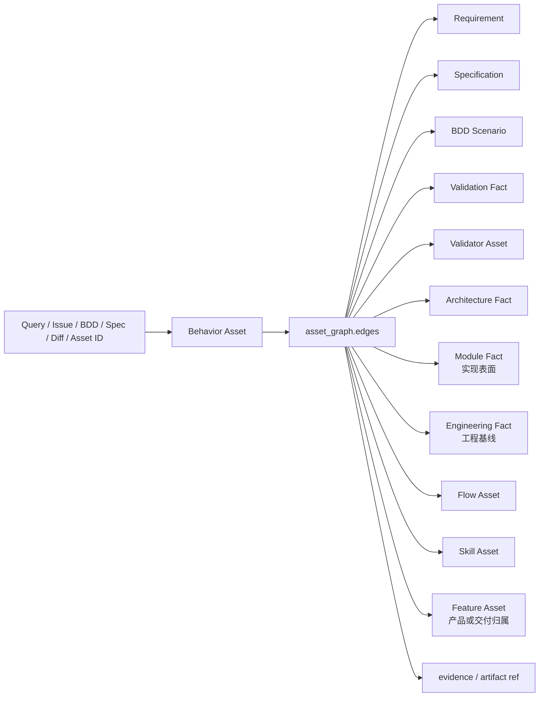
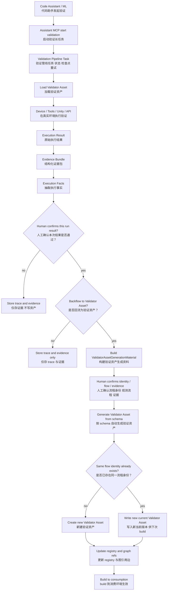

# UConnect：代码助手上下文管理设计

本文独立说明 `UConnect` 的上下文管理体系。`UConnect` 是面向 Unity 工程的代码助手上下文管理方案，关注代码助手如何稳定获取、消费、验证和沉淀上下文资产，不是 `Assistant Runtime` 的执行编排，也不是软件工程管线、运维或版本治理平台。

## 1. 设计目标

上下文管理的目标，是让代码助手在大型 Unity 项目中具备更稳定的研发辅助能力：

- 可观测：知道代码助手使用了哪些上下文资产、生成了什么计划、产出了什么结果
- 可约束：通过 Skill、schema、词汇表和共享资产约束代码助手行为
- 可验证：让上下文资产和生成的执行计划能被真实执行结果反哺
- 可沉淀：把有效的需求意图、设计承诺、场景分析、架构事实、验证事实、流程资产、验证能力和历史有效计划样本沉淀为稳定资产

这里的重点不是补足模型上下文窗口的短板，而是沉淀模型即使能够通读代码也无法稳定恢复出来的工程知识和验证知识。

## 2. 总体架构与运行时序

上下文管理体系先区分“系统模块”“资产对象”和“治理机制”。

- 系统模块
  - 可被调用、可测试，具备明确输入输出契约、状态或产物、职责边界，负责生成、校验、发布、加载或消费上下文
- 资产对象
  - 被系统模块读写的数据，例如 `Behavior Asset`、`Module Fact`、`Engineering Fact`、`Architecture Fact`、`Validation Fact`、`Feature Asset`、`Requirement Asset`、`Specification Asset`、`BDD Scenario Asset`、`Flow Asset`、`Skill Asset`、`Validator Asset`、registry 和 `asset_graph`
- 治理机制
  - 约束系统如何运转的规则或增强手段，例如 build gate、snapshot control、budget control、RAG / GraphRAG

### 2.1 系统模块

上下文管理中的系统模块保持最小集合，避免把内部子能力拆成过多“系统”：

- `Context Authoring & Build Toolchain`
  - 负责资产生产、编辑、检查、回流、`Behavior Asset` 生成或导入、代码事实扫描、`Asset Graph` 构建、schema / 词表 / 引用校验，以及 build 到 consumption
- `Context Consumption Service`
  - 作为上下文资产消费侧的 MCP 对外入口，负责管理 build 后的稳定资产、registry index、Asset Graph、snapshot、trace、资源加载、资产查询和 Router / Loader API surface
- `Context Router / Loader`
  - 根据 query、diff、显式资产入口、Behavior、Asset Graph、policy、当前消费快照和预算选择上下文资产，并输出 `ContextBundle` 精确资产清单
- `Skill Execution`
  - 消费 `ContextBundle` 精确资产清单，并按清单中的授权资源标识到 consumption 受控读取资产正文，生成上层运行时输入或分析结果
- `Validation Evidence Pipeline`
  - 由 `Assistant MCP` 启动和持有长任务状态，接入设备层、日志、数据、事件、callback、SQL/API 等证据来源，负责证据采集、归一化、执行事实生成和 `Validator Asset` 回流

### 2.2 资产对象

资产对象是系统模块读写、发布和消费的数据。它们不主动执行逻辑，也不直接调用外部工具。

基础关系如下：




`Registry Item` 和 `asset_graph` 负责在不打开资产正文的情况下完成候选召回；Router 再结合 policy、当前消费快照和 budget 完成过滤、裁剪和清单生成。`ContextBundle` 只承载精确资产清单，不承载完整资产正文。`Asset Body` 是代码助手或 Skill 按清单授权从 consumption 受控读取的资产正文；`Fact` 只指事实类资产中的事实内容，不承担默认导航中心职责。

上下文管理中的资产对象分为四类：

**事实描述资产**

- `Module Fact`
  - 自动生成的代码模块事实，资源依赖，用于实现表面定位、影响面补充和代码证据审计
- `Engineering Fact`
  - 工程事实，用于描述可从工程配置、依赖声明或构建配置恢复的 SDK 版本、插件版本、平台基线和兼容矩阵
- `Architecture Fact`
  - 设计与架构事实，用于约束调用方向、模块职责、设计边界和反设计经验；通常通过 `Behavior -> Architecture Fact` 边进入上下文
- `Validation Fact`
  - 验证事实，用于描述某个行为应满足的验证口径、可采集证据、通过条件、失败信号、适用范围、兼容性、AB Test、fallback 和历史有效计划样本

**编排能力资产**

- `Behavior Asset`
  - 行为资产，用于描述系统对用户、业务或外部系统可观察的行为；它是 Router 默认导航中心，回答“这个系统行为是什么、触发条件是什么、可观察结果是什么、关联哪些需求/规格/BDD/验证/实现表面”
- `Feature Asset`
  - 功能资产，用于描述产品或交付归属；它不作为默认导航中心，不重复保存需求和规格边
- `Requirement Asset`
  - 需求意图资产，用于从 GitHub Project / Issue 等来源沉淀原始需求、设计意图、关键讨论结论和验收标准；它不是代码事实，也不直接从 commit 推断意图
- `Specification Asset`
  - 规格资产，用于从 spec / plan / 设计文档中沉淀“设计上承诺怎么做”；它把 `Requirement Asset` 的“需要做什么”映射到 `Architecture Fact / Validation Fact / BDD Scenario Asset / implementation evidence` 的“真正做了什么、怎么证明”
- `BDD Scenario Asset`
  - BDD 场景资产，用稳定 `bdd:<domain>/<scenario_name>` 表达真实场景分析和 Given / When / Then 验收语义；它像其它资产一样通过自己的 `Asset Registry Item` 被 Router 发现，也可以从 `Specification Asset / Validation Fact / Validator Asset` 的 `bdd_refs` 展开
- `Flow Asset`
  - 流程资产，用于描述初始化、登录、账号同步、支付等跨模块关键链路
- `Skill Asset`
  - Skill 文件本体，用于约束代码助手如何消费上下文并生成结构化输出
- `Validator Asset`
  - 验证能力资产，可以是验证 Skill、工具调用、设备层操作和证据解析逻辑的组合，用于描述当前正确验证流程

**索引与注册项**

- `Asset Registry Item`
  - 所有资产的静态索引条目，包括资产类型、摘要、路径、适用场景、输入输出 schema 和预算信息
  - 它是资产的静态身份证，用于在不加载资产本体的情况下，快速、准确地判断资产对当前 query 的潜在价值
  - 它回答“这个资产是什么、在哪里、适用于什么、依赖什么 schema、预计占用多少预算”
- `asset_graph`
  - 当前消费快照内的资产关系图，默认以 `Behavior Asset` 为导航中心，把行为连接到 `Requirement / Specification / BDD / Validation / Validator / Architecture / Module / Engineering / Flow / Skill / Evidence` 等资产；`Requirement / Specification / BDD` 等高价值资产也可以作为显式入口，再通过 `by_asset` 反向索引定位指向它们的行为

**治理辅助数据**

- `snapshot / trace`
  - 支撑 hash、路径、快照复现和审计解释的构建产物
- `registry`
  - 像资产目录，记录资产是什么、在哪里、适用于什么，用于在不打开资产正文的情况下发现候选资产
- `policy`
  - 像选择规则，决定当前 query intent 应沿哪些图边扩展、保留哪些资产、剔除哪些噪音
- `vocabulary`
  - 像统一词典，约束模块、能力、场景和证据通道命名，避免不同资产使用不同表达导致 Router 误判

可路由正文资产默认维护两件套：`Asset Body` 与 `Asset Registry Item`。`Feature Asset` 例外，默认以 `Asset Registry Item` 表达产品或交付归属；只有当功能边界、能力拆解或稳定说明需要独立正文时，才补充 `Feature Asset Body`。系统不维护独立的动态指标文件。Router 在运行时把 `Asset Registry Item` 和当前加载原因融合成 `Runtime Asset Descriptor`，用于最终排序、过滤和裁剪。同优先级排序使用确定性 tie-breaker（显式边优先于推断边，再按 `confidence` 降序，最后按 `asset_id` 字典序），不依赖任何运行期累积指标，以保证同一快照下输出可复现。

### 2.3 治理机制

治理机制是约束资产如何生产、构建、发布、消费、回流和淘汰的规则。它不是单独的执行模块，而是由上述系统模块共同实现。

上下文管理中的治理机制包括：

- `Schema / Vocabulary / Quality`
  - 约束资产字段、命名、schema、quality checks 和受控词表
- `Build Gate / Snapshot`
  - 控制 registry item、可路由正文资产两件套、registry index、Asset Graph 和 trace 如何 build 到 consumption，并形成可复现快照
- `Asset Admission / Retention`
  - 通过人工准入标准和定期裁剪控制资产进入与留存，避免低价值资产稀释高价值上下文；它不依赖运行期使用指标
- `Routing / Budget / Explainability`
  - 约束 Router 沿哪些图边扩展、保留哪些资产、如何裁剪预算，以及如何解释选择和丢弃原因
- `Validation Evidence Backflow`
  - 约束真实执行证据如何生成 `Execution Facts`，并在人工确认后回流为新的 `Validator Asset`、registry item 和 Asset Graph 引用
- `RAG / GraphRAG`
  - 作为结构化加载达到规模瓶颈后的增强检索机制，不替代 Asset Graph 和 Router 主链路

治理机制的目标不是让系统完全自动维护知识库，而是把高价值架构事实、验证事实和关键流程资产的生产、复核、回流收敛到受控 authoring / Adapter 链路。

### 2.4 全局架构图




这张图只表达全局主链路：代码扫描器从代码库生成轻量模块事实和工程事实，Adapter 和 authoring 产出 `Behavior Asset` 与上层资产，`Asset Graph` 把行为、需求、规格、BDD、验证、架构、实现表面和工具能力发布到消费环境。消费环境向代码助手提供上下文，代码助手借助 Router / Skill 生成运行时输入，`Assistant Runtime` 执行后产出执行证据。执行证据一方面进入质量治理和资产准入复核，另一方面通过 `Validation Evidence Backflow` 生成当前正确的 `Validator Asset`，再回到 authoring 环境完成确认、校验和 build。Router 加载策略、registry、snapshot 和回流 schema 的细节放在后文局部章节展开。

## 3. 生成环境与使用环境

上下文资产需要区分生成环境和使用环境。

**生成环境**

- 面向上下文资产生产和维护人员使用
- 负责事实提取、检查、build、同步和资产维护
- 包含生产类 Skill、check Skill、review Skill 和治理规则
- 可以存在未 build 的工作文件，但未 build 到 consumption 的资产不会被 Router 消费

**使用环境**

- 面向代码助手和项目研发使用
- 只暴露已整理、已发布、可消费的稳定资产
- 项目开发人员和代码助手原则上只使用 `Context Consumption Service` 这一层
- 不直接暴露生成环境中的中间态和治理流程

这个分层解决的是资产发布边界问题：生成环境承载复杂生产过程，使用环境只消费 build 产物，避免半成品资产污染 agent 召回。

## 4. 目录结构

上下文资产按 domain 组织。除 `Feature Asset` 可保持 item-only 外，每个可消费正文资产在自己的资产目录下维护两件套：

- `asset.body.`*
  - 资产本体，回答“事实内容是什么、Skill 怎么执行、Validator 怎么验证、Flow 怎么走”
- `asset.registry.yaml`
  - 静态身份证，回答“这个资产是什么、在哪里、适用于什么、依赖什么 schema、预计占用多少预算”

`Asset Body` 和 `Asset Registry Item` 可以物理 colocate，但语义上仍然分离。`Feature Asset` 的 item-only 形态只保存产品或交付归属、适用条件和轻量关联，不承载需求、规格、BDD、验证正文或模块导航入口。系统不维护独立的动态指标文件；资产是否可见只由当前 build snapshot 决定。Router 不扫描 authoring 目录；只有 build 到 `consumption/context_service` 的产物才允许被 Router 和 Skill 消费。

```text
context/
├─ authoring/
│  ├─ domains/
│  │  └─ account/
│  │     ├─ behavior_assets/
│  │     ├─ architecture_facts/
│  │     ├─ flow_assets/
│  │     └─ modules/
│  │        └─ account_core/
│  │           ├─ module_facts/
│  │           │  └─ asset.body.yaml
│  │           ├─ behavior_assets/
│  │           ├─ architecture_facts/
│  │           ├─ validation_facts/
│  │           ├─ bdd_scenarios/
│  │           ├─ feature_assets/
│  │           ├─ requirement_assets/
│  │           ├─ specification_assets/
│  │           ├─ flow_assets/
│  │           ├─ skill_assets/
│  │           │  └─ account_integration_validation/
│  │           │     ├─ SKILL.md
│  │           │     └─ asset.registry.yaml
│  │           └─ validator_assets/
│  │  └─ shared/
│  │     ├─ engineering_facts/
│  │     ├─ architecture_facts/
│  │     └─ flow_assets/
│  ├─ adapters/
│  │  └─ <adapter_id>/
│  │     ├─ mappings/
│  │     ├─ diagnostics/
│  │     └─ runs/
│  ├─ shared_assets/
│  │  ├─ vocabularies/
│  │  ├─ schemas/
│  │  ├─ templates/
│  │  │  └─ diagrams/
│  │  ├─ policies/
│  │  └─ skills/
│  ├─ asset_graph/
│  │  ├─ asset_graph.yaml
│  │  └─ diagnostics/
│  ├─ execution_evidence/
│  │  ├─ raw_artifact_refs/
│  │  ├─ evidence_bundles/
│  │  ├─ execution_facts/
│  │  └─ validator_asset_generation_materials/
│  └─ build/
│     ├─ diagnostics/
│     └─ snapshots/
└─ consumption/
   └─ context_service/
      ├─ domains/
      │  └─ account/
      │     ├─ behavior_assets/
      │     ├─ architecture_facts/
      │     ├─ flow_assets/
      │     └─ modules/
      │        └─ account_core/
      │           ├─ module_facts/
      │           ├─ behavior_assets/
      │           ├─ architecture_facts/
      │           ├─ validation_facts/
      │           ├─ bdd_scenarios/
      │           ├─ feature_assets/
      │           ├─ requirement_assets/
      │           ├─ specification_assets/
      │           ├─ flow_assets/
      │           ├─ skill_assets/
      │           └─ validator_assets/
      ├─ asset_graph/
      │  └─ asset_graph.yaml
      ├─ snapshots/
      ├─ indexes/
      │  ├─ asset_registry.index.yaml
      │  ├─ by_behavior/
      │  ├─ by_domain/
      │  ├─ by_module/
      │  ├─ by_type/
      │  └─ asset_graph.diagnostics.yaml
      ├─ traces/
      │  └─ router/
      └─ adapters/
         └─ openviking/
```

其中：

- `authoring/`：资产生产和维护环境，不被 Router 直接消费。
- `authoring/domains/`：按业务域或功能域组织当前项目的上下文资产。
- `authoring/domains/<domain>/behavior_assets/`：存放 domain 级 Behavior Asset，用于描述该 domain 下可观察的业务或系统行为。
- `authoring/domains/<domain>/architecture_facts/`：存放 domain 级架构约束、职责边界和反设计经验。
- `authoring/domains/<domain>/flow_assets/`：存放 domain 级关键流程资产。
- `authoring/domains/<domain>/modules/`：按模块组织 module 级资产。
- `authoring/domains/<domain>/modules/<module>/module_facts/`：存放当前模块的自动生成模块事实，用于实现表面定位和影响面补充。
- `authoring/domains/<domain>/modules/<module>/behavior_assets/`：存放实现表面主要落在当前模块的行为资产；它仍以行为为导航中心，不以模块为导航根。
- `authoring/domains/<domain>/modules/<module>/architecture_facts/`：存放当前模块的架构事实。
- `authoring/domains/<domain>/modules/<module>/validation_facts/`：存放当前模块的验证事实和验证口径。
- `authoring/domains/<domain>/modules/<module>/bdd_scenarios/`：存放当前模块可复用的 BDD Scenario Asset，沉淀真实场景分析和 Given / When / Then 验收语义；每个场景维护 `asset.body.* / asset.registry.yaml` 两件套，可被 Router 通过 registry index 发现，也可被规格、验证事实和 Validator 通过 `bdd_refs` 引用。
- `authoring/domains/<domain>/modules/<module>/feature_assets/`：存放与当前模块实现表面相关的产品或交付归属资产；模块只用于物理组织，不作为 Feature 导航入口。
- `authoring/domains/<domain>/modules/<module>/requirement_assets/`：存放 issue / project / 用户意图沉淀的需求资产。
- `authoring/domains/<domain>/modules/<module>/specification_assets/`：存放 spec / plan / 设计文档沉淀的规格资产。
- `authoring/domains/<domain>/modules/<module>/flow_assets/`：存放当前模块参与或负责的流程资产。
- `authoring/domains/<domain>/modules/<module>/skill_assets/`：存放当前模块级任务方法和 Skill 注册信息。
- `authoring/domains/<domain>/modules/<module>/validator_assets/`：存放当前模块可复用的验证执行流程资产。
- `authoring/domains/shared/`：存放当前项目内跨 domain / 跨核心模块复用的共享资产。
- `authoring/domains/shared/engineering_facts/`：存放全局工程基线、SDK 版本、构建配置和兼容矩阵。
- `authoring/domains/shared/architecture_facts/`：存放跨 domain 复用的架构约束和设计经验。
- `authoring/domains/shared/flow_assets/`：存放跨 domain 复用的关键流程资产。
- `authoring/adapters/`：存放资产生产端 Adapter，不被 Router 直接消费。
- `authoring/adapters/<adapter_id>/`：存放某个外部生产端到 UConnect 的资产、关系边和状态导入配置。
- `authoring/adapters/<adapter_id>/mappings/`：存放外部阶段产物到 UConnect asset body、registry item 和边的映射规则。
- `authoring/adapters/<adapter_id>/diagnostics/`：存放 Adapter 导入时发现的缺失证据、冲突 ID、无法解析来源和被拒绝边。
- `authoring/adapters/<adapter_id>/runs/`：存放 Adapter 单次导入 trace、输入快照和输出清单。
- `authoring/shared_assets/`：存放项目无关的 authoring 基础能力。
- `authoring/shared_assets/vocabularies/`：存放资产类型、引用边、意图、平台和证据通道等受控词汇。
- `authoring/shared_assets/schemas/`：存放 asset body、registry、graph、policy 和 build gate 使用的 schema。
- `authoring/shared_assets/templates/`：存放生成 registry item、可路由正文资产两件套和辅助产物时使用的模板。
- `authoring/shared_assets/templates/diagrams/`：存放可复用的图表生成模板。
- `authoring/shared_assets/policies/`：存放 routing、budget、build gate 和 review 等治理策略。
- `authoring/shared_assets/skills/`：存放项目无关的资产生产、复核和一致性检查 Skill。
- `authoring/asset_graph/`：存放以资产为节点的关系图和 graph validator 诊断结果；默认导航中心是 `Behavior Asset`。
- `authoring/asset_graph/asset_graph.yaml`：存放 authoring 阶段可 review 的资产关系图交换格式。
- `authoring/asset_graph/diagnostics/`：存放 graph validator 对悬空引用、非法边和缺失资产的诊断结果。
- `authoring/execution_evidence/`：存放验证长任务产出的内部 evidence store，不作为默认上下文资产暴露。
- `authoring/execution_evidence/raw_artifact_refs/`：存放原始日志、截图、SQL/API 结果和设备状态等 artifact 引用。
- `authoring/execution_evidence/evidence_bundles/`：存放一次验证执行的结构化证据清单。
- `authoring/execution_evidence/execution_facts/`：存放从证据中抽取出的不可变执行事实。
- `authoring/execution_evidence/validator_asset_generation_materials/`：存放从执行事实整理出的 Validator Asset 生成中间资料。
- `authoring/build/`：存放 build 诊断和输入快照，不作为 Router 消费入口。
- `authoring/build/diagnostics/`：存放 schema、词汇、引用、graph 和外部状态字段检查诊断。
- `authoring/build/snapshots/`：存放 build 使用的输入快照和 source commit 记录。
- `consumption/context_service/`：发布后的稳定消费环境，Router 和 Skill 只能读取这一层。
- `consumption/context_service/domains/`：存放通过 build gate 的发布资产 registry item 和可消费资产正文；Feature item-only 只发布 registry item。
- `consumption/context_service/domains/<domain>/behavior_assets/`：存放发布后的 domain 级行为资产两件套。
- `consumption/context_service/domains/<domain>/modules/<module>/`：存放按模块发布的可消费资产分片，包括当前模块相关行为、模块事实、验证、Skill、Validator 等资产；Feature item-only 只发布 registry item。
- `consumption/context_service/asset_graph/`：存放发布后的当前稳定 Asset Graph。
- `consumption/context_service/asset_graph/asset_graph.yaml`：存放发布后的资产关系图快照。
- `consumption/context_service/snapshots/`：存放 asset、policy、registry 和 graph 的消费快照清单。
- `consumption/context_service/indexes/`：存放 build 生成的 registry index、分片索引和 graph diagnostics。
- `consumption/context_service/indexes/asset_registry.index.yaml`：存放所有发布资产的汇总注册索引。
- `consumption/context_service/indexes/by_behavior/`：存放按 Behavior Asset 切分的资产索引，是 Router 默认读取的行为中心索引。
- `consumption/context_service/indexes/by_domain/`：存放按 domain 切分的资产索引。
- `consumption/context_service/indexes/by_module/`：存放按 module 切分的辅助索引，只用于实现表面定位、影响面补充和显式模块请求。
- `consumption/context_service/indexes/by_type/`：存放按 asset type 切分的资产索引。
- `consumption/context_service/indexes/asset_graph.diagnostics.yaml`：存放发布图的 graph validation 和 build gate 诊断。
- `consumption/context_service/traces/`：存放 Router、build 和消费链路的可审计 trace。
- `consumption/context_service/traces/router/`：存放 Router 单次加载决策、裁剪原因和 sufficiency 结果。
- `consumption/context_service/adapters/`：存放面向具体实现或运行环境的消费适配层，区别于 `authoring/adapters/` 的资产生产端 Adapter。
- `consumption/context_service/adapters/openviking/`：存放 `OpenViking` 实现适配层。

build 到 `consumption/context_service/` 的资产必须能被解析到稳定 ID、路径或 URI、版本或 hash。Router 和 Skill 只能消费这一层的 build 产物，不能直接消费 authoring 工作文件。

`authoring/asset_graph/` 包含以下资产图：

- `asset_graph`
  - 以 registry 中的资产 ID 为节点，保存 `Behavior Asset` 到 `Requirement / Specification / BDD / Validation / Validator / Architecture / Module / Engineering / Flow / Skill / Evidence` 的关系边；`Requirement / Specification / BDD` 也可以作为显式入口，再通过 `by_asset` 反向索引定位指向它们的行为

`asset_registry` 不再作为独立人工维护目录存在。每个资产目录维护自己的 `asset.registry.yaml`，build 阶段汇总生成 `consumption/context_service/indexes/asset_registry.index.yaml` 和分片索引。

`authoring/shared_assets/policies/` 包含以下共享策略：

- `routing_policies`
  - query 类型到上下文加载策略的映射
- `budget_profiles`
  - 不同任务类型的 token / asset 数量预算

默认导航语义是 `query / issue / BDD / spec -> Behavior Asset -> asset_graph edges`。`module` 仍然存在，但它只是行为的一条实现表面边，用于定位代码、影响面和工程事实；`Feature Asset` 只表达产品或交付归属，不保存需求、规格或模块导航边。GitHub Project / Issue 沉淀为 `Requirement Asset`；spec / plan / 设计文档沉淀为 `Specification Asset`；BDD 验收场景沉淀为 `BDD Scenario Asset`。这些资产都可以被 registry 直接发现；当它们作为入口时，Router 通过 `by_asset` 反向索引定位指向它们的 `Behavior Asset`。PR 作为 feature、requirement 或 specification 的来源引用进入，不作为默认图边。`Skill Asset` 以 module 级或 domain 级任务方法为常见归属，表达接入、集成、上报、回归预检等方法；默认不下沉到 feature 级。

## 5. Shared Assets

`shared_assets` 是项目无关的 authoring 基础能力层，用于让不同项目、不同 Skill、不同上下文资产使用同一套语言和结构。它不存放当前项目的具体架构图、架构说明、版本基线、验证约束或验证触点。

- `vocabularies`
  - 统一词汇表，约束 `module_tags`、`capabilities`、`dependency_edge_type` 等命名，并包含 `edge_ontology.yaml` 定义合法的资产关系边类型、来源取值和边状态
- `schemas`
  - `asset.registry.yaml`、Behavior Asset、Fact Body、`asset_graph.yaml`、routing policy、bundle trace 等可校验 schema
- `templates`
  - Fact、Flow、Validator、registry、graph、Skill 输出等模板
  - diagram 生成模板如果被多个 Skill 复用，放在 `templates/diagrams/`
- `policies`
  - build gate、routing、budget、review 等治理规则
- `skills`
  - 项目无关的资产生产、资产复核、图生成和一致性检查 Skill，例如 `fact_authoring`、`fact_review`、`diagram_authoring`

名字约束词汇表本身也是 shared assets。它不是附属文档，而是上下文资产能否稳定复用的基础。

项目内跨 domain / 跨核心模块复用的上下文知识不放在 `shared_assets`，而是放在 `authoring/domains/shared/`，并作为普通资产维护两件套。`domains/shared/` 只保留 `engineering_facts / architecture_facts / flow_assets`：

- 共享架构约束、反设计经验和调用方向
  - 注册为 `Architecture Fact`，放入 `domains/shared/architecture_facts/`
- SDK 接入基线版本、宿主工程基线和兼容矩阵
  - 注册为 `Engineering Fact`，统一放入 `domains/shared/engineering_facts/`
  - 全局只有一份工程事实来源；行为相关性通过 `asset_graph` 的 `implemented_by` 边或 registry 中的 `package_refs / source_paths / platforms` 表达，不在模块目录复制
- 项目共享架构图、流程图、依赖图
  - 如果只是产物附件，由对应 `Architecture Fact / Validation Fact / Flow Asset` 正文引用
  - 如果需要作为可路由上下文消费，应注册为 `Architecture Fact` 或 `Flow Asset`
- Feature、Requirement、Specification、Validation、Validator 和 Skill
  - 默认归属到具体 `domains/<domain>/modules/<module>/`
  - 其中 `Skill Asset` 是 module 级任务方法，不放到 feature 级
  - GitHub Project / Issue 如果经过 ML / 人工筛选后具备长期价值，应注册为 `Requirement Asset`，放入对应 module 的 `requirement_assets/`
  - spec / plan / 设计文档如果描述了可长期复用的设计承诺，应注册为 `Specification Asset`，放入对应 module 的 `specification_assets/`，并通过自身 `requirement_refs` 映射需求
  - BDD 验收场景应沉淀为 `BDD Scenario Asset`，放入对应 module 的 `bdd_scenarios/`，维护资产两件套，并通过自己的 registry item 被 Router 发现，也通过 `bdd_refs` 被规格、验证事实和 Validator 引用
  - PR 不作为独立资产类型，只作为 `Feature Asset.source_refs`、`Requirement Asset.source_refs` 或 `Specification Asset.source_refs` 的来源引用

不新增 `refs.shared`。`domains/shared/` 只是项目内共享资产的物理 domain；消费模型上仍是普通资产，通过 `asset_graph` 中的普通关系边、registry item 和资产正文中的稳定引用参与消费。

### 5.1 Asset Registry

`Asset Registry Item` 是每个资产目录下的 `asset.registry.yaml`。它不是集中手写的大注册表。它为所有可被 Router 独立发现、过滤、排序、裁剪和加载的资产提供静态身份证，包括 `Behavior Asset`、`Module Fact`、`Engineering Fact`、`Architecture Fact`、`Validation Fact`、`Feature Asset`、`Requirement Asset`、`Specification Asset`、`BDD Scenario Asset`、`Flow Asset`、`Skill Asset` 和 `Validator Asset`。

build 阶段会扫描所有 `asset.registry.yaml`，生成 `consumption/context_service/indexes/asset_registry.index.yaml` 和按 domain / module / type 的分片索引。Router 默认先消费 build 后的 registry index 判断是否值得加载本体，只有需要展开细节、执行 Skill 或执行 Validator 时才读取 Asset Body。

这里的 `Asset Item` 指 `Asset Registry Item` 的具体类型，是资产本体的静态索引条目，不是资产正文。

所有 `Asset Registry Item` 至少回答：

- 这个资产是什么类型、在哪里
- 适用于哪些 intent、模块、平台、场景和能力
- 需要加载正文时应读取哪个 Asset Body
- 预计占用多少 token 或加载成本
- 依赖哪些 schema、资产或能力
- 为什么它可能和当前 query 有关

不同资产类型的 Item 还需要回答各自的关键问题：

- `ModuleFactItem`
  - 这个模块的包名、根路径、asmdef 和依赖关系是什么
- `BehaviorAssetItem`
  - 这个行为是什么、适用哪些场景和能力，以及它是否可作为默认导航入口
- `EngineeringFactItem`
  - 这条工程事实描述哪些 SDK、插件、平台配置或兼容矩阵，来源路径是什么
- `ArchitectureFactItem`
  - 这条架构事实约束哪些模块、能力或设计边界
- `ValidationFactItem`
  - 这条验证事实约束哪些验证口径、证据通道和通过条件
- `FeatureAssetItem`
  - 这个功能属于哪个 domain、表达什么产品或交付归属，并关联哪些行为、架构、验证和流程事实
- `RequirementAssetItem`
  - 这条需求资产来自哪个 GitHub Project / Issue，沉淀了哪些原始需求、设计意图、讨论结论和验收标准，并被哪些规格或验证事实覆盖
- `SpecificationAssetItem`
  - 这条规格资产来自哪些 spec / plan / 设计文档，承诺怎么实现需求，并如何映射到架构事实、验证事实、BDD Scenario Asset 和实现证据
- `BddScenarioAssetItem`
  - 这个场景资产沉淀了哪个真实用户或业务场景、适用哪些模块和能力、关联哪些需求/规格/验证事实/Validator，以及 Given / When / Then 验收语义是什么
- `FlowAssetItem`
  - 这个流程涉及哪些模块、入口和关键链路
- `SkillAssetItem`
  - 这个 Skill 适用于什么意图，需要哪些上下文，输出什么 schema
- `ValidatorAssetItem`
  - 这个验证资产验证什么任务目标和平台，执行本体在哪里，需要哪些工具、设备能力和证据通道，支撑证据位于哪个内部 evidence store

对 `Validator Asset` 而言，`Validator Asset Body` 只描述“当前正确验证流程”。可信摘要、最近验证结果、provenance 引用和 evidence store 引用由 `ValidatorAssetItem` 和 evidence store 共同表达。`ValidatorAssetItem` 只保存可用于发现和选择的静态引用；最近验证的证据指向由 `evidence_store_refs` 记录，在每次回流 build 时刷新，不再依赖独立的动态指标文件。

`Asset Registry Item` schema 如下。以下 TypeScript 只表达结构；落地到 YAML 时字段名使用 snake_case。

```ts
type AssetType =
  | "behavior_asset"
  | "module_fact"
  | "engineering_fact"
  | "architecture_fact"
  | "validation_fact"
  | "feature_asset"
  | "requirement_asset"
  | "specification_asset"
  | "bdd_scenario_asset"
  | "flow_asset"
  | "skill_asset"
  | "validator_asset";

type RiskLevel = "low" | "medium" | "high" | "critical";

// Fact / Fact 类 registry item 的复核状态
type FactReviewStatus = "current" | "stale";

// 关系边状态，用于 asset_graph.edges
type EdgeStatus =
  | "candidate"
  | "confirmed"
  | "partial"
  | "blocked"
  | "needs_review"
  | "stale"
  | "invalid";

type StatusSource = {
  // 状态来源系统，例如 Adapter、人工 authoring、验证回流或 validator health check
  source_system:
    | "uconnect_build"
    | "adapter"
    | "manual_authoring"
    | "validation_feedback"
    | "validator_health_check"
    | "other_producer";
  // Adapter ID；source_system 为 adapter 时必填
  source_adapter?: string;
  // 来源阶段，例如 retrieve、impl、verify、wiki、ingest
  source_stage?: string;
  // 状态依据的源文件、note、报告或 evidence URI
  source_artifact?: string;
  // 状态依据的代码提交号
  source_commit?: string;
  // 状态依据的资产或代码快照 ID
  source_snapshot?: string;
};

type AssetAppliesTo = {
  // 适用 query intent
  intents?: QueryIntent[];
  // 适用功能域或业务域
  domains?: string[];
  // 适用模块
  modules?: string[];
  // 适用平台
  platforms?: Array<"ios" | "android" | "unity_editor" | string>;
  // 适用场景
  scenarios?: string[];
  // 适用能力
  capabilities?: string[];
  // 适用验证触点
  validation_touchpoints?: string[];
};

type BaseAssetItem = {
  // 资产稳定 ID
  asset_id: string;
  // 资产类型
  asset_type: AssetType;
  // 资产可读标题
  title: string;
  // 资产摘要，用于不加载正文时做价值判断
  summary: string;
  // 资产正文在 consumption 环境中的相对路径
  body_path?: string;
  // 稳定资源 URI
  uri: string;
  // schema 引用
  schema_refs?: {
    // 输入 schema
    input?: string;
    // 输出 schema
    output?: string;
    // quality checks schema
    quality_checks?: string;
  };
  // 适用条件
  applies_to: AssetAppliesTo;
  // 预估 token 成本
  token_estimate?: number;
  // 依赖资产列表
  dependencies?: string[];
  // Router 选择该资产时可用的检索标签
  search_tags?: string[];
  // 资产风险等级，用于跨模块预算分配和复核优先级
  risk_level?: RiskLevel;
};

type ModuleFactItem = BaseAssetItem & {
  asset_type: "module_fact";
  // UPM 包名或模块包名
  package_name: string;
  // 模块根路径
  package_root: string;
  // Unity asmdef 名称
  asmdef_name?: string;
  // 直接依赖模块
  declared_dependencies?: string[];
  // 下游依赖模块
  dependent_packages?: string[];
  // 代码入口点摘要
  entry_points?: string[];
  // 配置触点摘要
  config_touchpoints?: string[];
  // 资源触点摘要
  asset_touchpoints?: string[];
  // 对应 asset_graph 节点 ID
  graph_node_ref?: string;
};

type BehaviorAssetItem = BaseAssetItem & {
  asset_type: "behavior_asset";
  // 所属功能域或业务域
  domain: string;
  // 行为可读名称
  behavior_name: string;
  // 行为别名，用于 Query / Issue / BDD / Spec 命中
  aliases?: string[];
  // 行为适用模块；模块只是实现表面，不是默认导航根
  module_refs?: string[];
  // 行为涉及能力
  capability_tags?: string[];
  // 行为适用场景
  scenario_tags?: string[];
  // 是否作为默认导航入口进入 by_behavior 索引
  entrypoint?: boolean;
};

type EngineeringFactItem = BaseAssetItem & {
  asset_type: "engineering_fact";
  // 工程事实主题，例如 sdk_version_baseline、platform_build_config、compatibility_matrix
  engineering_topics: string[];
  // 适用模块
  module_tags?: string[];
  // 事实来源路径，例如 Packages/manifest.json、Podfile.lock、Gradle 文件或 ProjectSettings
  source_paths: string[];
  // 关联 SDK、插件或包名
  package_refs?: string[];
  // 关联平台
  platforms?: string[];
  // 基线版本摘要
  baseline_summary?: string;
};

type ArchitectureFactItem = BaseAssetItem & {
  asset_type: "architecture_fact";
  // 被约束模块标签
  module_tags: string[];
  // 被约束能力标签
  capability_tags?: string[];
  // 架构事实主题，例如 layering、lifecycle、anti_pattern、tradeoff
  architecture_topics?: string[];
  // 架构约束标签
  architecture_constraints?: string[];
  // 该事实适用的风险点摘要
  risk_summary?: string;
  // 复核状态摘要，来自 Architecture Fact Body 的 code_binding 或生产端 registry 写入
  review_status?: FactReviewStatus;
  // 复核状态来源摘要
  status_source?: StatusSource;
  // stale 时的外部复核原因摘要
  stale_reasons?: string[];
};

type ValidationFactItem = BaseAssetItem & {
  asset_type: "validation_fact";
  // 被约束模块标签
  module_tags: string[];
  // 被验证能力标签
  capability_tags?: string[];
  // 验证触点
  validation_touchpoints: string[];
  // 证据通道，例如 log、callback、event、api、sql、ui、device_state
  evidence_channels?: string[];
  // 绑定的 Validator Asset
  validator_bindings?: string[];
  // 关联 Specification Asset，用于回溯验证口径覆盖了哪些设计承诺
  specification_refs?: string[];
  // BDD Scenario Asset 引用，表达真实场景分析和验收语义，而不是执行工具细节
  bdd_refs?: string[];
  // 实现或验证证据引用，指向 authoring/execution_evidence 或发布后的 evidence index
  implementation_evidence_refs?: string[];
  // 关键通过条件摘要
  pass_criteria_summary?: string;
  // 关键失败信号摘要
  fail_signal_summary?: string;
  // 复核状态摘要，来自 Validation Fact Body 的 code_binding 或生产端 registry 写入
  review_status?: FactReviewStatus;
  // 复核状态来源摘要
  status_source?: StatusSource;
  // stale 时的外部复核原因摘要
  stale_reasons?: string[];
};

type FeatureAssetItem = BaseAssetItem & {
  asset_type: "feature_asset";
  // 所属功能域或业务域
  domain: string;
  // Feature 可读名称
  feature_name: string;
  // 涉及能力
  capability_tags?: string[];
  // 关联产品或交付归属对应的 Behavior Asset
  behavior_refs?: string[];
  // 关联的 Architecture Fact
  architecture_fact_refs?: string[];
  // 关联的 Validation Fact
  validation_fact_refs?: string[];
  // 关联的 Flow Asset
  flow_asset_refs?: string[];
  // PR / commit / comment / doc 等来源引用。PR 不作为独立资产类型。
  source_refs?: Array<{
    type: "issue" | "project" | "discussion" | "comment" | "pr" | "commit" | "doc" | "other";
    ref: string;
    url?: string;
  }>;
};

type RequirementAssetItem = BaseAssetItem & {
  asset_type: "requirement_asset";
  // 需求来源，例如 github、jira、linear
  source_provider: "github" | "jira" | "linear" | "other";
  // 来源项目或项目板
  source_project?: string;
  // 来源 issue / ticket 标识
  source_issue?: string;
  // 来源 URL
  source_url: string;
  // 涉及能力
  capability_tags?: string[];
  // 需求意图摘要
  intent_summary: string;
  // 设计意图摘要
  design_intent_summary?: string;
  // 验收标准摘要
  acceptance_summary?: string;
  // 价值筛选等级，由 ML / 人工复核确定
  value_level?: "low" | "medium" | "high" | "critical";
  // 关联 PR / commit / comment / doc 等来源引用。PR 不作为独立资产类型。
  source_refs?: Array<{
    type: "issue" | "project" | "discussion" | "comment" | "pr" | "commit" | "doc" | "other";
    ref: string;
    url?: string;
  }>;
};

type SpecificationAssetItem = BaseAssetItem & {
  asset_type: "specification_asset";
  // 规格来源，例如 Adapter spec、Adapter plan、设计文档或人工 authoring 规格
  source_provider: "adapter_spec" | "adapter_plan" | "design_doc" | "manual_authoring" | "other";
  // 归属 Feature；Specification 不直接替代 Feature 作为功能归属
  feature_refs: string[];
  // 覆盖的 Requirement Asset
  requirement_refs: string[];
  // 设计承诺摘要，回答“设计上承诺怎么做”
  commitment_summary: string;
  // 需求覆盖摘要，回答“哪些需求已覆盖、部分覆盖、不在范围内或被替代”
  requirement_coverage_summary?: string;
  // 实现覆盖摘要，回答“真正做了什么”
  implementation_coverage_summary?: string;
  // 验证覆盖摘要，回答“怎么证明”
  validation_coverage_summary?: string;
  // 关联 Architecture Fact
  architecture_fact_refs?: string[];
  // 关联 Validation Fact
  validation_fact_refs?: string[];
  // BDD Scenario Asset 引用
  bdd_refs?: string[];
  // PR / commit / doc / spec / plan 等来源引用
  source_refs?: Array<{
    type: "spec" | "plan" | "task" | "doc" | "issue" | "project" | "discussion" | "comment" | "pr" | "commit" | "other";
    ref: string;
    url?: string;
  }>;
};

type BddScenarioAssetItem = BaseAssetItem & {
  asset_type: "bdd_scenario_asset";
  // BDD 场景稳定 ID，和 asset_id 保持同一命名空间
  scenario_id: string;
  // 场景分析摘要，回答用户目标和真实业务场景是什么
  scenario_analysis_summary: string;
  // 适用范围摘要，用于 Router 不打开正文时判断场景是否相关
  scope_summary?: string;
  // 关联 Requirement Asset，用于回溯需要做什么
  requirement_refs?: string[];
  // 关联 Specification Asset，用于回溯设计承诺怎么做
  specification_refs?: string[];
  // 关联 Validation Fact，用于回溯验证什么
  validation_fact_refs?: string[];
  // 关联 Validator Asset，用于回溯怎么执行验证
  validator_refs?: string[];
  // 关联 Feature Asset，用于回溯产品或交付归属
  feature_refs?: string[];
  // Given / When / Then 摘要，不替代正文中的完整场景
  acceptance_summary?: string;
};

type FlowAssetItem = BaseAssetItem & {
  asset_type: "flow_asset";
  // 流程目标，例如 account_login、cross_device_sync
  flow_goal: string;
  // 流程涉及模块
  involved_modules: string[];
  // 流程入口语义，不写代码路径或符号
  entry_summary?: string;
  // 关键链路引用
  sequence_refs?: string[];
  // 关联的 Architecture Fact
  architecture_fact_refs?: string[];
  // 关联的 Validation Fact
  validation_fact_refs?: string[];
  // 流程触发条件摘要
  trigger_summary?: string;
  // 流程结束状态摘要
  terminal_state_summary?: string;
};

type SkillAssetItem = BaseAssetItem & {
  asset_type: "skill_asset";
  // Skill 名称
  skill_name: string;
  // Skill 支持的 query intent
  supported_intents: QueryIntent[];
  // Skill 需要的上下文类型
  required_context_asset_types: AssetType[];
  // Skill 推荐加载的上下文能力或主题
  preferred_context_tags?: string[];
  // Skill 输出 schema 引用
  output_schema_ref: string;
  // Skill 质量检查摘要
  quality_check_refs?: string[];
  // Prompt 缓存策略提示，例如 stable_header、context_append_only
  prompt_cache_profile?: string;
};

type ValidatorAssetItem = BaseAssetItem & {
  asset_type: "validator_asset";
  // 验证流程身份
  flow_identity: ValidatorFlowIdentity;
  // 该 Validator 验证的 Validation Fact 列表
  validates: string[];
  // 当前 Validator 可执行或可采集的 BDD Scenario Asset
  bdd_refs?: string[];
  // 需要执行该 Validator 时加载的 Validator Asset Body 路径
  validator_asset_body_ref: string;
  // 需要的工具摘要，例如 midscene_cli、unity_editor、adb、sql、api
  required_tools?: string[];
  // 需要的设备能力摘要
  required_device_capabilities?: string[];
  // 证据来源摘要
  evidence_channels?: Array<"log" | "callback" | "event" | "api" | "sql" | "ui" | "device_state" | "screenshot">;
  // 内部 evidence store 命名空间引用
  evidence_store_refs?: string[];
};

type AssetRegistryItem =
  | BehaviorAssetItem
  | ModuleFactItem
  | EngineeringFactItem
  | ArchitectureFactItem
  | ValidationFactItem
  | FeatureAssetItem
  | RequirementAssetItem
  | SpecificationAssetItem
  | BddScenarioAssetItem
  | FlowAssetItem
  | SkillAssetItem
  | ValidatorAssetItem;
```

`FactReviewStatus` 只描述 Fact / Fact 类 registry item 本身是否仍被外部生产端复核为当前有效。它不表示某条关系边是否可信，也不用于 `asset_graph.edges`。

`EdgeStatus` 只描述关系边本身的准入、覆盖和有效性。`candidate` 表示候选关系；`confirmed` 表示关系已闭环确认；`partial` 表示只覆盖部分范围；`blocked` 表示缺少必要证据或流程阻断；`needs_review` 表示证据不足或需要人工复核；`stale` 表示外部生产端判断该关系过期；`invalid` 表示该关系已被证明错误。每条边必须同时携带 `status_source`，用于解释是谁、基于什么证据决定了这个 `EdgeStatus`。

Router 在运行时会把 `AssetRegistryItem` 和当前加载原因融合为 `Runtime Asset Descriptor`。它不是注册表存储对象，只存在于本次 `ContextBundle` 或 trace 中。

```ts
type RuntimeAssetDescriptor = {
  // 本次使用的快照 ID
  snapshotId: string;
  // 静态资产条目
  item: AssetRegistryItem;
  // 本次加载该资产的原因
  loadReasons: string[];
  // Router 计算得到的相关度分数
  relevanceScore?: number;
  // Router 计算得到的信任分数
  trustScore?: number;
  // Router 计算得到的信息密度分数
  densityScore?: number;
  // 本次预算裁剪后的 token 上限
  tokenBudget?: number;
};
```

统一注册表是 build 产物，不要求物理上只有一个 YAML 文件。中大型工程中推荐使用以下分片结构：

- `asset_registry.index.yaml`
  - 全局轻量索引，只保存 `asset_id`、`asset_type`、`domain`、`behavior_tags`、`module_tags`、`intent_tags`、可选 `body_path` 和 `estimated_tokens`
  - Router 先读取它完成粗筛，不打开资产正文，也不扫描所有分片正文
- `by_behavior/<behavior_id>.yaml`
  - 默认导航分片，按 Behavior Asset 聚合需求、规格、BDD、验证、架构、实现表面、流程、Skill 和 Validator 候选资产
  - 适合大多数从 query、issue、BDD、spec 或 diff 推导出来的上下文加载
- `by_domain/<domain>.yaml`
  - 主分片，按功能域或业务域组织，例如账号、支付、广告
  - 适合按 domain 粗筛行为和共享资产
- `by_module/<module_id>.yaml`
  - 辅助分片，按模块组织与该实现表面相关的 `Behavior Asset / Module Fact / Engineering Fact / Architecture Fact / Validation Fact / Flow Asset / Skill Asset / Validator Asset` 候选资产
  - 只用于显式模块请求、changed paths 反推行为和影响面补充，不作为默认导航主路径
- `by_type/<asset_type>.yaml`
  - 辅助索引，只在 query 明确要求列出某类资产时使用，例如列出所有 Skill 或 Validator
  - 不作为 Router 默认主路径，避免跨类型场景反复读取多份类型分片

Router 的默认访问路径是：先读 `asset_registry.index.yaml` 做轻量粗筛，再解析或确认 `Behavior Asset`，读取必要的 `by_behavior / by_domain / by_module` 分片和 `asset_graph` 边，最后结合 routing policy 和 budget 生成 `Runtime Asset Descriptor`。分片的目标不是单纯省 token，而是减少无关资产噪音、降低并发写入冲突，并让候选召回更贴近 Router 的真实导航路径。

YAML 示例：

```yaml
# 资产注册表条目列表
assets:
  # 单个资产的静态身份证
  - asset_id: validation:account/cross_device_identity_sync
    # 资产类型，用于 Router 判断本体类别
    asset_type: validation_fact
    # 资产可读标题
    title:
    # 资产摘要，用于不加载正文时做价值判断
    summary:
    # consumption 环境中的相对路径；Feature item-only 时可省略
    body_path:
    # 稳定资源 URI，可由 Context Consumption Service 解析
    uri:
    # 资产输入、输出或质量检查 schema 引用
    schema_refs:
    # 资产适用条件
    applies_to:
      # 适用的 query intent
      intents:
      # 适用模块
      modules:
      # 适用平台
      platforms:
      # 适用场景
      scenarios:
      # 适用能力标签
      capabilities:
      # 适用验证触点
      validation_touchpoints:
    # 预估 token 成本
    token_estimate:
    # 依赖的其它资产 ID
    dependencies:
```

### 5.2 Routing Policies

`routing_policies` 是共享策略。它定义不同 query intent 如何从 `Behavior Asset` 出发加载 `Requirement Asset / Specification Asset / BDD Scenario Asset / Validation Fact / Validator Asset / Architecture Fact / Module Fact / Engineering Fact / Feature Asset / Flow Asset / Skill Asset` 等资产，以及每类请求的扩展深度、槽位要求和预算边界。

`asset_graph` 保存“资产之间有哪些可治理关系边”，`routing_policies` 决定“当前请求允许沿哪些边走、走多深、哪些候选资产应被保留或剔除”。它的目的不是把上下文压到最小，而是剥离噪音，形成更高质量的候选上下文。

### 5.3 Budget Profiles

`budget_profiles` 是共享策略。它约束 Router 每次加载的 token 预算、资产数量上限和各类资产优先级。预算控制服务于上下文质量：在候选资产过多时优先保留高相关、高可信、高信息密度资产，而不是单纯追求更少 token。

`BudgetProfile` 结构如下：

```ts
type BudgetProfile = {
  // 档位名称
  name: "small" | "normal" | "deep";
  // 本次加载最大 token 预算
  max_tokens: number;
  // 本次加载最大资产数量
  max_assets: number;
  // 各资产类型的数量上限
  max_assets_per_type?: Record<string, number>;
  // 各资产类型的优先级权重，用于超预算时的保留顺序
  type_priority?: Record<string, number>;
};
```

## 6. Fact 设计

`Fact` 是事实类资产的正文内容，回答“这个事实本身是什么”。它不负责资产发现或运行时排序；这些由 `Asset Registry Item`、`Asset Graph` 和 Router 完成。

UConnect 不再把事实资产放进层级模型。系统默认以 `Behavior Asset` 为导航中心，再通过 `asset_graph` 的关系边连接事实资产：

- `Module Fact`
  - 描述代码模块事实，用于实现表面定位、依赖关系、影响面补充和代码证据审计
- `Engineering Fact`
  - 描述可从工程配置恢复的 SDK 版本、插件版本、平台构建配置和兼容矩阵，用于升级检查、环境约束和验证准备
- `Architecture Fact`
  - 描述架构事实，用于约束模块职责、调用方向、接入边界和反设计经验
- `Validation Fact`
  - 描述验证事实，用于约束验证口径、证据通道、通过条件、失败信号、兼容性、AB Test 和 fallback

`Behavior Asset / Requirement Asset / Specification Asset / BDD Scenario Asset / Flow Asset / Skill Asset / Validator Asset` 也可以有 `Asset Body`，但它们不是 `Fact`。它们通过 registry、`asset_graph` 和稳定引用参与路由与导航。

事实类资产的共同边界：

- `Fact Body` 保存事实内容
- `asset.registry.yaml` 保存静态身份证和可发现摘要
- `asset_graph` 负责把 Fact 连接到行为、需求、规格、BDD、流程、Skill 和 Validator
- Router 默认先读 registry / graph，只有需要正文时才读取 `Fact Body`

UConnect 不负责判断代码结构是否漂移。事实资产的 `review_status / stale_reasons` 是由资产生产端或 Adapter 写入的外部复核状态，UConnect build 只校验字段合法、引用存在和快照一致，不重新运行 CodeGraph 或结构签名比较。

`Module Fact` 和 `Engineering Fact` 每次 build 都从当前工程或工程配置自动生成，代表当前容器状态，不做 stale 判断。`Engineering Fact` 记录当前容器版本、工程基线、SDK / package / platform baseline 和 build 使用的 source commit。`Architecture Fact / Validation Fact` 的真实性、漂移状态和复核结论由 Adapter、人工 authoring 或其它生产端维护。`Flow Asset` 不直接保存代码路径或入口符号，只引用 `Architecture Fact / Validation Fact` 并继承它们的外部复核状态。`Validator Asset` 不直接保存代码结构绑定，只引用 `Validation Fact`；验证流程或证据提取是否漂移，由 Adapter、验证回流或 validator health check 产出状态，再写入 UConnect。

事实资产的代码结构绑定使用统一字段：

```ts
type FactCodeBinding = {
  // 该事实被外部生产端确认时依据的代码提交号
  source_commit: string;
  // 该事实绑定的源码、配置或资源路径；用于外部生产端复核和 UConnect 审计，不由 UConnect 计算漂移
  source_paths: string[];
  // 外部生产端在确认时记录的结构或证据签名
  structural_signature: {
    // 绑定的模块 ID
    modules?: string[];
    // 绑定的包根、asmdef、依赖和入口符号摘要
    module_structure?: Record<string, unknown>;
    // 绑定的配置、资源或验证触点摘要
    touchpoints?: Record<string, unknown>;
    // 结构签名 hash
    signature_hash: string;
  };
  // 外部生产端写入的复核状态
  review_status: FactReviewStatus;
  // 复核状态来源
  status_source?: StatusSource;
  // 标记 stale 时的外部复核原因
  stale_reasons?: string[];
};
```

### 6.1 Behavior Asset

`Behavior Asset` 是 Router 默认导航中心。它描述系统对用户、业务或外部系统可观察的行为，而不是描述某个模块、某段实现或某个产品功能归属。

来源：

- Adapter 从 issue、spec、BDD、implementation、verify、wiki 或 ingest 产物中抽取
- 人工 authoring 对核心行为进行补充
- 验证回流确认某个行为的验证口径和验证流程后补全关系边

主要消费者：

- `Context Router / Loader`
- 需求、规格、BDD、验证和影响面分析类 Skill
- `Asset Graph Builder`

最小正文 schema：

```ts
type BehaviorAssetBody = {
  // Behavior 稳定 ID
  behavior_id: string; // behavior:<domain>/<behavior_name>
  // 固定为 behavior_asset
  asset_type: "behavior_asset";
  // 所属 domain
  domain: string;
  // 行为可读名称
  name: string;
  // 行为摘要，用于 Router 初筛
  summary: string;
  // 行为别名，用于 Query / Issue / BDD / Spec 命中
  aliases?: string[];
  // 行为适用范围
  scope: {
    // 适用业务域
    domains?: string[];
    // 涉及模块；模块只是实现表面，不是默认导航根
    modules?: string[];
    // 适用平台
    platforms?: string[];
    // 适用场景标签
    scenarios?: string[];
    // 能力标签
    capabilities?: string[];
  };
  // 行为触发条件
  triggers?: string[];
  // 用户或系统可观察结果
  observable_outcomes?: string[];
  // 失败或风险信号
  failure_signals?: string[];
  // 关联资产投影，供 build gate、Router 和关系数据库建边
  linked_assets?: {
    requirement_refs?: string[];
    specification_refs?: string[];
    bdd_refs?: string[];
    validation_fact_refs?: string[];
    validator_refs?: string[];
    architecture_fact_refs?: string[];
    module_refs?: string[];
    engineering_fact_refs?: string[];
    flow_asset_refs?: string[];
    skill_refs?: string[];
    implementation_evidence_refs?: string[];
  };
  // 来源引用，例如 issue、spec、BDD、PR、commit 或文档
  source_refs?: SourceRef[];
};
```

Behavior Asset 的价值在于把“用户要做什么、系统表现出什么行为、怎样验证这个行为”变成稳定节点。模块、架构、工程基线和验证都是这个行为的边，而不是上层导航入口。

### 6.2 Module Fact

`Module Fact` 是自动生成的代码模块事实。它的定位是实现表面定位、依赖关系和影响面补充，不是默认导航根，也不是重型知识库。

来源：

- Unity `asmdef`
- UPM package metadata
- package root
- AST / CodeGraph
- 配置扫描
- 资源引用扫描

主要消费者：

- `Asset Graph Builder`
- `Context Router / Loader`
- 影响面分析类 Skill

最小正文 schema：

```ts
type ModuleFactBody = {
  // Fact 稳定 ID，通常与 module asset ID 对齐
  fact_id: string;
  // 固定为 module_fact
  fact_type: "module_fact";
  // UPM 包名或模块包名
  package_name: string;
  // 模块根路径
  package_root: string;
  // Unity asmdef 名称
  asmdef_name?: string;
  // 当前包声明依赖的包列表
  declared_dependencies: string[];
  // 依赖当前包的下游包列表
  dependent_packages: string[];
  // 类级符号路径形式的入口点
  entry_points: Array<{
    // 类级符号路径，例如 Guru.Account.AccountService
    symbol: string;
    // 源码路径
    source_path: string;
    // 入口用途摘要
    purpose?: string;
  }>;
  // 配置文件路径触点
  config_touchpoints: Array<{
    // 配置文件路径
    path: string;
    // 配置用途摘要
    purpose?: string;
  }>;
  // 资源路径触点
  asset_touchpoints: Array<{
    // 资源路径
    path: string;
    // 资源用途摘要
    purpose?: string;
  }>;
  // 仅高价值模块维护，不作为所有模块强制字段
  capabilities?: {
    // 当前模块提供的能力
    provided?: string[];
    // 当前模块消费的能力
    consumed?: string[];
  };
};
```

`entry_points`、`config_touchpoints`、`asset_touchpoints` 都应优先路径化。`capabilities` 只面向项目核心能力模块、Skill 经常命中的包、复杂接入包、高风险包和经常参与影响面分析的包维护。

### 6.3 Engineering Fact

`Engineering Fact` 是工程事实资产。它描述可以从 Unity / UPM 工程配置、依赖声明、构建配置或平台配置中恢复出来的事实，例如 SDK 版本基线、插件版本、宿主工程基线、平台构建参数和兼容矩阵。

来源：

- `Packages/manifest.json`
- UPM package metadata
- Unity ProjectSettings
- iOS `Podfile.lock`
- Android Gradle dependency
- SDK config / plugin config
- CI 或构建配置中可解析的版本基线

主要消费者：

- SDK 升级检查类 Skill
- 集成验证类 Skill
- `Context Router / Loader`
- `Validation Evidence Pipeline`

最小正文 schema：

```ts
type EngineeringFactBody = {
  // Fact 稳定 ID
  fact_id: string;
  // 固定为 engineering_fact
  fact_type: "engineering_fact";
  // 工程事实主题，例如 sdk_version_baseline、platform_build_config、compatibility_matrix
  topics: string[];
  // 事实适用范围
  scope: {
    // 适用模块
    modules?: string[];
    // 适用平台
    platforms?: string[];
    // 适用 SDK、插件或包
    packages?: string[];
  };
  // 工程事实来源
  source_paths: string[];
  // 基线条目
  baselines: Array<{
    // 基线 ID
    id: string;
    // 基线对象，例如 com.company.sdk.account、Google Play Games、Apple Game Center
    subject: string;
    // 当前版本或配置值
    value: string;
    // 值来源路径
    source_path: string;
    // 适用平台
    platform?: string;
    // 说明
    note?: string;
  }>;
  // 可从配置恢复的兼容矩阵
  compatibility_matrix?: Array<{
    // 被比较对象
    subject: string;
    // 版本或配置条件
    condition: string;
    // 兼容性结论
    compatible: boolean;
    // 证据路径
    evidence_path?: string;
  }>;
  // 本事实生成时依据的代码提交号
  source_commit?: string;
};
```

`Engineering Fact` 可以频繁重建。它只回答“工程当前是什么状态”，不回答“为什么必须这样设计”。设计原因属于 `Architecture Fact`，验证口径属于 `Validation Fact`。

### 6.4 Architecture Fact

`Architecture Fact` 是设计和架构事实资产。它描述代码不一定能直接恢复出来的设计约束和工程经验，用于让代码助手理解“应该怎么接、不能怎么接、为什么不能这么接”。

来源：

- 项目架构设计
- 历史事故复盘
- 反设计经验
- 工程管线约束
- SDK 接入设计约束
- 兼容性设计原则

主要消费者：

- 集成方案生成类 Skill
- 影响面分析类 Skill
- SDK 升级检查类 Skill
- Router 的风险和预算分配逻辑

最小正文 schema：

```ts
type ArchitectureFactBody = {
  // Fact 稳定 ID
  fact_id: string;
  // 固定为 architecture_fact
  fact_type: "architecture_fact";
  // 架构事实主题，例如 layering、lifecycle、anti_pattern、tradeoff
  topics: string[];
  // 事实适用范围
  scope: {
    // 适用模块
    modules?: string[];
    // 适用能力
    capabilities?: string[];
    // 适用平台
    platforms?: string[];
    // 适用 SDK、插件或项目版本
    versions?: string[];
  };
  // 架构约束列表
  constraints: Array<{
    // 约束 ID
    id: string;
    // 约束正文
    statement: string;
    // 约束原因
    rationale?: string;
    // 推荐做法
    recommended_practice?: string;
    // 禁止或高风险做法
    prohibited_practice?: string;
    // 违反约束时可能造成的影响
    risk_if_violated?: string;
  }>;
  // 证据或来源引用，例如设计文档、事故复盘、历史 PR
  evidence_refs?: string[];
  // 外部生产端复核绑定
  code_binding?: FactCodeBinding;
};
```

`Architecture Fact` 不应写成泛泛的设计说明。它必须能被 Router 或 Skill 用于约束决策，例如影响面判断、接入方案生成、风险提示或反设计拦截。它不承载版本基线或兼容矩阵这类易变且可从配置恢复的事实。

`Architecture Fact` 可以携带 `code_binding.source_commit / source_paths / structural_signature / review_status`，但这些字段是 Adapter、人工 authoring 或其它生产端写入的复核证据。UConnect build 不比较当前代码结构与 `structural_signature`，也不自行把资产标记为 `stale`。

`stale` 是外部复核信号，不是 UConnect 自动失效状态。默认策略是：Router 仍可返回 `stale` 的 `Architecture Fact`，但必须降低其排序权重，在 `ContextBundle` 或 diagnostics 中标明 `review_status: stale`、`status_source` 与触发原因；当某个 routing policy 或 Skill 要求 `architecture_fact` 必须是强约束事实时，policy 可以声明 `allow_stale_required: false`，此时 `stale` 资产只能作为参考上下文，不能单独满足 required slot。复核通过后由生产端或 Adapter 刷新 `source_commit`、签名和 `review_status`。

### 6.5 Validation Fact

`Validation Fact` 是验证事实资产。它描述“什么才算验证通过”，不是某一次执行日志，也不是具体设备操作脚本。

来源：

- QA checklist
- 项目验证口径
- 已确认有效的历史验证计划样本
- 真实验证回流
- 兼容性要求
- AB Test / fallback / 容错要求

主要消费者：

- 集成验证类 Skill
- 回归预检类 Skill
- `Validator Asset`
- `Validation Evidence Pipeline`
- Router 的验证触点选择逻辑

最小正文 schema：

```ts
type ValidationFactBody = {
  // Fact 稳定 ID
  fact_id: string;
  // 固定为 validation_fact
  fact_type: "validation_fact";
  // 被验证目标
  target: {
    // 目标能力或业务语义
    capability: string;
    // 适用模块
    modules?: string[];
    // 适用平台
    platforms?: string[];
    // 适用场景
    scenarios?: string[];
  };
  // 验证口径
  validation_scope: {
    // 需要验证的行为
    expected_behaviors: string[];
    // 不属于本验证事实负责范围的行为
    out_of_scope?: string[];
  };
  // 证据通道
  evidence_channels: Array<"log" | "callback" | "event" | "api" | "sql" | "ui" | "device_state">;
  // 通过条件
  pass_criteria: string[];
  // 失败信号
  fail_signals: string[];
  // 兼容性要求
  compatibility?: {
    // 向后兼容要求
    backward_compatibility?: string[];
    // SDK、插件或项目版本要求
    version_constraints?: string[];
    // 系统版本或设备要求
    environment_constraints?: string[];
  };
  // AB Test 与 fallback 约束
  runtime_variants?: {
    // AB Test 分流行为
    ab_test?: string[];
    // fallback 或容错行为
    fallback?: string[];
  };
  // 可复用的历史计划样本引用，不保存原始执行证据
  historical_plan_refs?: string[];
  // 关联规格引用，用于回溯验证口径覆盖了哪些设计承诺
  specification_refs?: string[];
  // BDD Scenario Asset 引用，表达验收语义
  bdd_refs?: string[];
  // 实现或验证证据引用，指向 evidence store 或发布后的 evidence index
  implementation_evidence_refs?: string[];
  // 推荐绑定的 Validator Asset
  validator_bindings?: string[];
  // 外部生产端对验证口径与证据触点的复核绑定
  code_binding?: FactCodeBinding;
};
```

`Validation Fact` 只沉淀可复用验证事实。一次真实执行产生的原始日志、截图、callback 参数、SQL 查询结果和设备状态属于 evidence store；它们可以作为回流输入和审计依据，但不默认进入 `Validation Fact Body`。

`Validation Fact` 的 `code_binding` 记录验证口径依赖的代码结构和验证触点，例如代码入口、配置触点、日志 tag、callback 名称、event 名称、API/SQL 结果 schema 或设备状态观测点。该字段只作为外部生产端复核状态和审计证据进入 UConnect；build gate 不重新扫描这些触点，也不自行判定验证口径是否漂移。

`Validator Asset` 只通过 `validates` 引用 `Validation Fact`，不重复保存这些代码结构绑定。Router 返回 Validator Asset 时应同时暴露其关联 `Validation Fact` 的 `review_status` 和 `status_source`，以及 `Validator Asset -> Validation Fact` 关系边的 `EdgeStatus`。如果关联 `Validation Fact.review_status` 为 `stale`，或关联边为 `blocked / partial / needs_review / stale / invalid`，Validator Asset 只能作为候选验证流程，不能证明当前验证口径仍然有效。

### 6.6 BDD Scenario Asset

`BDD Scenario Asset` 用于稳定表达真实场景分析和 Given / When / Then 验收语义。它不是单纯的关系边，也不只是 `Validation Fact` 的附属字段；Router 可以通过它自己的 `Asset Registry Item` 直接发现它，并在场景、验收、验证和回归类请求中把它作为独立候选资产加载。

`bdd_refs` 只保存稳定 `scenario_id`，不内嵌 Given / When / Then 正文。这样 `Specification Asset / Validation Fact / Validator Asset` 可以用轻量引用连接到同一个 BDD Scenario Asset，build gate 可以统一校验引用存在，关系数据库也可以建立 `requirement_asset -> specification_asset -> bdd_scenario_asset -> validation_fact -> validator_asset` 的可查询边。

核心资产正文 schema：

```ts
type BddScenarioAssetBody = {
  // BDD 场景稳定 ID，和 registry asset_id 使用同一命名空间
  scenario_id: string; // bdd:<domain>/<scenario_name>
  // 固定为 bdd_scenario_asset
  asset_type: "bdd_scenario_asset";
  // 场景标题
  title: string;
  // 场景分析，回答为什么这个场景值得被 Router 直接命中
  scenario_analysis: {
    // 用户或业务目标
    user_goal: string;
    // 业务上下文
    business_context?: string;
    // 场景成立的前置假设
    assumptions?: string[];
    // 需要覆盖的边界情况
    edge_cases?: string[];
    // 风险说明
    risk_notes?: string[];
  };
  // 来源引用，例如 spec、plan、issue、project、doc、pr、commit
  source_refs?: Array<{
    type: "spec" | "plan" | "task" | "doc" | "issue" | "project" | "discussion" | "comment" | "pr" | "commit" | "bdd" | "other";
    ref: string;
    url?: string;
  }>;
  // 适用范围
  scope?: {
    domains?: string[];
    modules?: string[];
    features?: string[];
    platforms?: string[];
    capabilities?: string[];
    scenarios?: string[];
  };
  // 前置条件
  given: string[];
  // 触发动作
  when: string[];
  // 期望结果
  then: string[];
  // 关联资产投影，供 build gate、Router 和关系数据库建边
  linked_assets?: {
    requirement_refs?: string[];
    specification_refs?: string[];
    validation_fact_refs?: string[];
    validator_refs?: string[];
    feature_refs?: string[];
    implementation_evidence_refs?: string[];
  };
  tags?: string[];
  status?: string;
  notes?: string;
};
```

### 6.7 Feature / Requirement / Specification Assets

`Feature Asset`、`Requirement Asset` 和 `Specification Asset` 共同描述“需求、规格、实现和验证”的闭环。

职责链路固定为一条语义链，不在 `Feature Asset` 或 `Module Fact` 上重复保存需求和规格关系：

- `Requirement Asset`：需要做什么，来自 GitHub Project / Issue、用户意图、关键讨论结论和验收标准
- `Specification Asset`：设计承诺怎么做，并通过 `requirement_refs / requirement_coverage / implementation_coverage / validation_coverage` 映射 Requirement、实现证据和验证口径
- `BDD Scenario Asset`：真实场景分析是什么，独立保存 Given / When / Then 验收语义，并可被 Router 直接发现
- `Validation Fact`：验证什么，引用 `Specification Asset / BDD Scenario Asset`
- `Validator Asset`：怎么执行验证，引用 `Validation Fact / BDD Scenario Asset`
- `Feature Asset`：产品或交付归属，只关联 `Behavior Asset / Architecture Fact / Validation Fact / Flow Asset`
- `Implementation / Validation evidence`：真正做了什么、怎么证明，以 PR、commit、执行证据、BDD 结果和 validator evidence bundle 等引用形式进入

这条链路最终通过 `asset_graph` 与 `Behavior Asset` 连接。`Behavior Asset` 是运行时导航中心；`Requirement Asset` 不直接绑定 module，`Feature Asset` 不承担模块入口，`Module Fact` 只作为实现表面边参与导航。

最小正文 schema：

```ts
type SourceRef = {
  // 来源类型，例如 issue、project、spec、plan、PR、commit 或 doc
  type: string;
  // 来源稳定标识
  ref: string;
  // 来源 URL
  url?: string;
};

type FeatureAssetBody = {
  // Feature 稳定 ID
  feature_id: string;
  // 资产类型固定为 feature_asset
  asset_type: "feature_asset";
  // 所属 domain
  domain: string;
  // Feature 可读名称
  name: string;
  // Feature 摘要
  summary: string;
  // 功能能力标签
  capability_tags?: string[];
  // Feature 只关联行为、事实和流程，不重复保存 Requirement / Specification 直接边
  linked_assets?: {
    // 关联 Behavior Asset
    behavior_refs?: string[];
    // 关联 Architecture Fact
    architecture_fact_refs?: string[];
    // 关联 Validation Fact
    validation_fact_refs?: string[];
    // 关联 Flow Asset
    flow_asset_refs?: string[];
  };
  // 来源引用；PR 作为来源引用，不作为独立资产类型
  source_refs?: SourceRef[];
};

type RequirementAssetBody = {
  // Requirement 稳定 ID
  requirement_id: string;
  // 资产类型固定为 requirement_asset
  asset_type: "requirement_asset";
  // 需求来源信息
  source: {
    // 来源系统
    provider: "github" | "jira" | "linear" | "other";
    // 来源项目或项目板
    project?: string;
    // 来源 issue 或 ticket
    issue?: string;
    // 来源 URL
    url: string;
    // 相关来源引用，例如讨论、评论、PR 或文档
    source_refs?: SourceRef[];
  };
  // 需求意图，回答需要做什么
  intent: string;
  // 问题陈述
  problem_statement: string;
  // 设计意图，保留原始需求背后的目标和取舍
  design_intent: string;
  // 验收标准
  acceptance_criteria?: string[];
  // 需求相关资产引用；Requirement 不直接声明 module 归属
  linked_assets?: {
    // 关联 Architecture Fact
    architecture_fact_refs?: string[];
    // 关联 Validation Fact
    validation_fact_refs?: string[];
    // 关联 Flow Asset
    flow_asset_refs?: string[];
  };
};

type SpecificationAssetBody = {
  // Specification 稳定 ID
  specification_id: string;
  // 资产类型固定为 specification_asset
  asset_type: "specification_asset";
  // 规格来源信息
  source: {
    // 来源提供方
    provider: "adapter_spec" | "adapter_plan" | "design_doc" | "manual_authoring" | "other";
    // 来源引用，例如 spec、plan、issue、PR 或 commit
    source_refs?: SourceRef[];
  };
  // 规格适用范围
  scope: {
    // 适用 domain
    domains?: string[];
    // 适用 module
    modules?: string[];
    // 适用平台
    platforms?: string[];
    // 适用场景标签
    scenarios?: string[];
    // 适用能力标签
    capabilities?: string[];
  };
  // 覆盖的 Requirement Asset，回答这份规格承诺解决哪些需求
  requirement_refs: string[];
  // 归属 Feature Asset，Specification 不直接替代 Feature
  feature_refs: string[];
  // 设计承诺列表，回答设计上承诺怎么做
  commitments: Array<{
    // 设计承诺稳定 ID
    commitment_id: string;
    // 设计承诺正文
    statement: string;
    // 设计理由或取舍说明
    rationale?: string;
    // 该承诺覆盖的 Requirement Asset
    requirement_refs?: string[];
    // 该承诺关联的 Architecture Fact
    architecture_fact_refs?: string[];
    // 该承诺关联的 Validation Fact
    validation_fact_refs?: string[];
    // 该承诺关联的 BDD Scenario Asset
    bdd_refs?: string[];
    // 该承诺关联的实现或验证证据
    implementation_evidence_refs?: string[];
  }>;
  // Requirement 覆盖关系，回答哪些需求已覆盖、部分覆盖、不在范围内或被替代
  requirement_coverage?: Array<{
    // 被覆盖的 Requirement Asset
    requirement_ref: string;
    // 覆盖状态
    coverage_status: "covered" | "partially_covered" | "out_of_scope" | "superseded";
    // 支撑该覆盖结论的承诺 ID
    commitment_refs?: string[];
    // 覆盖说明
    notes?: string;
  }>;
  // 实现覆盖关系，回答真正做了什么
  implementation_coverage?: Array<{
    // 相关设计承诺 ID
    commitment_refs?: string[];
    // 相关 PR 引用
    pr_refs?: string[];
    // 相关 commit 引用
    commit_refs?: string[];
    // 相关实现或验证证据引用
    evidence_refs?: string[];
    // 实现覆盖说明
    notes?: string;
  }>;
  // 验证覆盖关系，回答怎么证明
  validation_coverage?: Array<{
    // 相关设计承诺 ID
    commitment_refs?: string[];
    // 相关 Validation Fact
    validation_fact_refs?: string[];
    // 相关 Validator Asset
    validator_refs?: string[];
    // 相关 BDD Scenario Asset
    bdd_refs?: string[];
    // 验证证据引用
    evidence_refs?: string[];
  }>;
};
```

`Specification Asset` 是闭环核心：它不替代 `Architecture Fact` 或 `Validation Fact`，而是把需求意图、设计承诺、架构约束、验证口径、BDD Scenario Asset 和实现证据连接起来。外部生产端 Adapter 应把 proposal、spec、plan、implementation、BDD Scenario 矩阵和 evidence refs 转换为这些结构化资产，而不是让 Router 直接解析外部 Markdown、notes 或数据库记录。

### 6.8 Flow Asset

`Flow Asset` 是编排能力资产，不是 Fact，但其正文 schema 在此一并定义以保持完整。它描述初始化、登录、账号同步、支付等跨模块关键链路，用于让代码助手理解“这条链路怎么走、涉及哪些模块、入口和终态是什么”。

来源：

- 项目关键链路设计
- 跨模块时序
- 已确认的初始化、登录、同步、支付等流程

主要消费者：

- 集成方案生成类 Skill
- 影响面分析类 Skill
- Router 的流程相关度选择逻辑

最小正文 schema：

```ts
type FlowAssetBody = {
  // Flow 稳定 ID，对应 flow:<domain>/<flow_name>
  flow_id: string;
  // 固定为 flow_asset
  asset_type: "flow_asset";
  // 流程目标，例如 account_login、cross_device_sync
  flow_goal: string;
  // 流程涉及模块
  involved_modules: string[];
  // 流程入口语义，不写代码路径或符号
  entry_summary?: string;
  // 关键链路步骤
  steps: Array<{
    // 步骤 ID
    id: string;
    // 步骤所属模块
    module?: string;
    // 步骤动作语义
    action: string;
    // 步骤产生的关键状态或事件
    outcome?: string;
  }>;
  // 流程触发条件
  trigger?: string;
  // 流程结束状态
  terminal_state?: string;
  // 关联的 Architecture Fact 引用
  architecture_fact_refs?: string[];
  // 关联的 Validation Fact 引用
  validation_fact_refs?: string[];
};
```

`Flow Asset` 只描述链路本身，不承载验证口径（属于 `Validation Fact`）、约束设计（属于 `Architecture Fact`），也不直接保存代码路径、入口符号、日志 selector 或 callback 名称。需要代码结构绑定时，必须通过 `architecture_fact_refs / validation_fact_refs` 引用对应 Fact。Flow 的复核状态由关联的 `Architecture Fact / Validation Fact` 继承：任一强相关 Fact 为 `stale` 时，Router 输出该 Flow Asset 必须带 diagnostics。

## 7. Asset Graph

`asset_graph` 是当前消费快照内的资产关系图，它不以内嵌正文保存知识。Registry 负责声明“有哪些资产节点”；`asset_graph` 负责声明“这些资产之间有哪些受控关系边”。

默认导航中心是 `Behavior Asset`。Router 可以从 query、diff、issue、BDD、spec 或显式 asset id 出发，先定位一个或多个 `Behavior Asset`，再沿 `asset_graph` 扩展到 `Requirement / Specification / BDD / Validation / Validator / Architecture / Module / Engineering / Feature / Flow / Skill / Evidence` 等资产。`Requirement / Specification / BDD` 也可以作为显式入口；这时 Router 通过 `by_asset` 反向索引定位指向该入口资产的行为，再继续扩展。

### 7.1 设计原则

Asset Graph 要解决的不是“如何保存更多知识”，而是以下几个运行时问题：

- Skill 不知道从哪里开始读上下文，只能依赖代码助手临场搜索
- 每次都把所有资产塞给 Skill 会造成 context 会爆炸，并降低上下文质量
- 只靠自然语言标题或模糊匹配查找资产，会让召回结果非常不稳定
- 流程资产、代码结构，验证口径和验证工具绑定无法跟具体行为建立明确关系

因此，Asset Graph 的设计原则是：**行为作为默认导航中心，运行时导航走确定性图边。**

### 7.2 图模型

`asset_graph` 只包含节点、边和索引，不包含资产正文。

- `nodes`
  - 来自发布后的 registry index，只保存 `asset_id / asset_type / entrypoint / metadata`
  - `Behavior Asset` 是默认入口节点；`Requirement / Specification / BDD` 等资产可以作为显式入口节点
- `edges`
  - 保存 `from_asset_id / edge_type / to_asset_id / source / status / status_source / reason / confidence / diagnostics`
  - 每条边都必须符合 `edge_ontology.yaml`
- `indexes`
  - build 生成的查询索引，例如 `by_behavior / by_asset / by_edge_type`
  - Router 读取索引做候选扩展，不扫描 authoring 目录
- `diagnostics`
  - 保存 graph validation 和 build gate 的拒绝、降级、缺失引用和悬空边原因



证据引用是允许的边终点，但不要求成为 registry 节点。也就是说，`evidence:` 和 `artifact:` 可以出现在 `edges.to_asset_id` 中，用于审计实现或验证证据；Router 不把它们当作可加载正文资产，除非后续另有 evidence index 负责解析。

### 7.3 关系边语义

关系边统一维护在 `authoring/asset_graph/asset_graph.yaml` 中。边类型不是隐式约定，而是受治理的词汇语义，定义在 `vocabularies/edge_ontology.yaml` 中。新增边类型属于词汇扩展，必须先更新该词表并通过评审，再被资产引用。

核心边语义如下：

| edge_type | 指向资产 | 语义 |
|---|---|---|
| `has_requirement` | `Requirement Asset` | 行为或规格满足哪些“需要做什么” |
| `specified_by` | `Specification Asset` | 行为或需求由哪些设计承诺定义 |
| `has_bdd` | `BDD Scenario Asset` | 行为、规格、验证事实或 Validator 关联哪些真实场景和验收语义 |
| `validated_by` | `Validation Fact` | 行为、规格或 BDD 需要哪些验证事实 |
| `executed_by` | `Validator Asset` | 行为、验证事实或 BDD 由哪些 Validator 执行验证 |
| `constrained_by` | `Architecture Fact` | 行为、规格或流程受哪些架构事实约束 |
| `implemented_by` | `Module Fact / Engineering Fact` | 行为、规格或流程涉及哪些实现表面和工程基线 |
| `evidenced_by` | `evidence_ref` | 行为、规格、验证事实或 Validator 有哪些实现或验证证据 |
| `belongs_to_feature` | `Feature Asset` | 行为归属哪个产品或交付功能 |
| `participates_in_flow` | `Flow Asset` | 行为参与哪些关键流程 |
| `uses_skill` | `Skill Asset` | 处理这个行为时可用哪些任务方法 |
| `depends_on_behavior` | `Behavior Asset` | 当前行为依赖哪些前置行为或协同行为 |

`implemented_by` 不是中心边，只是行为到实现表面的关系。默认导航仍然是 `Behavior Asset -> asset_graph.edges`，模块只在 changed paths、影响面分析、SDK 升级和明确模块请求中提供辅助定位。
`depends_on_behavior` 是 `behavior_asset -> behavior_asset` 的行为依赖边，不用于非行为入口定位。Requirement、Specification、BDD、Validation、Validator、Feature 或 Module 入口定位行为时使用 `by_asset` 反向索引。

build gate 必须按 `edge_ontology.yaml` 校验所有边的 `edge_type`、允许的起点和终点资产类型、`source` 取值、`status` 取值和 `status_source`。未在词表中声明的边类型、来源值或状态值一律阻断发布；GitHub Project / Issue 沉淀为 `Requirement Asset`，spec / plan / 设计文档沉淀为 `Specification Asset`，BDD 验收场景沉淀为 `BDD Scenario Asset`。这些资产通过 registry 和 `asset_graph` 参与导航。PR 作为 `Feature Asset.source_refs`、`Requirement Asset.source_refs` 或 `Specification Asset.source_refs` 的来源引用保留，不进入默认图边。其它 tools 引入和业务事件类边都应通过同一套词汇扩展流程接入，而不是绕过词表新增隐式边。

引用值必须使用稳定资产 ID，而不是自然语言标题。资产 ID 统一成以下形式：

```text
behavior:<domain>/<behavior_name>
module:<package_name>
engineering:<domain>/<asset_name>
arch:<domain>/<asset_name>
validation:<domain>/<asset_name>
requirement:<domain>/<requirement_name>
feature:<domain>/<feature_name>
spec:<domain>/<spec_name>
bdd:<domain>/<scenario_name>
flow:<domain>/<flow_name>
skill:<skill_name>
validator:<domain>/<platform>/<scenario>
evidence:<evidence_namespace>/<evidence_id>
artifact:<artifact_namespace>/<artifact_id>
index:<index_name>
```

`Validator Asset` 的 ID 统一使用 `validator:<domain>/<platform>/<scenario>`，因为同一验证口径在不同平台（如 iOS / Android）是各自独立的资产。`index:` 是索引对象的命名空间，例如 `index:asset_graph`。`evidence:` 是 evidence store 命名空间，`artifact:` 是外部实现、验证或文档产物命名空间；二者都不要求在 registry 中注册为正文资产。

资产 ID 字段命名约定：registry 项统一用 `asset_id`；资产正文内的主键沿用各自语义（行为正文用 `behavior_id`、事实正文用 `fact_id`、Validator 正文用 `validator_id`），这是有意区分，便于在正文层和索引层分别定位。

字段命名风格约定：落地为 YAML 的资产、索引与快照清单（如 `asset.registry.yaml`、`asset_graph.yaml`、`graph_snapshot.yaml`）统一使用 snake_case；运行时对象（如 `ContextLoadRequest`、`ContextBundle`、`RuntimeAssetDescriptor`）作为序列化 JSON 使用 camelCase。二者是有意区分，不是笔误。`ContextBundle.snapshots.graphSnapshotId` 是运行时字段，对应快照清单中的 `graph_snapshot_id`。

`Module Fact` 只保存自动生成的包级事实。`Engineering Fact` 保存可从工程配置恢复的版本、平台和兼容矩阵事实。`asset_graph` 保存由 Adapter、registry、policy 或自动扫描投影生成的候选导航边，从而让模块事实保持轻量，同时让 `Behavior / Requirement / Specification / BDD / Engineering Fact / Architecture Fact / Validation Fact / Feature Asset / Flow Asset / Skill Asset / Validator Asset` 等资产的绑定关系独立更新。

### 7.4 `asset_graph` 文件结构

`asset_graph` 是索引对象，不是执行模块。它本身不理解业务，也不生成验证计划；真正执行构建的是 build 阶段的 graph builder。authoring 阶段可以用 `asset_graph.yaml` 作为可 review 的交换格式，发布到 consumption 后必须冻结为当前 graph snapshot。

最小结构如下：

```yaml
# 图 schema 版本
version: 1
# Asset Graph 固定资产 ID
asset_id: index:asset_graph
# 本次图构建依据的代码提交号
source_commit:
# 发布后的图快照 ID
graph_snapshot_id:
# 自动生成时间
generated_at:
# 资产节点列表。节点来自 registry index，不以内嵌正文为准。
nodes:
  - asset_id: behavior:<domain>/<behavior_name>
    asset_type: behavior_asset
    entrypoint: true
    metadata: {}
# 规范化引用边表。
edges:
  - edge_id:
    from_asset_id: behavior:<domain>/<behavior_name>
    edge_type: validated_by
    to_asset_id: validation:<domain>/<validation_name>
    source: adapter
    status: confirmed
    status_source:
      source_system: adapter
      source_adapter:
    reason:
    confidence:
    diagnostics: []
# 发布索引；具体物理格式可为 YAML / JSONL / SQLite，但字段语义固定。
indexes:
  by_behavior: {}
  by_asset: {}
  by_edge_type: {}
diagnostics: []
```

`edges` 只保存导航所需的稳定资产 ID、边类型、引用来源、状态、原因和置信度。Router 不在图里做最终排序，而是在运行时把 registry item 与加载原因融合为 `Runtime Asset Descriptor`，并用确定性 tie-breaker 排序。

### 7.5 构建与发布

`asset_graph builder` 只做结构化合并，不做业务判断。它接收当前 build snapshot 内的以下输入：

- registry index
  - 提供所有可路由资产节点、资产类型、正文路径、摘要、适用条件和 token 预估
- Adapter 投影
  - 提供外部生产端确认过的资产投影、关系边、`EdgeStatus`、`status_source`、证据引用和 diagnostics
- 资产正文稳定引用
  - 例如 `BehaviorAsset.linked_assets`、`SpecificationAsset.requirement_refs / bdd_refs`、`ValidationFact.bdd_refs`、`ValidatorAsset.validates / bdd_refs`
- 自动生成事实
  - 只提供 `Module Fact / Engineering Fact` 节点，以及可确定的 `implemented_by` 辅助边
- 词表和策略
  - 提供 `edge_ontology.yaml`、`asset_types.yaml`、`query_intents.yaml` 和 routing policy 约束

构建流程固定为：

1. 固定输入快照，写入 `source_commit`
2. 从 registry index 生成 `nodes`
3. 合并 Adapter 已准入的显式边
4. 从资产正文稳定引用生成结构化边投影
5. 补充确定性辅助边，例如 `Behavior -> Module Fact`、`Behavior -> Engineering Fact`、`Behavior -> Skill Asset`
6. 为 `by_asset` 生成反向索引，用于从 Requirement、Specification、BDD、Validation、Validator、Feature 或 Module 入口定位相关行为
7. 校验每条边的 `edge_type / source / status / status_source / reason / confidence`
8. 校验所有边的端点是否存在于 registry index，或属于允许的 `evidence:` / `artifact:` 外部引用命名空间
9. 生成 `by_behavior / by_asset / by_edge_type` 索引和 diagnostics
10. 通过 build gate 后发布到 `consumption/context_service`

`source` 取值固定为 `auto | registry | adapter | policy`。`source: auto` 只用于代码扫描和确定性规则能证明的低语义边；`source: adapter` 用于外部生产端、验证回流或人工 authoring 已通过 Adapter admission gate 写入的显式边。`source` 与 `ContextBundle.intentResolution.source` 是不同字段，不得混用。

UConnect build 只传播和校验外部复核状态，不计算代码漂移。`Flow Asset` 通过 `architecture_fact_refs / validation_fact_refs` 继承相关 Fact 的 `review_status`；`Validator Asset` 通过 `validates` 继承相关 `Validation Fact` 的 `review_status`。这些状态由 Adapter、验证回流或人工 authoring 写入。

发布产物至少包括：

- `consumption/context_service/asset_graph/asset_graph.yaml`
- `consumption/context_service/indexes/by_behavior/`
- `consumption/context_service/indexes/asset_graph.diagnostics.yaml`
- `consumption/context_service/snapshots/graph_snapshot.yaml`

`graph_snapshot.yaml` 至少记录 `graph_snapshot_id / source_commit / published_at / asset_snapshot / policy_snapshot / registry_snapshot / diagnostics_summary`。Router 输出 `ContextBundle.snapshots.graphSnapshotId` 时必须引用该快照，并使用同一个快照解释资产选择和丢弃原因。

### 7.6 边界约束

- `asset_graph` 不保存资产正文，不替代 registry
- `asset_graph` 不以 module 为默认导航根
- `Module Fact` 不保存完整代码摘要，也不承载需求、规格或验证语义
- `Engineering Fact` 不替代 `Architecture Fact / Validation Fact`
- `Feature Asset` 不保存 Requirement / Specification 直接边，也不保存模块导航边
- `Requirement / Specification / BDD` 可以作为显式入口，但必须通过 `by_asset` 反向索引定位相关行为
- authoring 中间态不直接进入 Router；Router 只读取 build 后的 graph snapshot

## 8. Context Router / Loader

资产对象定义只解决“知识以什么形态存在、放在哪里”，还需要 `Context Router / Loader` 解决“运行时怎么消费这些知识”。

### 8.1 定位与边界

`Context Router / Loader` 是上下文消费链路的确定性控制层。它不生成运行时输入，不执行 Skill，不判断业务是否通过，只负责把一次请求转成高信噪比、可审计、受预算约束、在同一消费快照内可复现的 `ContextBundle`。

`ContextBundle` 是精确资产清单，不是最终 prompt，也不是资产正文集合。它提供被选中资产的摘要、路径、hash、选择原因、授权读取范围和预算信息，让代码助手根据目标 Skill 自行组织 prompt 和运行时输入；需要完整正文时，代码助手必须按清单中的 `uri / path / snapshot` 通过受控读取接口获取。

它负责：

- 识别 query intent
- 定位候选行为
- 按策略沿 `asset_graph` 做有界扩展
- 从当前 build snapshot 中加载 `Behavior Asset / Requirement Asset / Specification Asset / BDD Scenario Asset / Validation Fact / Validator Asset / Architecture Fact / Module Fact / Engineering Fact / Feature Asset / Flow Asset / Skill Asset` 的 registry item、摘要和必要片段
- 剥离低相关或低可信资产，并在预算约束内保留高质量上下文
- 输出带 reason 的 `ContextBundle` manifest

它不负责：

- 生成运行时输入
- 生成最终 prompt
- 直接调用 `Assistant Runtime`
- 直接读取 authoring 中的工作文件
- 让 LLM 自由决定加载全部上下文
- 管理资产生命周期或替换关系
- 替代 Skill 的输出质量检查

### 8.2 输入输出契约

Router 的输入是结构化加载请求。`query` 允许来自自然语言，但必须经过 `Intent Resolver` 归一化为稳定 intent 后才能选择 policy：

```ts
type ContextLoadRequest = {
  // 原始查询文本，可以来自自然语言或上层工具
  query: string;
  // 已明确指定并需要 Router 校验的 query intent
  queryIntent?: QueryIntent;
  // 代码助手或 Skill 给出的 intent 提示，不能直接信任
  queryIntentHint?: QueryIntent;
  // 当前代码变更路径，用于反推候选模块，再通过 asset_graph 回到候选行为
  changedPaths?: string[];
  // 当前资源变更路径，用于匹配 Module Fact.asset_touchpoints，再通过 asset_graph 回到候选行为
  changedAssetPaths?: string[];
  // 当前配置变更路径，用于匹配 Module Fact.config_touchpoints，再通过 asset_graph 回到候选行为
  changedConfigPaths?: string[];
  // 显式目标行为
  targetBehaviors?: string[];
  // 显式入口资产，例如 requirement/spec/bdd/validation/validator/feature/module
  entryAssetIds?: string[];
  // 显式目标模块；只作为实现表面辅助输入，不作为默认导航根
  targetModules?: string[];
  // 上层希望优先使用的 Skill
  preferredSkills?: string[];
  // 本次 bundle 将要交给的目标 Skill；Sufficiency Gate 据此读取该 Skill 的 required_context 计算必需槽位
  targetSkill?: string;
  // token 和资产数量预算档位
  budgetProfile?: "small" | "normal" | "deep";
  // 指定使用的消费快照；未传时使用当前默认快照
  snapshotId?: string;
};

type QueryIntent =
  | "smoke_test"
  | "impact_analysis"
  | "integration_validation"
  | "regression_precheck"
  | "sdk_upgrade_check";
```

`snapshotId` 未提供时，Router 使用 `Context Consumption Service` 当前默认消费快照，并把实际使用的快照写入 `ContextBundle.snapshots.snapshotId`。Router 只读取该快照中存在的资产；不在当前快照中的资产对 Router 不可见。

Router 的输出是交给 Skill 的上下文包：

```ts
type ContextBundle = {
  // 一次 Router load 的稳定输出 ID
  bundleId: string;
  // 归一化后的 query intent
  intent: QueryIntent;
  // intent 解析过程和置信度
  intentResolution: {
    // intent 来源
    source: "explicit" | "skill" | "rule" | "classifier" | "fallback";
    // intent 解析置信度
    confidence: "high" | "medium" | "low";
    // 支撑该 intent 的规则、关键词或证据
    evidence: string[];
  };
  // Router 选中的行为集合
  selectedBehaviors: string[];
  // Router 辅助定位出的实现表面模块集合
  selectedModules: string[];
  // 最终交给 Skill 的资产摘要列表
  assets: Array<{
    // 资产 ID
    id: string;
    // 资产类型
    type: AssetType;
    // 资产可读标题
    title?: string;
    // 资产摘要
    summary: string;
    // 稳定资源 URI
    uri: string;
    // consumption 环境中的相对路径
    path: string;
    // 资产输入、输出或质量检查 schema 引用
    schemaRefs?: {
      // 输入 schema
      input?: string;
      // 输出 schema
      output?: string;
      // quality checks schema
      qualityChecks?: string;
    };
    // 按需读取正文时建议使用的粒度；bundle 自身只返回摘要和读取指针
    recommendedFetchMode: "summary" | "excerpt" | "full";
    // 本次 bundle 授权读取正文的最大粒度
    authorizedFetchMode: "summary" | "excerpt" | "full";
    // 被选择进入 bundle 的原因
    reason: string;
    // Router 排序后的优先级
    priority: number;
    // 预估 token 成本
    tokenEstimate?: number;
    // 资产正文或摘要 hash，用于缓存和一致性校验
    contentHash?: string;
    // 资产关联的来源模块
    sourceModules?: string[];
    // 引用边置信度，用于排序，越高越靠前
    confidence?: number;
    // 去重合并后被折叠的资产引用
    mergedRefs?: Array<{
      // 被合并资产 ID
      id: string;
      // 被合并资产类型
      type: AssetType;
      // 被合并资产 URI
      uri: string;
      // 被合并资产路径
      path: string;
      // 被合并资产原始选择原因
      reason: string;
      // 被合并资产关联模块
      sourceModules: string[];
    }>;
  }>;
  // 被丢弃或裁剪的候选资产
  droppedAssets: Array<{
    // 被丢弃资产 ID
    id: string;
    // 丢弃原因
    reason:
      | "duplicate"
      | "budget_exceeded"
      | "low_priority"
      | "policy_blocked"
      | "not_in_snapshot"
      | "low_relevance";
  }>;
  // 本次上下文预算使用情况
  budget: {
    // 最大 token 预算
    maxTokens: number;
    // 已使用 token 预估
    usedTokensEstimate: number;
  };
  // 本次加载使用的快照集合
  snapshots: {
    // 消费快照 ID
    snapshotId: string;
    // 资产快照 ID
    assetSnapshotId: string;
    // policy 快照 ID
    policySnapshotId: string;
    // Asset Graph 快照 ID
    graphSnapshotId: string;
    // registry index 快照 ID
    registrySnapshotId: string;
  };
  // 上下文是否足够的判定结果
  sufficiency: {
    // 足够性状态
    status: "sufficient" | "partial" | "insufficient";
    // 确定性覆盖率分数
    score: number;
    // 缺失槽位
    missingSlots: Array<{
      // 缺失槽位名称
      slot: string;
      // 谁要求该槽位
      requiredBy: "routing_policy" | "skill" | "manual";
      // 缺失原因
      reason: string;
      // 允许继续扩展的方向
      allowedExpansion?: string[];
    }>;
    // Router 停止加载的原因
    stopReason:
      | "enough_context"
      | "token_budget"
      | "max_depth"
      | "direct_request"
      | "low_relevance"
      | "missing_refs"
      | "blocked";
  };
};
```

`bundleId` 是一次 Router load 的稳定输出 ID。`context.router.expand` 和 `context.router.explain` 必须通过它定位原始快照、trace 和已加载资产集合。

`ContextBundle.assets` 返回的是资产摘要、消费路径和读取授权，不返回完整正文。每个条目来自 `Asset Registry Item` 的运行时融合视图，`type` 表示资产本体类型。`uri` 是面向 `Context Consumption Service` 的稳定资源标识，`path` 是消费环境中的相对路径，禁止指向 authoring 目录。`recommendedFetchMode` 只表示代码助手按需读取正文时的建议粒度，不表示 bundle 内已经包含该正文。代码助手需要正文时，必须通过受控资产读取接口获取。

Router 依赖的基础资产包括：

- `asset_graph`
- build 后的 registry index
- `by_behavior`
- `by_asset`
- `routing_policies`
- `budget_profiles`

### 8.3 Intent Resolver

`Intent Resolver` 负责把自然语言请求、Skill 调用和代码变更归一化为稳定的 `QueryIntent`。代码助手或 Skill 提交 `queryIntentHint` 时，Router 必须重新校验，不接受未验证的 intent 直接进入 policy 选择。

分类顺序固定如下：

1. 显式命令优先
  - 用户或上层工具明确指定 `queryIntent` 时，先校验该 intent 是否存在对应 policy
2. Skill 绑定优先
  - `preferredSkills` 命中 registry index 中唯一 Skill Asset 的 intent 时，使用该 intent
3. 规则匹配
  - 根据 query 关键词、显式行为、entry asset、changed paths、touchpoints 和文件类型匹配 intent
4. 轻量分类器兜底
  - 规则无法唯一命中时，使用本地规则分类器或 LLM 分类器生成候选 intent
5. 低置信度阻断
  - intent 置信度为 `low` 且候选数大于 1 时，Router 返回 `ambiguous_intent`，不得静默选择 policy

规则匹配不是全文搜索替代品。它只负责把请求导向正确 policy；真正的资产选择仍由 `asset_graph`、`routing_policies` 和 `Context Fuser` 完成。

### 8.4 Routing Policy 契约

`RoutingPolicy` 只定义加载策略，不保存资产内容，也不替代 `asset_graph`。

```ts
type RoutingPolicy = {
  // policy 稳定 ID
  id: string;
  // policy 适用的 query intent
  intent: QueryIntent;
  // 默认预算档位
  defaultBudgetProfile: "small" | "normal" | "deep";
  // 资产类型加载顺序
  loadOrder: AssetType[];
  // 每类资产最多保留数量
  maxAssetsPerType: Record<string, number>;
  // 当前 policy 必须依赖的索引
  requiredIndexes: string[];
  // 判定 sufficient 必须满足的槽位
  requiredSlots: Array<
    | "behavior_asset"
    | "module_fact"
    | "engineering_fact"
    | "architecture_fact"
    | "validation_fact"
    | "feature_asset"
    | "requirement_asset"
    | "specification_asset"
    | "bdd_scenario_asset"
    | "flow_asset"
    | "skill_asset"
    | "validator_asset"
  >;
  // 可以提升上下文质量的可选槽位
  optionalSlots?: Array<
    | "engineering_fact"
    | "architecture_fact"
    | "validation_fact"
    | "feature_asset"
    | "requirement_asset"
    | "specification_asset"
    | "bdd_scenario_asset"
    | "flow_asset"
    | "skill_asset"
    | "validator_asset"
  >;
  // sufficient 所需最小覆盖率
  sufficiencyThreshold: number;
  // stale 的 Architecture Fact 是否允许满足 required architecture_fact 槽位
  allowStaleRequired?: boolean;
  // 槽位覆盖率权重
  sufficiencyWeights?: Record<string, number>;
  // 允许从某类资产沿哪些 asset_graph 边扩展
  expansionRules: Array<{
    // 扩展起点资产类型
    from: "behavior_asset" | "requirement_asset" | "specification_asset" | "bdd_scenario_asset" | "validation_fact" | "validator_asset" | "feature_asset" | "module_fact" | "flow_asset";
    // 扩展使用的 asset_graph 边类型
    via: "has_requirement" | "specified_by" | "has_bdd" | "validated_by" | "executed_by" | "constrained_by" | "implemented_by" | "evidenced_by" | "belongs_to_feature" | "participates_in_flow" | "uses_skill" | "depends_on_behavior";
    // 最大扩展深度
    maxDepth: number;
  }>;
  // 允许从 build 阶段索引化的资产正文引用继续展开
  bodyRefExpansionRules?: Array<{
    // 扩展起点资产类型
    from: "specification_asset" | "validation_fact" | "validator_asset" | "bdd_scenario_asset";
    // 扩展使用的索引化正文引用字段
    via: "requirement_refs" | "bdd_refs" | "specification_refs" | "validation_fact_refs" | "validator_refs";
    // 目标类型
    to: "requirement_asset" | "bdd_scenario_asset" | "specification_asset" | "validation_fact" | "validator_asset";
    // 最大扩展深度
    maxDepth: number;
  }>;
};
```

`allowStaleRequired` 是运行时字段名；落地到 `routing_policies.yaml` 时使用 `allow_stale_required`。未声明时默认按 `true` 处理，即 `stale` 的 `Architecture Fact` 可以满足 required slot，但必须在 diagnostics 中暴露复核状态；高风险 policy 应显式设为 `false`。

`bodyRefExpansionRules` 也是运行时字段名；落地到 `routing_policies.yaml` 时使用 `body_ref_expansion_rules`，与其它 YAML 策略字段保持 snake_case。

`expansionRules` 沿 `asset_graph.edges` 做第一跳和图边扩展。`bodyRefExpansionRules` 用于 build 阶段从资产正文抽取并发布到 registry / graph index 的稳定引用，例如 `Specification Asset.requirement_refs`、`Specification Asset.bdd_refs`、`Validation Fact.bdd_refs` 和 `Validator Asset.bdd_refs`。Router 运行时不为了扩展规则自由打开资产正文；它只消费当前快照内已索引的引用关系。`Requirement Asset / Specification Asset / BDD Scenario Asset` 可以作为显式入口进入，Router 通过 `by_asset` 反向索引定位指向它们的行为。

不同 query intent 的默认加载策略：

- `smoke_test`
  - 优先加载 `Behavior Asset`、相关 `BDD Scenario Asset`、`Validation Fact`、`Validator Asset` 和必要实现表面
- `impact_analysis`
  - 从行为出发加载相关需求、规格、架构事实、流程、实现表面和必要历史验证事实
- `integration_validation`
  - 加载接入基线、关键流程资产、验证约束和 Validator Asset
- `regression_precheck`
  - 加载历史有效计划样本、QA checklist、验证口径和相关 Validator Asset 摘要
- `sdk_upgrade_check`
  - 加载 `Engineering Fact` 中的 SDK 接入基线、版本兼容矩阵、相关行为的架构事实、验证事实和 Validator Asset

### 8.5 标准路由算法

标准算法：

1. 标准化请求
  - 调用 `Intent Resolver` 解析并校验 `queryIntent`
  - 归一化 `targetBehaviors`
  - 归一化 `entryAssetIds`
  - 归一化 `changedPaths`
  - 归一化 `changedAssetPaths`
  - 归一化 `changedConfigPaths`
  - 归一化 `targetModules`
  - 读取 `preferredSkills`
2. 选择 routing policy
  - 优先使用请求显式指定的 policy
  - 否则按 `queryIntent` 选择默认 policy
  - 未命中时使用 fallback policy，并记录 warning
3. 固定消费快照
  - 读取 `snapshotId` 指定快照，或使用当前默认快照
  - 本次请求中的 registry、graph、asset manifest、asset body 读取和 trace 都必须来自同一快照
4. 定位候选行为
  - 使用 `targetBehaviors` 直接定位
  - 使用 `entryAssetIds` 直接定位 Requirement / Specification / BDD / Validation / Validator / Feature / Module 等入口资产，再通过 `by_asset` 反向索引定位指向它们的行为
  - 使用 `changedPaths -> package_root -> module_fact` 定位实现表面，再通过 `by_asset` 或 `implemented_by` 反向索引定位相关行为
  - 使用 `entry_points / config_touchpoints / asset_touchpoints` 补充实现表面定位，其中 `changedConfigPaths` 匹配 `config_touchpoints`，`changedAssetPaths` 匹配 `asset_touchpoints`
5. 读取 Asset Graph
  - 加载候选行为节点和 `by_behavior` 分片
  - 加载候选行为在 `asset_graph` 中的受控关系边
6. 按 policy 执行有界扩展
  - 根据 `loadOrder` 决定资产类型顺序
  - 根据 `expansionRules` 决定沿哪些 `edge_type` 走
  - 根据 `bodyRefExpansionRules` 决定是否展开当前快照中已索引的 `requirement_refs / bdd_refs`
  - 根据 `maxDepth` 控制扩展深度；超过深度的候选必须写入 diagnostics，不继续扩展
  - 多个 Behavior 命中时分别按同一 policy 扩展，再交给 `Context Fuser` 合并，不引入独立图扩展状态机
  - `Requirement Asset / Specification Asset / BDD Scenario Asset` 可以由 registry item、已索引正文引用、`asset_graph` 边或显式请求引入
7. 执行候选过滤
  - 当前快照中不存在的资产直接丢弃为 `not_in_snapshot`
  - 不符合 intent、平台、场景、行为、模块、能力或验证触点的资产丢弃为 `policy_blocked`
8. 执行排序
  - 当前行为资产优先
  - 显式入口和显式边优先于 registry 类型字段推断
  - required slots 高于 optional slots
  - 引用边 `confidence` 高者优先
  - 仍同序时按 `asset_id` 字典序作确定性 tie-breaker，不依赖任何运行期累积指标
9. 执行预算控制
  - 按 `budget_profiles` 控制 token
  - 按 `maxAssetsPerType` 控制资产数量
  - 超预算时保留高优先级资产，丢弃低优先级资产并记录 diagnostics
10. 执行 Context Sufficiency Gate
  - 计算上下文是否满足 policy 和 Skill 的最小要求
    - 输出 `sufficient / partial / insufficient`
    - 输出 `missingSlots`、可扩展方向和不足原因 diagnostics
11. 执行 Context Fuser
  - 输出资产列表、去重结果、排序、预算裁剪记录、snapshots 和 sufficiency 结果

### 8.6 Context Sufficiency Gate

“上下文是否足够”由 Router 判断，不由 LLM 主观判断。Router 使用 `Context Sufficiency Gate` 把“够不够”转成可检查的槽位满足问题。

为避免 Router 的足够性判定与 Skill 的接收条件各自为政，两者共享同一份必需槽位定义：当 `ContextLoadRequest.targetSkill` 存在时，Gate 读取该 Skill registry item 的 `required_context_asset_types` 作为必需槽位来源，并把对应缺失项标记为 `requiredBy: "skill"`；不存在 `targetSkill` 时，仅按 `routing_policy` 的必需槽位判定，标记为 `requiredBy: "routing_policy"`。因此 Skill 拒绝 `ContextBundle` 的条件与 Gate 计算 `missingSlots` 的条件是同一处定义，不是两套独立规则。

这里的 Skill registry item 即 `SkillAssetItem`，是 Skill 资产在 `asset.registry.yaml` 中的静态索引视图。Skill 文件 frontmatter 中的 `required_context` 是 authoring 源字段；build 阶段必须把它归一化为 `SkillAssetItem.required_context_asset_types`，并校验两者一致。Router 只读取 build 后的 `SkillAssetItem`，不直接解析 authoring 侧 Skill 文件。

判定责任：

- Router 负责给出 `sufficient / partial / insufficient`，并按 `targetSkill` 的 `required_context_asset_types` 与 `routing_policy` 共同计算必需槽位
- Skill 的接收条件不再独立判定，而是复用 Gate 基于其 `required_context_asset_types` 得到的结果；Gate 判定为 `sufficient` 即代表满足该 Skill 的 `required_context`
- LLM 只能基于 `missingSlots` 发起扩展请求
- 人工只能显式放行 `partial`，不能把 `insufficient` 当成稳定上下文

`missingSlots` 必须说明缺失资产类型、缺失来源和允许补齐方向，至少包含：

```ts
type MissingSlot = {
  // 缺失资产类型
  assetType: AssetType;
  // 缺失原因来源
  requiredBy: "routing_policy" | "skill";
  // 对应行为或入口资产
  scopeAssetId?: string;
  // 允许补齐的边或索引方向
  allowedExpansion?: string[];
  // 诊断说明
  diagnostics: string[];
};
```

如果 required slot 缺失但 policy 不允许继续扩展，Gate 必须返回 `insufficient`。如果缺失项可由 `context.router.expand` 在同一 snapshot 和 policy 边界内补齐，Gate 返回 `partial`，并把 `allowedExpansion` 写入 `missingSlots`。

标准槽位：

```text
behavior_asset
module_fact
engineering_fact
architecture_fact
validation_fact
requirement_asset
specification_asset
bdd_scenario_asset
feature_asset
flow_asset
skill_asset
validator_asset
```

`score` 不是 LLM 打分，而是确定性加权覆盖率：

```text
score = weighted_filled_slots / weighted_total_slots
```

Skill 只能消费 `sufficient` 或被人工允许的 `partial` `ContextBundle`。`insufficient` 不得进入运行时输入生成。

### 8.7 Context Fuser

`Context Fuser` 负责把 Router 已选中的候选资产合并成最终 `ContextBundle` 精确清单。它解决的是跨类型排序、去重、裁剪和可解释输出问题，不重新检索资产，也不绕过 policy 加载新资产正文。

融合算法：

1. 建立强制保留集合
  - `targetBehaviors` 对应的 `Behavior Asset`
  - 显式 `entryAssetIds` 命中的资产
  - policy required slots 对应的最小资产
  - Skill `required_context` 对应的最小资产
2. 去重
  - 先按 `asset_id` 去重
  - 再按 `contentHash` 去重
  - 再按 `evidenceRefs + code_binding.structural_signature.signature_hash` 去重
  - 任意去重阶段都必须把被合并资产的 `reason`、`sourceModules`、`asset_id` 和 `asset type` 追加到保留资产的 `mergedRefs`
  - 按 `contentHash` 去重时，保留排序更靠前的资产清单项；其它资产不得直接丢弃，必须把它们的 `reason`、`sourceModules` 和引用身份合并进保留资产的 `mergedRefs`
3. 计算优先级
  - 显式请求命中最高
  - required slots 高于 optional slots
  - 当前行为高于邻接行为
  - `asset_graph` 显式边高于 registry 类型字段推断
  - 引用边 `confidence` 高者优先
  - 历史计划样本按 intent、行为、模块、验证触点、平台和环境匹配度排序
  - 仍同序时按 `asset_id` 字典序作确定性 tie-breaker
4. 分配预算
  - 先保留强制集合
  - 再按 `RoutingPolicy.loadOrder` 和 `budget_profiles` 分配各类型预算
  - 超预算时按 `priority / tokenEstimate` 选择信息密度更高的资产
  - 强制集合（required slots）超预算时不直接返回 `insufficient`，按以下顺序降级：先尝试升档 `budget_profile`（small → normal → deep）；仍超预算则把 required 资产的 `recommendedFetchMode / authorizedFetchMode` 降为 `summary` 以压缩后续读取成本预估；摘要后仍超预算才返回 `insufficient`，并在 diagnostics 中写明是哪些 required 资产、哪一档预算下无法容纳
  - 任何阶段都不得静默丢弃 required slots
5. 生成裁剪记录
  - 重复资产标记为 `duplicate`
  - 超预算资产标记为 `budget_exceeded`
  - 低优先级被裁剪资产标记为 `low_priority`
  - policy 禁止资产标记为 `policy_blocked`
  - 当前快照不存在的资产标记为 `not_in_snapshot`
  - 相关性不足的资产标记为 `low_relevance`
6. 输出 `ContextBundle`
  - 资产顺序固定为 `behavior_asset -> requirement_asset -> specification_asset -> bdd_scenario_asset -> validation_fact -> validator_asset -> architecture_fact -> module_fact -> engineering_fact -> feature_asset -> flow_asset -> skill_asset`
  - 同类型内按 priority 降序排列
  - 每个资产必须保留 `summary`、`uri`、`path`、`recommendedFetchMode`、`authorizedFetchMode`、`reason`、`sourceModules`、`contentHash` 和 `tokenEstimate`
  - 发生去重合并的资产必须保留 `mergedRefs`

多个 Behavior 命中时，Fuser 不做额外图扩展，只合并 Router 已经按 policy 扩展出的候选资产。相同 `asset_id` 只保留一份，`reason / sourceBehaviors / sourceModules` 必须合并；多个行为共同引用的 `Architecture Fact / Validation Fact / Flow Asset / Module Fact / Engineering Fact` 可作为共享资产保留一次。

历史计划样本的相关度计算固定为结构化匹配，不使用自由文本打分：

```text
relevance =
  intent_match * 0.35 +
  behavior_overlap * 0.25 +
  validation_touchpoint_overlap * 0.20 +
  platform_environment_match * 0.20
```

其中 `behavior_overlap` 和 `validation_touchpoint_overlap` 使用 Jaccard 系数，结果必须归一化到 `[0,1]`，空集合结果为 `0`。

### 8.8 LLM 与 Router 的通信策略

LLM / 代码助手不直接读上下文资产。它通过 `Context Consumption Service` 暴露的结构化工具请求上下文。

在 VS Code、Codex、Claude Code、Kilo Code、GitHub Copilot 等代码助手场景中，`Context Consumption Service` 对外优先以 MCP Server 暴露。`Context Router / Loader` 是这个 MCP Server 下的核心能力之一；本地调试和 CI 提供 CLI / library API。MCP 是交互协议，CLI / API 是实现和测试入口。

MCP 工具：

```text
context.assets.search
context.assets.get
context.snapshot.get
context.router.load
context.router.expand
context.router.explain
context.router.resolveIntent
context.router.fetchAsset
```

其中，`context.assets.* / context.snapshot.*` 是资产和快照的基础读取接口；`context.router.*` 是基于 intent、Asset Graph、policy、当前 snapshot 和 budget 的受控上下文加载接口。代码助手生成运行时输入时应优先使用 `context.router.load`，只有在调试、审计或已获得 bundle 授权时才按需读取具体资产正文。

`context.router.load` 的工作原理：

1. 接收 `ContextLoadRequest`
2. 通过 `Intent Resolver` 得到稳定 `QueryIntent`
3. 选择 `routing_policy`
4. 固定消费快照并读取对应的 `graph_snapshot.yaml`
5. 读取同一快照下的 `asset_graph.yaml`
6. 根据 `targetBehaviors / entryAssetIds / changedPaths / targetModules` 定位行为入口
7. 沿 `asset_graph.edges` 加载候选资产摘要、registry 类型字段和消费路径
8. 执行 policy filter、budget manager、sufficiency gate 和 `Context Fuser`
9. 输出 `ContextBundle` manifest
10. 保存一份轻量 `bundle trace`

`context.router.expand` 用于在已有 bundle 基础上按缺失槽位做有界扩展，输入为 `ContextRouterExpandInput`：

```ts
type ContextRouterExpandInput = {
  // 上一次 load 返回的 bundle ID，用于继承快照和已加载集合
  previousBundleId: string;
  // 本次希望补齐的缺失槽位，取自上一次 ContextBundle.sufficiency.missingSlots
  targetSlots: string[];
  // 允许扩展的方向，必须落在 policy 允许范围内
  allowedExpansion?: string[];
  // 本次扩展的额外预算上限，不得突破 policy 上限
  expandBudgetProfile?: "small" | "normal" | "deep";
};
```

`context.router.expand` 默认继承 `previousBundleId` 对应的快照集合，不刷新快照；它只能沿 policy 允许的方向扩展，Router 必须重新校验请求是否越界。

`context.router.fetchAsset` 不执行新一轮路由，不允许读取 bundle 之外的资产，不允许跨 snapshot 读取正文；它只是把 `ContextBundle` 中已经授权的某个资产清单项解析为对应正文。

`bundle trace` 是 `explain` 的依据，不是上下文资产正文。它至少记录：

```yaml
# bundle trace 主键
bundleId:
# 原始请求 hash
requestHash:
# intent 解析结果
intentResolution:
# 被选中资产列表
selectedAssets:
  - assetId:
    reason:
    selectedBy:
# 被丢弃资产列表
droppedAssets:
  - assetId:
    reason:
    stage:
# 本次 load 使用的快照集合
snapshots:
  snapshotId:
  assetSnapshotId:
  policySnapshotId:
  graphSnapshotId:
  registrySnapshotId:
```

`context.router.explain` 不重新执行完整 Router 加载流程，也不使用最新资产重新解释。它解释的是某次 `load` 已经发生过的选择结果。

通信规则：

- LLM 只能提交 `ContextLoadRequest` 或 `ContextRouterExpandInput`
- Router 返回 `ContextBundle`，并明确 sufficiency 状态
- `ContextBundle` 不是最终 prompt，也不包含完整正文；代码助手必须根据 Skill instructions、资产摘要和按清单授权获取的正文自行组织 prompt
- LLM 基于 `missingSlots` 发起扩展请求
- Router 必须校验扩展请求是否符合 policy、budget 和当前快照
- LLM 只能通过 `context.router.fetchAsset` 获取当前 bundle 清单内授权资产正文
- `context.router.expand` 默认继承 `previousBundleId` 对应的 snapshots；需要刷新快照时必须重新执行 `context.router.load`
- LLM 不得直接指定“加载所有相关资产”
- Router 拒绝的扩展必须返回 diagnostics

最终 prompt 和运行时输入由代码助手结合 Skill 自己组织。Router 提供稳定 asset id、summary、path、hash 和 snapshot，帮助代码助手复用缓存；Router 不输出单体 prompt，也不规定模型内部如何拼接上下文。如果上层运行时输入是 RunPlan，它由代码助手按 Skill 输出，不由 `ContextBundle` 直接承载。

### 8.9 技术落地

Router / Loader 拆成以下内部组件：

- `request normalizer`
  - 标准化 `ContextLoadRequest`
- `intent resolver`
  - 解析或校验 `queryIntent`
- `policy resolver`
  - 从 `routing_policies` 选择加载策略
- `snapshot resolver`
  - 固定本次加载使用的 consumption snapshot
- `module resolver`
  - 基于 `targetModules`、`changedPaths` 和 touchpoints 辅助定位实现表面模块
- `behavior resolver`
  - 基于 query、entry asset、BDD、spec、issue、changed paths 和模块反向索引定位行为
- `graph walker`
  - 从 `asset_graph` 读取 edges 并按规则扩展
- `asset manifest loader`
  - 从 `Context Consumption Service` resources 加载资产 registry item、摘要、消费路径、hash 和正文读取指针
- `policy filter`
  - 根据 intent、平台、场景、模块、能力和验证触点剥离噪音资产
- `budget manager`
  - 控制 token 和资产数量
- `sufficiency gate`
  - 判断 required slots 是否满足
- `context fuser`
  - 执行跨类型排序、去重、预算裁剪和 `ContextBundle` 组装
- `diagnostics reporter`
  - 输出加载原因、丢弃原因、风险提示

### 8.10 使用规范

- Router 只读取 `Context Consumption Service` 当前消费快照中的资产
- Router 输出必须在同一快照内可复现：同一输入、同一 asset snapshot、同一 policy snapshot、同一 graph snapshot、同一 registry snapshot，应得到同一组资产
- 排序使用确定性 tie-breaker（显式边 > 推断边 → `confidence` 降序 → `asset_id` 字典序），不依赖任何运行期累积指标，以保证可复现
- Skill 不得绕过 Router 直接扫描 `Context Consumption Service` 全量资产
- token 预算由 `budget_profiles` 控制，不由单个 Skill 自由决定

## 9. Skill 模板

Skill 不只是 prompt，而是带输入、输出、上下文依赖和质量约束的结构化资产。

### 9.1 定位与边界

Skill 是代码助手侧的结构化执行规范，不是上下文检索器，也不是设备执行器。它消费 Router 产出的 `ContextBundle`，再生成上层运行时输入或分析结果。

这里的“消费 `ContextBundle`”不是把 `ContextBundle` 原样塞进模型 prompt，也不是让 Router 预先返回完整资产正文，而是读取其中的 asset summary、path、hash 和 reason，再按 Skill 自己的 instructions 组织 prompt。完整资产正文只在需要时通过 Router 的受控读取接口获取。

它负责：

- 读取受控上下文
- 按固定 instructions 组织输出
- 按 `output_schema` 生成结构化结果
- 执行输出前质量检查
- 声明交接边界

它不负责：

- 自由检索 `Context Consumption Service` 全量资产
- 绕过 Router 选择上下文
- 执行设备动作
- 直接执行验证工具
- 修改上下文资产正文
- 替代 `Assistant Runtime` 的状态机和生命周期管理

### 9.2 上下文职责与质量边界

Skill 只声明自身需要什么上下文、如何消费上下文、输出什么 schema、用哪些 quality checks 约束输出。它不携带团队、人员或维护责任字段。

Skill 的上下文职责包括：

- 声明触发条件
- 声明输入字段
- 声明必需上下文类型
- 声明建议使用的 routing policy 和 budget profile
- 声明输出 schema
- 声明 quality checks
- 声明交接目标和契约

Router 只根据 registry index 中的 Skill Asset 条目选择和返回 Skill 摘要，不判断 Skill 内容是否“写得好”。Skill 的质量由 `output_schema`、`quality_checks`、示例和 build gate 约束。

### 9.3 文件结构

每个 Skill 必须包含以下部分：

```md
# Skill 稳定 ID
id:
# Skill 可读名称
name:
# Skill 用途说明
description:
# Skill 触发条件
when_to_use:
# Skill 输入字段
inputs:
# Skill 必需上下文
required_context:
# Skill 上下文加载策略
context_loading:
# Skill 执行说明
instructions:
# Skill 输出 schema
output_schema:
# Skill 质量检查
quality_checks:
# Skill 交接边界
handoff:
```

Skill 文件的最终形态如下：

```md
---
# Skill 稳定 ID
id: skill:<skill_name>
# Skill 可读名称
name:
# Skill 用途说明
description:
# Skill 触发条件
when_to_use:
# Skill 输入列表
inputs:
  - user_goal
  - diff_summary
  - context_bundle
# Skill 运行所需上下文类型
required_context:
  - module_fact
  - architecture_fact
  - validation_fact
# Skill 建议使用的上下文加载策略
context_loading:
  # 路由策略 ID
  routing_policy:
  # 预算档位
  budget_profile:
# Skill 输出结构
output_schema:
# Skill 输出质量检查规则
quality_checks:
# Skill 输出交接目标和契约
handoff:
  # 交接目标
  target:
  # 交接契约
  contract:
---

## Instructions

## Output Rules

## Quality Checks
```

字段含义：

- `id`
  - Skill 稳定 ID，对应 `skill:<skill_name>`
- `name`
  - Skill 可读名称
- `description`
  - Skill 的用途说明
- `when_to_use`
  - 触发条件，供代码助手和 Router 判断是否适用
- `inputs`
  - Skill 所需输入，例如用户意图、diff、目标模块、上下文包
- `required_context`
  - 需要的上下文类型，例如 `module_fact`、`engineering_fact`、`architecture_fact`、`validation_fact`、`feature_asset`、`requirement_asset`、`specification_asset`、`bdd_scenario_asset`、`flow_asset`、`skill_asset`、`validator_asset`
- `context_loading`
  - 加载策略，例如使用哪个 `routing_policy` 和 `budget_profile`
- `instructions`
  - 约束代码助手如何处理输入和上下文
- `output_schema`
  - 输出结构，对齐上层运行时输入契约
- `quality_checks`
  - 输出前必须满足的检查项
- `handoff`
  - 交给 Assistant、Router 或人工复核的边界说明

Skill 生成运行时输入前，应消费 `ContextBundle` manifest，并按需读取 bundle 清单内已授权资产正文，而不是直接自由检索 `Context Consumption Service` 中的全部资产。

Skill 文件是 `skill_asset` 的资产本体；`SkillAssetItem` 是它对应的 registry item。build gate 必须校验 Skill frontmatter 与 `asset.registry.yaml` 一致，尤其是 `id`、`when_to_use / supported_intents`、`required_context / required_context_asset_types`、`output_schema` 和 `quality_checks`。消费环境中的 Router 只依赖 `SkillAssetItem` 做发现、过滤和 Sufficiency Gate 判定；Skill 执行层在真正运行该 Skill 时才读取 `SKILL.md` 正文。

### 9.4 Skill 执行算法

Skill 执行必须按固定流程进行：

1. 校验输入
  - 必须存在 `user_goal`
  - 必须存在 `context_bundle`
  - 必须存在 `output_schema`
2. 校验上下文
  - 检查 `required_context` 是否满足
  - 检查关键资产是否存在于当前 `ContextBundle`
  - 检查关键资产是否来自同一消费快照
3. 执行 instructions
  - 只使用 `ContextBundle` 中的资产摘要和通过受控接口获取的已授权资产正文
  - 不自行扩展上下文范围
  - 不把缺失上下文伪造成确定事实
4. 生成结构化输出
  - 输出必须匹配 `output_schema`
  - 输出必须包含来源资产引用
  - 输出必须区分事实、推断和待验证项
5. 执行 quality checks
  - 检查 schema
  - 检查必要字段
  - 检查是否引用了不存在的资产
  - 检查是否越权做出最终业务判定
6. handoff
  - 交给代码助手继续处理
  - 或交给 `Assistant Runtime`
  - 或交给人工复核

### 9.5 Quality Checks

每个 Skill 必须有 3 到 6 条可检查的质量规则。规则必须是明确的 yes/no 检查，不能是模糊评价。

示例：

```yaml
# Skill 输出质量检查列表
quality_checks:
  # 输出 schema 检查
  - id: output_schema_valid
    question: 输出是否符合声明的 output_schema
  # 上下文引用边界检查
  - id: uses_only_context_bundle
    question: 输出是否只引用 ContextBundle 中存在的资产或 fetchAsset 返回的资产正文
  # 业务最终判定越权检查
  - id: no_final_business_judgement
    question: 输出是否避免替上层做最终业务判定
  # 缺失上下文标记检查
  - id: missing_context_marked
    question: 缺失上下文是否被明确标记为待确认
```

Quality Checks 的作用是拦截明显失控的 Skill 输出，不负责自动优化 Skill prompt。

### 9.6 技术落地

Skill 执行层至少需要以下能力：

- `asset registry resolver`
  - 根据 `skill:<skill_name>` 等资产 ID 找到 Skill 文件或其它资产本体
- `frontmatter parser`
  - 解析 Skill metadata
- `context requirement checker`
  - 检查 `required_context`
- `schema validator`
  - 校验输出结构
- `quality checker`
  - 执行 yes/no 质量规则
- `handoff adapter`
  - 把输出交给代码助手、Assistant Runtime 或人工复核

落地命令固定为：

```text
context:skill:validate
context:skill:run
context:skill:check-output
```

- `context:skill:validate`
  - 校验 Skill 文件结构和 metadata
- `context:skill:run`
  - 使用给定 `ContextBundle` manifest 和按清单授权获取的资产正文执行 Skill
- `context:skill:check-output`
  - 对 Skill 输出执行 schema 和 quality checks

### 9.7 使用规范

- Skill 必须作为 `skill_asset` 提供 `asset.registry.yaml`，并 build 进 registry index 后才能被 Router 或代码助手引用
- Skill 必须声明 `output_schema` 和 `quality_checks`
- Skill 必须声明 `required_context`
- Skill 必须消费 `ContextBundle`
- Skill 必须自己组织 prompt 和运行时输入
- Skill 不得直接读取 authoring 环境
- Skill 不得直接读取 `Context Consumption Service` 全量资产
- Skill 不得把推断结果写成代码事实
- Skill 不得替 `Assistant Runtime` 执行状态管理

## 10. Validation Evidence Pipeline 与验证回流

`Validation Evidence Pipeline` 解决的是“真实验证结果如何回流为可复用验证能力”的问题。`Assistant MCP` 负责启动和执行长任务，上下文治理系统负责定义 schema、资产写入规则、证据记录和审计边界。

核心关系：

```text
Validator Asset
  -> Assistant MCP long-running task
  -> Execution Result
  -> Evidence Bundle
  -> Execution Facts
  -> Human Result Confirmation
  -> ValidatorAssetGenerationMaterial
  -> Validator Asset
```

### 10.1 定位与边界

- `Assistant MCP`
  - 负责启动验证任务、持有任务状态、调度设备和工具、处理中断、恢复、重试、取消和审计日志
- `Validator Asset`
  - 是可执行验证 Pipeline 资产，描述某个平台、场景、工具和证据通道下如何验证某个 `Validation Fact`
- `Validation Evidence Pipeline`
  - 按 `Validator Asset` 执行验证，采集证据，生成 `Execution Facts`、生成资料和最终可沉淀的 `Validator Asset`
- `Context Governance`
  - 定义 schema、证据结构、`Validator Asset` 写入规则、`asset.registry.yaml` 写入规则和审计要求

### 10.2 Validator Asset Schema

`Validator Asset` 是可执行验证 Pipeline，不是单个校验函数。Android 和 IOS 平台可以是两个独立 `Validator Asset`，但引用同一个 `Validation Fact`。

`Validator Asset` 不直接保存代码路径、入口符号、日志 selector、callback 名称或 event/schema 这类代码结构绑定；这些绑定属于 `Validation Fact.code_binding`。Validator 只描述“如何执行当前验证流程”：使用哪些工具、设备要求、执行步骤、证据提取器和结果解释规则。它的有效性来自所引用 `Validation Fact` 的外部 `review_status`，以及 Adapter、验证回流或 validator health check 写入的状态。

```yaml
# Validator Asset 稳定 ID
validator_id: validator:<domain>/<platform>/<scenario>
# 资产类型固定为 validator_asset
asset_type: validator_asset
# 验证流程身份，对应 ValidatorFlowIdentity，用于判定是否同一验证流程
flow_identity:
  normalized_task_goal:
  platform:
  scenario:
  capability:
  validation_fact_ids:
  identity_hash:
# 当前 Validator 验证的 Validation Fact 列表
validates:
  - validation:<domain>/<validation_fact_name>
# 当前 Validator 可执行或可采集的 BDD Scenario Asset
bdd_refs:
  - bdd:<domain>/<scenario_name>
# 适用平台
platform:
# 适用验证场景
scenario:
# Validator 执行所需组件
components:
  # 关联 Skill Asset
  skill: skill:<skill_name>
  # 执行时需要调用的工具
  tools:
    - assistant.device.launch
    - assistant.logs.collect
    - assistant.callback.capture
  # 执行时需要的资源
  resources:
    - resource:<name>
  # 执行配置
  config:
    # 设备数量和设备类型要求
    devices_required:
    # 网络环境配置
    network_profiles:
# 设备侧要求
device_requirements:
  # 支持平台
  platforms:
  # 最低系统版本
  min_os_versions:
  # 需要设备数量
  device_count:
# 验证执行步骤
execution_steps:
  # 单个执行步骤
  - step_id:
    # 动作语义
    action:
    # 执行动作的工具
    tool:
    # 工具输入
    inputs:
    # 该步骤预期采集到的证据
    expected_evidence:
# 证据提取器
evidence_extractors:
  # 单个证据提取器
  - extractor_id:
    # 证据来源
    source: log | callback | event | api | sql | ui | device_state
    # 证据选择器
    selector:
    # 提取后的执行事实类型
    output_fact_type:
# 结果解释规则
result_interpretation:
  # 判定通过条件
  pass_when:
  # 判定失败条件
  fail_when:
# 输出 schema
outputs:
  # Execution Fact schema 引用
  execution_fact_schema:
  # 证据摘要 schema 引用
  evidence_summary_schema:
```

`Validator Asset` 必须提供 `asset.registry.yaml`，并通过 `asset_graph.executed_by` 与相关行为或验证事实建立候选引用；只有 build 进 registry index 后，Router 才能默认发现它。

Router 选择 Validator Asset 时必须同时检查 `validates` 指向的 `Validation Fact`。如果关联 `Validation Fact` 为 `stale`，Validator Asset 可以返回为候选执行流程，但 diagnostics 必须说明验证口径待复核；高风险 policy 可以禁止这类 Validator 满足 required `validator_asset` 槽位。

### 10.3 长任务状态 Schema

长任务状态由 `Assistant MCP` 持有。上下文治理系统要求它能导出稳定 task trace，用于证据回放、审计和资产回流。

```ts
// Validation Evidence Pipeline 的长任务状态枚举
type ValidationPipelineTaskState =
  // 任务已创建
  | "created"
  // 任务已进入队列
  | "queued"
  // 任务运行中
  | "running"
  // 等待外部 artifact 或设备结果
  | "waiting_artifacts"
  // 正在提取证据
  | "extracting_evidence"
  // 正在生成 Execution Facts
  | "building_execution_facts"
  // 等待人工确认本次执行结果
  | "waiting_result_confirmation"
  // 本次执行结果已人工确认
  | "result_confirmed"
  // 等待是否回流到 Validator Asset 的决策
  | "waiting_backflow_decision"
  // 正在生成 Validator Asset 生成资料
  | "building_validator_asset_material"
  // 等待人工确认生成资料
  | "waiting_material_confirmation"
  // 正在生成最终 Validator Asset
  | "generating_validator_asset"
  // Validator Asset 已写入
  | "validator_asset_written"
  // 任务完成
  | "completed"
  // 任务失败
  | "failed"
  // 任务取消
  | "cancelled"
  // 任务中断，可从 checkpoint 恢复
  | "interrupted";

type ValidationPipelineTask = {
  // 长任务 ID
  taskId: string;
  // 单次验证 run ID
  runId: string;
  // 上层 RunPlan 引用
  runPlanId?: string;
  // 本次执行使用的 Validator Asset ID
  validatorAssetId: string;
  // 本次验证关联的 Validation Fact ID 列表
  validationFactIds: string[];
  // 当前任务状态
  state: ValidationPipelineTaskState;
  // 当前阶段名称
  currentPhase?: string;
  // 本次任务使用的上下文快照
  contextSnapshots: {
    // 资产快照 ID
    assetSnapshotId?: string;
    // 图快照 ID
    graphSnapshotId?: string;
    // policy 快照 ID
    policySnapshotId?: string;
  };
  // 任务输入引用
  inputs: {
    // RunPlan 引用
    runPlanRef?: string;
    // Validator 配置引用
    validatorConfigRef: string;
    // 设备会话引用列表
    deviceSessionRefs: string[];
  };
  // 任务输出引用
  outputs: {
    // ExecutionResult 引用
    executionResultRef?: string;
    // EvidenceBundle 引用
    evidenceBundleRef?: string;
    // ExecutionFact 引用列表
    executionFactRefs?: string[];
    // Validator Asset 生成资料引用
    validatorAssetMaterialRef?: string;
    // 最终写入的 Validator Asset 引用
    validatorAssetRef?: string;
    // 证据摘要引用
    evidenceSummaryRef?: string;
  };
  // 可恢复 checkpoint 列表
  checkpoints: Array<{
    // 阶段名称
    phase: string;
    // 阶段输入 hash
    inputHash: string;
    // 阶段输出引用
    outputRefs: string[];
    // 阶段完成时间
    completedAt: string;
  }>;
  // 重试次数
  attempts: number;
  // 是否请求取消
  cancelRequested?: boolean;
  // 错误信息
  error?: {
    // 错误码
    code: string;
    // 错误消息
    message: string;
    // 是否可恢复
    recoverable: boolean;
  };
};
```

任务只在阶段边界安全中断。恢复时必须从最近 checkpoint 继续，不得重复执行已经完成的写入动作。已确认的 `Execution Facts` 作为不可变执行证据保留；如果验证流程、需求或通过条件发生变化，应基于新的执行 run 生成新的 `Execution Facts` 和新的 `Validator Asset`，再通过下一次 build 让当前消费快照指向新的正确资产，而不是覆盖旧证据。

### 10.4 执行证据 Schema

`Execution Result` 是 Assistant MCP 对一次验证执行的原始结果摘要。

```ts
type ExecutionResult = {
  // 单次验证 run ID
  runId: string;
  // 长任务 ID
  taskId: string;
  // 使用的 Validator Asset ID
  validatorAssetId: string;
  // 关联的 Validation Fact ID 列表
  validationFactIds: string[];
  // 本次执行状态
  status: "passed" | "failed" | "partial" | "blocked";
  // 执行环境
  environment: {
    // 执行平台
    platform: "ios" | "android" | "unity_editor";
    // 设备 ID 列表
    deviceIds: string[];
    // 系统版本列表
    osVersions?: string[];
    // App 版本
    appVersion?: string;
    // SDK 版本
    sdkVersion?: string;
    // 网络配置
    networkProfile?: string;
  };
  // 原始 artifact 列表
  artifacts: Array<{
    // artifact ID
    artifactId: string;
    // artifact 类型
    type: "log" | "screenshot" | "callback" | "event" | "sql" | "api" | "ui" | "device_state";
    // artifact 存储 URI
    uri: string;
    // 采集时间
    capturedAt: string;
    // artifact 内容 hash
    contentHash?: string;
  }>;
};
```

`Evidence Bundle` 是一次执行的证据清单，保证 `Execution Facts` 可以追溯到原始证据。

```ts
type EvidenceBundle = {
  // 证据包 ID
  evidenceBundleId: string;
  // 单次验证 run ID
  runId: string;
  // 使用的 Validator Asset ID
  validatorAssetId: string;
  // 原始 artifact 引用列表
  artifactRefs: string[];
  // 证据提取结果
  extractorResults: Array<{
    // 证据提取器 ID
    extractorId: string;
    // 来源 artifact ID
    sourceArtifactId: string;
    // 提取时间
    extractedAt: string;
    // 提取后的输出引用
    outputRefs: string[];
  }>;
};
```

`Execution Fact` 是从证据中提取出来的结构化执行事实。

```ts
type ExecutionFact = {
  // 执行事实 ID
  factId: string;
  // 单次验证 run ID
  runId: string;
  // 使用的 Validator Asset ID
  validatorAssetId: string;
  // 关联的 Validation Fact ID 列表
  validationFactIds: string[];
  // 事实来源通道
  source: "log" | "callback" | "event" | "api" | "sql" | "ui" | "device_state";
  // 事实主体
  subject: string;
  // 事实谓词
  predicate: string;
  // 观测值
  observedValue: unknown;
  // 观测时间
  timestamp?: string;
  // 支撑该事实的证据引用
  evidenceRefs: string[];
  // 提取置信度
  confidence: number;
  // 关联模块
  modules?: string[];
  // 关联验证触点
  validationTouchpoints?: string[];
};
```

### 10.5 Validator Asset 回流 Schema

人工确认本次验证符合预期后，Assistant MCP 可以发起交互式回流。回流最终必须落到 `Validator Asset`：`Execution Facts`、`Evidence Bundle` 和 artifacts 是输入证据，`Validation Fact` 是被引用或按需修订的验证口径，真正给 ML 和 Router 消费的是最终 `Validator Asset`。

回流不做“更新旧流程”的语义。每次回流都生成一份新的 `Validator Asset`。如果系统判定已经存在同一个验证流程，则在 authoring 中保留新资产，并由下一次 build 决定当前消费快照包含哪一个 `Validator Asset`。ML 不需要知道旧流程改了什么，只需要拿到当前快照中的正确流程。

判断“同一个验证流程”的核心依据是 `flowIdentity`：默认使用规范化后的任务目标和验证平台作为主键；当任务目标过宽或存在冲突时，再用场景、能力、验证事实等字段做消歧。设备型号、网络配置、SDK 版本通常属于验证范围或资源要求，不默认参与流程身份，除非它们本身就是任务目标的一部分。

```ts
type ValidatorFlowIdentity = {
  // 规范化后的任务目标，例如 account_cross_device_sync
  normalizedTaskGoal: string;
  // 验证平台
  platform: "ios" | "android" | "unity_editor";
  // 场景消歧字段，例如 google_play_games 或 apple_game_center
  scenario?: string;
  // 能力消歧字段，例如 account_sync 或 sdk_login
  capability?: string;
  // 关联验证事实 ID，用于目标过宽时消歧
  validationFactIds?: string[];
  // 基于上述字段生成的稳定 hash
  identityHash: string;
};

type ValidatorAssetGenerationMaterial = {
  // 生成资料 ID
  materialId: string;
  // 单次验证 run ID
  runId: string;
  // 原始任务目标
  taskGoal: string;
  // 验证流程身份
  flowIdentity: ValidatorFlowIdentity;
  // 关联 Validation Fact ID 列表
  validationFactIds: string[];
  // 执行环境
  environment: ExecutionResult["environment"];
  // 本次人工确认结果
  manualConfirmation: {
    // 确认人
    confirmedBy: string;
    // 确认时间
    confirmedAt: string;
    // 人工确认的结果
    result: "passed" | "failed" | "partial";
    // 人工确认覆盖的范围
    scopeConfirmed: {
      // 确认平台
      platform: string;
      // 确认场景
      scenario: string;
      // 确认设备列表
      deviceIds: string[];
      // 确认 SDK 版本
      sdkVersion?: string;
      // 确认 App 版本
      appVersion?: string;
    };
    // 人工备注
    notes?: string;
  };
  // 支撑生成 Validator Asset 的证据
  supportingEvidence: {
    // ExecutionResult 引用
    executionResultRef: string;
    // EvidenceBundle 引用
    evidenceBundleRef: string;
    // ExecutionFact 引用列表
    executionFactRefs: string[];
    // 原始 artifact 引用列表
    artifactRefs: string[];
  };
  // 从执行过程归纳出的验证流程材料
  observedFlow: {
    // 执行步骤材料
    executionSteps: unknown[];
    // 需要的工具
    tools: string[];
    // 需要的资源
    resources: string[];
    // 设备要求
    deviceRequirements: unknown;
    // 证据来源
    evidenceSources: Array<"log" | "callback" | "event" | "api" | "sql" | "ui" | "device_state">;
    // 通过信号
    passSignals: string[];
    // 失败信号
    failSignals: string[];
  };
  // 人工确认检查项，只确认生成资料是否正确
  confirmationChecklist: Array<{
    // 检查项 ID
    id: string;
    // 检查对象
    objectRef: "flowIdentity" | "observedFlow" | "supportingEvidence";
    // yes/no 检查问题
    question: string;
    // 是否必须确认
    required: boolean;
  }>;
};

type ValidatorAsset = {
  // Validator Asset ID
  validator_id: string;
  // 资产类型
  asset_type: "validator_asset";
  // 验证流程身份
  flow_identity: ValidatorFlowIdentity;
  // 引用的 Validation Fact 列表
  validates: string[];
  // 适用平台
  platform: "ios" | "android" | "unity_editor";
  // 适用场景
  scenario?: string;
  // 执行组件
  components: unknown;
  // 设备要求
  device_requirements: unknown;
  // 执行步骤
  execution_steps: unknown[];
  // 证据提取器
  evidence_extractors: unknown[];
  // 结果解释规则
  result_interpretation: unknown;
  // 输出 schema
  outputs: unknown;
};

type ValidatorAssetBuildMaterial = {
  // 生成资料 ID
  materialId: string;
  // 验证流程身份
  flowIdentity: ValidatorFlowIdentity;
  // 新 Validator Asset ID
  validatorAssetId: string;
  // 最终 Validator Asset 正文写入
  validatorAssetBody: ValidatorAsset;
  // asset.registry.yaml 写入
  registryWrite: unknown;
  // asset_graph 写入
  assetGraphWrite?: unknown;
  // 验证 provenance 写入；合并进 ValidatorAssetItem 的静态引用，不写独立指标文件
  provenanceWrite?: {
    // 单次验证 run ID
    runId: string;
    // 最近人工确认结果
    lastConfirmedResult: "passed" | "failed" | "partial";
    // 最近确认范围摘要
    lastConfirmedScope: string;
    // 内部 evidence store 引用
    evidenceStoreRefs: string[];
  };
};
```

Schema 含义：

- `ValidatorFlowIdentity`
  - 定义“是不是同一个验证流程”
  - 默认主键是 `normalizedTaskGoal + platform`，其它字段只用于消歧
- `ValidatorAssetGenerationMaterial`
  - 人工需要确认的生成资料
  - 它不是最终资产，只用于生成 `Validator Asset`
- `Validator Asset`
  - 最终沉淀资产，也是 ML 和 Router 消费的验证能力
  - 它只描述当前正确验证流程，不暴露旧流程差异，也不承载可信摘要或完整证据引用
- `ValidatorAssetBuildMaterial`
  - 写入阶段的内部资料
  - 它描述最终要写入的 `Validator Asset Body`、`asset.registry.yaml` 和 `asset_graph` 引用；验证 provenance（run、确认结果、evidence store 引用）合并进 `ValidatorAssetItem` 的静态字段，不写独立指标文件
  - 如果 `flowIdentity` 命中已有同流程资产，build 工具用新的当前资产覆盖消费快照中的旧引用；Router 不感知替换过程

同一 `flowIdentity` 的旧资产是否保留在 authoring audit、git history 或 trace 中，由审计策略决定，不暴露给 ML 默认消费链路。

### 10.6 回流流程图




### 10.7 安全规则

- 人工确认“本次验证通过”只证明本次 `environment / platform / scenario` 范围内成立。
- 人工只确认生成 `Validator Asset` 的资料，包括 `flowIdentity`、`observedFlow` 和 `supportingEvidence`。
- 系统按 `ValidatorAsset` schema 自动生成最终资产，不要求人工确认 diff、patch 或旧版本变化。
- 同一个验证流程由 `flowIdentity` 判定；默认主键是规范化任务目标和验证平台，场景、能力和验证事实只用于消歧。
- 命中同一 `flowIdentity` 的旧 `Validator Asset` 时，不在运行时写替换状态；由下一次 build 决定当前消费快照指向新资产。
- 如果回流扩大验证范围，必须通过新的 `Validation Fact / Validator Asset` 明确表达新的适用范围，不得把未验证范围写成已验证流程。
- 已确认的 `Execution Facts` 不做原地覆盖；验证流程或需求变化时，通过新的 run、证据链和新的 `Validator Asset` 表达当前正确流程。
- 所有回流产生的 `ValidatorAssetItem` 必须保留 `runId`、`validatorAssetId`、`executionFactRefs`、`artifactRefs`、确认人和确认时间等摘要引用。
- `Validation Evidence Pipeline` 可以生成资料和最终资产，但不能绕过人工确认写入 `Validator Asset`。

## 11. Asset Registry

可路由正文资产固定为两件套：`Asset Body` 和 `Asset Registry Item`。`Feature Asset` 默认 item-only，用 registry item 表达产品或交付归属和轻量关联；当 Feature 需要稳定正文时，可以补充 `Feature Asset Body`，但这不是默认要求。系统不维护独立的动态指标文件，避免字段归属出现二义性，也避免引入“更新需重新 build 才生效”的伪动态机制。

两件套边界：

- `asset.body.*`
  - 资产正文，保存事实内容、需求意图、设计承诺、BDD 场景、Flow 内容、Skill 指令或 Validator 流程；Feature 默认不需要正文
- `asset.registry.yaml`
  - 静态身份证和类型扩展字段，保存 Router 发现、过滤、排序、裁剪和加载决策所需的一切静态信息

`Asset Registry Item` 是所有资产共有的静态入口，对应资产目录中的 `asset.registry.yaml`。本章字段清单以第 6.1 章的 TypeScript schema 为准；落地到 YAML 时字段名使用 snake_case。除 item-only 的 `Feature Asset` 外，`asset.registry.yaml` 至少包含：

```yaml
# 资产稳定 ID
asset_id:
# 资产类型
asset_type:
# 资产可读标题
title:
# 资产摘要
summary:
# 资产正文在 consumption 环境中的相对路径；Feature item-only 时可省略
body_path:
# 稳定资源 URI
uri:
# schema 引用
schema_refs:
# 适用条件
applies_to:
# token 预估
token_estimate:
# 依赖资产列表
dependencies:
```

`Feature Asset` item-only 时必须通过 registry item 保存 `behavior_refs / capability_tags / architecture_fact_refs / validation_fact_refs / flow_asset_refs / source_refs` 等轻量字段，不能把需求、规格、BDD、验证正文或模块导航边塞进 item。需要这些正文时，应分别提升为 `Requirement Asset / Specification Asset / BDD Scenario Asset / Validation Fact`。

按类型扩展字段也必须写入 `asset.registry.yaml`，不得拆到额外文件。以下字段名与第 6.1 章 schema 保持一致：

- `ModuleFactItem`
  - `package_name`
  - `package_root`
  - `asmdef_name`
  - `entry_points`
  - `config_touchpoints`
  - `asset_touchpoints`
- `BehaviorAssetItem`
  - `behavior_name`
  - `aliases`
  - `behavior_refs`
  - `module_refs`
  - `capability_tags`
  - `scenario_tags`
- `EngineeringFactItem`
  - `engineering_topics`
  - `source_paths`
  - `package_refs`
  - `platforms`
  - `baseline_summary`
- `ArchitectureFactItem`
  - `module_tags`
  - `capability_tags`
  - `architecture_topics`
  - `architecture_constraints`
  - `review_status`
  - `status_source`
  - `stale_reasons`
- `ValidationFactItem`
  - `module_tags`
  - `validation_touchpoints`
  - `evidence_channels`
  - `validator_bindings`
  - `review_status`
  - `status_source`
  - `stale_reasons`
- `FeatureAssetItem`
  - `behavior_refs`
  - `capability_tags`
  - `architecture_fact_refs`
  - `validation_fact_refs`
  - `flow_asset_refs`
  - `source_refs`
- `SpecificationAssetItem`
  - `feature_refs`
  - `requirement_refs`
  - `commitment_summary`
  - `requirement_coverage_summary`
  - `implementation_coverage_summary`
  - `validation_coverage_summary`
  - `architecture_fact_refs`
  - `validation_fact_refs`
  - `bdd_refs`
- `FlowAssetItem`
  - `involved_modules`
  - `entry_summary`
  - `sequence_refs`
  - `architecture_fact_refs`
  - `validation_fact_refs`
- `SkillAssetItem`
  - `supported_intents`
  - `required_context_asset_types`
  - `output_schema_ref`
  - `quality_check_refs`
- `ValidatorAssetItem`
  - `flow_identity`
  - `validates`
  - `validator_asset_body_ref`
  - `required_tools`
  - `required_device_capabilities`
  - `evidence_channels`

高风险路由相关资产还应携带可选受控字段：

- `risk_level`
  - 取值来自统一词表：`low / medium / high / critical`
  - 用于跨模块预算分配和人工复核排序
- `validation_touchpoints`
  - 当前资产涉及的日志、事件、callback、SQL/API、UI 或设备证据通道
  - 用于验证相关度计算和 `Validation Fact.validator_bindings` 选择

资产是否可见只由当前 build snapshot 决定；如果资产不准，应重新生成或替换该资产，并重新 build。排序只使用确定性 tie-breaker（显式边 > 推断边 → `confidence` 降序 → `asset_id` 字典序），不依赖任何运行期累积指标。Router 承诺同一输入、同一 asset snapshot、同一 policy snapshot、同一 graph snapshot、同一 registry snapshot 下输出可复现。

## 12. Build Gate 与 Snapshot 治理

上下文管理不单独设计复杂时效性机制。资产是否能进入默认消费集合，由 build snapshot 控制。如果资产不准，应重新生成或替换该资产，并重新 build 当前消费快照，而不是让 Router 在运行时判断资产生命周期。

`build` 是唯一发布门禁。authoring 中的 registry item 和非 item-only 的资产正文只有通过 schema、词表、引用、registry 和 graph 校验后，才会被复制或编译到 `consumption/context_service`。`BDD Scenario Asset` 也必须维护资产两件套；它的正文通过 `bdd_scenario.schema.yaml` 校验，registry 通过 `asset_registry.schema.yaml` 校验，和其它资产之间的 `bdd_refs` 通过引用完整性与关系索引校验。

### 12.1 Build Gate 检查项

build gate 至少检查：

- 除 item-only 的 `Feature Asset` 外，每个可消费正文资产目录是否同时具备 `asset.body.* / asset.registry.yaml`；`requirement_assets / specification_assets / bdd_scenarios / flow_assets / skill_assets / validator_assets` 目录同样适用资产两件套规则
- `asset.registry.yaml` 是否符合 schema
- 非 item-only 资产的 `asset.registry.yaml.body_path` 是否能解析到资产本体
- `Architecture Fact / Validation Fact` 如果携带 `review_status / stale_reasons / status_source`，字段是否符合 schema，且状态来源是否能追溯到 Adapter、人工 authoring 或验证回流
- `Feature Asset` 是否只表达产品或交付归属，并通过 `behavior_refs / architecture_fact_refs / validation_fact_refs / flow_asset_refs` 关联行为、事实和流程；Feature 不保存 Requirement / Specification 直接引用，也不保存模块导航边
- `Requirement Asset` 是否不直接声明 `module_refs`，并且能被至少一个 `Specification Asset.requirement_refs` 覆盖
- `Specification Asset` 是否通过 `feature_refs / requirement_refs` 归属到 Feature 和 Requirement，并通过 `requirement_coverage / implementation_coverage / validation_coverage` 表达需求、实现和验证闭环
- `BDD Scenario Asset` 是否符合 `bdd_scenario.schema.yaml`，`scenario_id` 是否稳定，`asset_type` 是否为 `bdd_scenario_asset`，`scenario_analysis.user_goal`、`given / when / then` 是否非空，`linked_assets` 和其它资产中的 `bdd_refs` 是否指向存在的场景资产
- `Flow Asset` 是否只通过 `architecture_fact_refs / validation_fact_refs` 引用 Fact，不直接声明代码路径、入口符号、日志 selector 或 callback 名称
- `Validator Asset` 是否只通过 `validates` 引用 `Validation Fact`，不直接声明代码结构绑定；工具、设备、执行步骤和证据提取器只做 schema 与引用完整性检查
- `asset_graph.edges` 是否引用存在的资产 ID 或允许的 evidence / artifact ref
- `asset_graph.edges` 的边类型、起点/终点资产类型集合和 `source / status / status_source` 取值是否符合 `vocabularies/edge_ontology.yaml`
- registry index 是否能解析到 schema、summary 和 body path
- required refs 是否存在
- shared assets 中被消费的资产是否已注册为普通资产，并通过 `asset_graph` 普通图边、registry item 或稳定正文引用被发现

### 12.2 Build 输出

build 输出至少包括：

- `consumption/context_service/domains/`
- `consumption/context_service/indexes/asset_registry.index.yaml`
- `consumption/context_service/indexes/by_domain/`
- `consumption/context_service/indexes/by_module/`
- `consumption/context_service/indexes/by_type/`
- `consumption/context_service/indexes/by_behavior/`
- `consumption/context_service/indexes/by_asset/`
- `consumption/context_service/indexes/by_edge_type/`
- `consumption/context_service/asset_graph/asset_graph.yaml`
- `consumption/context_service/snapshots/`
- `consumption/context_service/traces/`

### 12.3 局部 Build

局部 build 的目标是用更小的输入影响面生成一个新的完整消费快照，让 Router 仍然只消费一致的 `snapshotId`。

局部 build 输入：

- `source_commit`
  - 本次局部 build 基于的代码提交号
- `changed_paths`
  - pull、PR merge 或人工指定的变更路径
- `previous_snapshot`
  - 上一次完整消费快照
- `authoring_roots`
  - 本次允许读取的 authoring 资产目录

局部 build 算法：

1. 根据 `changed_paths -> package_root -> module_id` 定位直接受影响实现表面
2. 沿 `asset_graph.implemented_by` 反向索引找到需要重新校验的相关行为
3. 重建受影响实现表面的 `Module Fact / Engineering Fact`
4. 重新读取受影响行为和实现表面相关的 `asset.registry.yaml` 与外部状态字段
5. 校验受影响行为相关的 `Architecture Fact / Validation Fact` 状态字段是否完整；不在 UConnect build 中重跑代码漂移检查
6. 重建受影响行为在 `asset_graph` 中的节点和 edges
7. 重新生成受影响的 `by_behavior / by_domain / by_module / by_type` registry index 分片
8. 从 `previous_snapshot` 继承未受影响资产、索引和图节点
9. 对合并后的完整快照执行 build gate
10. 发布新的 `snapshotId`

局部 build 输出仍然必须是完整快照：

- 完整 `asset_registry.index.yaml`
- 完整 `asset_graph.yaml`
- 完整 `snapshots/<snapshotId>.yaml`
- 受影响分片的更新结果
- build diagnostics

Router 不知道也不关心该 snapshot 是全量 build 还是局部 build 生成的。只要 `snapshotId` 固定，Router 的选择、过滤、裁剪和 explain 都必须可复现。

### 12.4 全量 Build

全量 build 用于重大版本迭代、资产结构调整、词表调整、schema 调整或局部 build 多次累积后需要重新校准的场景。

全量 build 会重新扫描全部 authoring 资产和全部自动生成输入，重新生成完整 `Module Fact`、registry index、Asset Graph、snapshot manifest 和 diagnostics。

### 12.5 资产准入与裁剪

系统不维护运行期使用指标，资产的进入与留存由人工准入和定期裁剪控制：

- 新资产进入消费集合前，应满足准入标准：属于模型无法从代码恢复的高价值知识、有明确适用条件、通过 build gate
- 定期裁剪低价值、长期未被引用或已被更优资产替代的条目，避免低价值资产稀释高价值上下文
- 验证回流确认某个 Validator Asset 有效时，其 provenance（run、确认结果、evidence store 引用）合并进 `ValidatorAssetItem` 静态字段，并在下一次 build 生效
- 资产准入和裁剪都通过重新 build 当前消费快照表达，Router 不在运行时判断资产生命周期

### 12.6 使用边界

- build gate 只保证结构和引用正确，不保证资产语义一定正确
- 排序使用确定性 tie-breaker，不依赖运行期累积指标，也不据此自动淘汰资产
- 语义错误通过重新生成、验证回流或替换资产处理
- Router 只消费当前 build snapshot，不读取 authoring 中间态

## 13. Context Consumption Service、OpenViking 与 RAG

`Context Consumption Service` 位于使用环境，是上下文资产消费侧的 MCP Server / API 边界。它不生产资产，也不执行 `Assistant Runtime` 任务；它负责承载 build 后的稳定资产、事实资产管理、资源加载、索引查询、Router / Loader API、trace 和快照版本管理。

`OpenViking` 是这一层的实现方式之一。它的作用不是替代代码助手已有的检索能力，而是把探索过程中真正有效的知识固化为私有上下文资产，供 Skill 和计划生成持续复用。

演进路径是：

- 先沉淀高质量上下文资产
- 再做结构化组织和层级化加载
- 资产规模达到结构化加载瓶颈后，引入 RAG 或 GraphRAG 作为增强检索层

RAG 的前提不是“材料很多”，而是“材料值得被召回”。资产质量不足时，RAG 只会更快地召回不可靠材料。

GraphRAG 用于增强 `Behavior Asset / Engineering Fact / Architecture Fact / Validation Fact / BDD Scenario Asset` 的跨资产关联检索，例如行为、模块、能力、工程事实、架构事实、验证事实、BDD 场景资产、版本基线、流程资产和验证工具绑定之间的关系检索。它不应替代当前的 `asset_graph` 和 `Context Consumption Service` 主路径。

## 14. Adapter

`Adapter` 是 UConnect 面向外部资产生产端的导入边界。它不属于 Router 主路径，也不让 Router 直接解析外部系统的 Markdown、notes、数据库记录或私有索引，而是把外部生产端产物转换成 UConnect 的 `Asset Body`、`Asset Registry Item`、关系索引、状态字段和证据引用。

UConnect 的边界是容器、路由和快照一致性，不是外部事实真实性判断。外部生产端负责事实真实性、实现影响范围、能力边界、BDD 验收、复核状态和漂移状态；UConnect 只接收 Adapter 产出的结构化资产、边状态和证据引用，并在 build gate 中校验 schema、引用、词表和 snapshot 一致性。

### 14.1 Adapter 通用契约

一个 Adapter 至少负责：

- 读取外部生产端的需求、规格、实现、验证、知识库或 evidence 产物
- 将外部对象映射为 UConnect 资产两件套、registry item 和关系边
- 为 `review_status / stale_reasons / status_source` 写入可追溯来源
- 为每条导入边写入受控 `edge_type / status / evidence_refs / confidence / reason`
- 只把原始证据作为 `source_refs / evidence_refs / uri` 引用，不把外部原文塞进 registry item
- 在写入 authoring 前执行 Adapter 自身的 admission gate

Adapter 输出仍进入 `authoring/domains/...`、`authoring/asset_graph/...` 或 `authoring/execution_evidence/...`。只有通过 UConnect build gate 后，才发布到 `consumption/context_service`。

Adapter 对 UConnect build 暴露的是抽象方法，而不是外部系统原始结构：

```ts
type AdapterBuildInput = {
  // 当前 UConnect build 使用的代码提交号
  sourceCommit: string;
  // 当前 authoring 输入快照 ID
  authoringSnapshot: string;
  // 本次允许扫描的 authoring roots
  authoringRoots: string[];
};

type AdapterAssetProjection = {
  // Adapter ID
  adapter_id: string;
  // 外部生产端对象 ID
  external_id: string;
  // UConnect 资产稳定 ID
  asset_id: string;
  // UConnect 资产类型
  asset_type: AssetType;
  // 对应 registry item 摘要字段
  registry_item: BaseAssetItem & Record<string, unknown>;
  // 可选资产正文输出路径
  body_path?: string;
  // 复核状态
  review_status?: FactReviewStatus;
  // 复核状态来源
  status_source: StatusSource;
  // stale 或 blocked 时的原因
  stale_reasons?: string[];
};

type AdapterGraphProjection = {
  // Adapter ID
  adapter_id: string;
  // 稳定边 ID
  edge_id: string;
  // 起点资产 ID
  from_asset_id: string;
  // 终点资产 ID
  to_asset_id: string;
  // 受控边类型
  edge_type: string;
  // 来源固定为 adapter
  source: "adapter";
  // 边状态
  status: EdgeStatus;
  // 状态来源
  status_source: StatusSource;
  // 证据引用
  evidence_refs: string[];
  // 可信度，由 Adapter 规则计算
  confidence: number;
  // 建边原因
  reason: string;
};

type AdapterDiagnostics = {
  level: "error" | "warning" | "info";
  code: string;
  message: string;
  asset_id?: string;
  edge_id?: string;
  external_id?: string;
};

type AdapterBuildOutput = {
  adapter_id: string;
  assets: AdapterAssetProjection[];
  edges: AdapterGraphProjection[];
  diagnostics: AdapterDiagnostics[];
};

interface UConnectAuthoringAdapter {
  adapter_id: string;
  collect(input: AdapterBuildInput): AdapterBuildOutput;
  validate(output: AdapterBuildOutput): AdapterDiagnostics[];
}
```

`asset_graph builder` 和 build gate 只消费 `AdapterBuildOutput`。它们不调用外部系统 API，不解析外部 Markdown，不重跑外部验证，也不推导外部事实真伪。

通用目录形态：

```text
context/authoring/adapters/<adapter_id>/
├─ adapter.config.yaml
├─ mappings/
├─ edge_admission_policy.yaml
├─ diagnostics/
└─ runs/
```

其中：

- `adapter.config.yaml`：声明外部生产端位置、扫描根、允许导入的阶段和默认状态映射
- `mappings/`：定义外部字段到 UConnect asset body、registry item 和关系边的结构化映射
- `edge_admission_policy.yaml`：定义 confirmed / partial / blocked / needs_review 的准入条件
- `diagnostics/`：记录本次导入的缺失证据、冲突 ID、无法解析来源和被拒绝边
- `runs/`：记录 Adapter 单次导入 trace、输入快照、输出资产列表和被拒绝边

### 14.2 GuruJarvis Adapter

`GuruJarvis Adapter` 是 UConnect 面向 Guru Jarvis 的资产生产端适配层。它不让 Router 直接解析 Guru Jarvis 的 Markdown、Obsidian notes 或 `.base` 文件，而是把 Guru Jarvis 各阶段产物转换成 UConnect 的结构化资产、关系索引和证据边。

#### 14.2.1 输入来源

GuruJarvis Adapter 支持以下输入：

- `Guru:Retrieve`
  - 输入 `synaptic/<feature_id>/retrieval.md`
  - 提供实现前候选证据：requirement slice、capability decision seeds、BDD seeds、verification seeds、code path hints、implementation boundary hints 和 gaps
  - 产出的边默认是 `candidate`
- `Guru:Impl`
  - 输入 `synaptic/<feature_id>/implementation.md`、`specs/<timestamp>-<feature_id>/spec.md / plan.md / tasks.md`
  - 提供实际实现影响范围：task -> requirement -> capability candidate -> BDD scenario -> code path -> verification evidence
  - 产出的边可以是 `confirmed / partial / blocked`，取决于 BDD 验证和 implementation evidence 是否闭环
- `Guru:Verify`
  - 输入验证报告、`BDD Validation Matrix`、测试或人工验证证据、capability / BDD 更新记录
  - 提供验收状态：pass / fail / blocked 和 evidence
  - 产出的边用于升级或降级验证相关状态
- `Guru:Wiki / Hippocampus`
  - 输入 `.guru/hippocampus/synaptic/capabilities/<capability-id>/` 六件套、`bdd-catalog.md`、`bdd/scenarios/*.md`、`capabilities.base`、`bdd.base`
  - 提供正式 capability、BDD、API reference、mechanism、usage、spec 和 knowledge 入口
  - 产出的边默认是知识库 confirmed 状态，但若 note 标记 `draft / missing / blocked`，Adapter 必须保留该状态
- `Guru:Ingest`
  - 输入 PR `info.yaml`、`base_commit..last_commit`、`last_commit` 快照、synaptic / specs 快照、changed code、CodeGraph 状态、API docs 和写回结果
  - 提供 PR 级证据闭环，是最高可信的批量导入来源
  - 只有 Ingest 判定闭环或用户确认写回的项，才允许进入 `confirmed`

#### 14.2.2 输出资产

GuruJarvis Adapter 输出到 authoring 环境，不直接写 consumption：

- `Requirement Asset`
  - 来自 proposal、issue、retrieval requirement slice 或 implementation requirement mapping
- `Specification Asset`
  - 来自 Guru spec / plan / implementation commitment、requirement coverage、implementation coverage 和 validation coverage
- `BDD Scenario Asset`
  - 来自 Guru Wiki BDD scenario note、BDD catalog、Retrieve BDD seed 或 Impl / Verify BDD matrix
- `Feature Asset`
  - 来自 capability / feature 归属信息，只表达产品或交付归属
- `Architecture Fact`
  - 来自 confirmed capability mechanism、设计边界、implementation boundary 或 Guru Wiki mechanism summary
- `Validation Fact`
  - 来自 BDD 验收语义、Verify 结果、Validation Matrix、Guru Wiki capability bdd
- `Flow Asset`
  - 来自 mechanism summary、sequence diagram、Impl dependency boundaries 或 service capability 流程描述
- `Validator Asset`
  - 来自 Verify / Validation Evidence Pipeline 已确认的可执行验证流程
- `Evidence refs`
  - 指向 Guru Jarvis artifact、commit range、verification output、API docs、BDD note 或 evidence store，不把原始证据全文塞进 registry item

Markdown 只能作为 `source_refs / evidence_refs / uri` 指向的原始证据，由代码助手在需要审计时按授权读取。

#### 14.2.3 边状态模型

GuruJarvis Adapter 为每条导入边生成统一的边状态：

```yaml
edge_id:
adapter_id: guru_jarvis
from_asset_id:
to_asset_id:
edge_type:
source: adapter
source_stage: retrieve | impl | verify | wiki | ingest
source_artifact:
source_commit:
source_snapshot:
evidence_refs: []
status: candidate | confirmed | partial | blocked | needs_review | stale | invalid
status_source:
  # 最后一次决定 status 的来源；可以不同于初始导入来源
  source_system: adapter
  source_adapter: guru_jarvis
  source_stage:
  source_artifact:
  source_commit:
  source_snapshot:
confidence:
reason:
```

状态语义：

- `candidate`
  - 来自 Retrieve、proposal、未验证 BDD seed 或自动候选映射
- `confirmed`
  - 来自 Impl 闭环、Verify pass、Wiki confirmed note 或 Ingest 闭环写回
- `partial`
  - 实现、需求覆盖或验证证据只覆盖部分范围
- `blocked`
  - Guru Jarvis 明确无法继续，例如缺 BDD、缺 codegraph、缺 capability 确认或验证失败
- `needs_review`
  - 证据不足、人工边需要确认、多个候选无法判定或状态来源不完整
- `stale`
  - Guru Jarvis 或人工生产端判断证据过期、实现变更、BDD 状态失效或知识库状态过期
- `invalid`
  - 已被 Verify / Ingest / 人工复核证明错误的边

UConnect build 不自行推导这些状态，只校验状态值、来源、证据引用和目标资产是否一致。

#### 14.2.4 阶段到状态映射

GuruJarvis Adapter 的默认状态映射：

| Guru Jarvis 来源 | 默认 UConnect 状态 | 说明 |
|---|---|---|
| Retrieve `Requirement Slice / Seeds / Hints` | `candidate` | 只代表实现前候选范围 |
| Impl `Capability Mapping Matrix` 且 BDD / code path / verification 闭合 | `confirmed` | 代表实现后影响范围已闭环 |
| Impl 覆盖不完整或存在 BDD gap | `partial` 或 `blocked` | 按 implementation.md 结论导入 |
| Verify pass | `confirmed` | 可确认 BDD / Validation 相关边 |
| Verify fail | `blocked / invalid / stale` | 不删除边，保留失败证据和诊断 |
| Wiki capability / BDD note `status: confirmed` | `confirmed` | 作为正式知识库事实导入 |
| Wiki note `draft / missing / blocked` | `needs_review / blocked` | 不提升为 confirmed |
| Ingest evidence closed | `confirmed` | PR 级高可信导入 |
| Ingest draft / missing / blocked | `needs_review / blocked` | 保留阻断原因 |

#### 14.2.5 Edge Admission Gate

GuruJarvis Adapter 写入 UConnect authoring 前必须执行 `Edge Admission Gate`：

- 边的 `edge_type` 必须来自 `edge_ontology.yaml` 或 GuruJarvis Adapter 定义的关系索引词表
- `from_asset_id / to_asset_id` 必须是稳定资产 ID
- `source_stage` 必须是 Guru Jarvis 已知阶段
- `source_artifact` 必须能解析到具体文件、commit range、Obsidian note、API doc 或 evidence store
- `source_commit` 或 `source_snapshot` 必须存在；如果 Guru Jarvis 输入没有 commit，状态不得高于 `candidate / needs_review`
- `status` 必须是受控枚举
- `confidence` 必须由来源规则决定，不能由 LLM 自由打分
- `confirmed` 边必须有闭环证据；缺 BDD、缺验证证据、缺 capability 确认或缺调用证据时不得 confirmed
- `invalid / stale / blocked` 边必须保留原因和证据引用，不做静默删除

#### 14.2.6 与 UConnect Build 的边界

GuruJarvis Adapter 可以读取 Guru Jarvis 的 CodeGraph、Ingest、Wiki、Verify 结果，但 UConnect build 不直接调用 CodeGraph，不重新比较源码，不重跑 Guru Jarvis 验证流程。

UConnect build 只检查：

- Adapter 输出的 asset body 是否符合 schema
- `asset.registry.yaml` 是否完整
- 边状态、来源和证据引用是否存在
- 引用目标是否在当前 authoring / consumption 快照中
- `asset_graph` 与关系索引是否能解析这些边
- `Engineering Fact` 是否记录当前容器 build 的 source commit、工程基线和 snapshot 信息

因此，Guru Jarvis 负责事实真实性和漂移判断；UConnect 负责把这些事实和边装进一个可查询、可路由、可快照复现的容器。

#### 14.2.7 目录形态

GuruJarvis Adapter 使用以下目录：

```text
context/authoring/adapters/guru_jarvis/
├─ adapter.config.yaml
├─ mappings/
│  ├─ retrieval.mapping.yaml
│  ├─ implementation.mapping.yaml
│  ├─ verify.mapping.yaml
│  ├─ wiki.mapping.yaml
│  └─ ingest.mapping.yaml
├─ edge_admission_policy.yaml
├─ diagnostics/
└─ runs/
```

其中：

- `adapter.config.yaml`：声明 Guru Jarvis repo、hippocampus 路径、synaptic / specs 扫描根、允许导入的阶段和默认状态映射
- `mappings/`：定义 Guru Jarvis 字段到 UConnect asset body、registry item 和关系边的结构化映射
- `edge_admission_policy.yaml`：定义 confirmed / partial / blocked / needs_review 的准入条件
- `diagnostics/`：记录本次导入的缺失证据、冲突 ID、无法解析 note、无法闭环边
- `runs/`：记录 Adapter 单次导入 trace、输入快照、输出资产列表和被拒绝边
