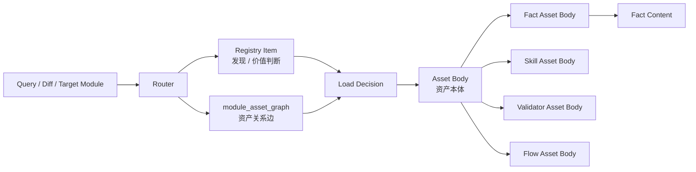
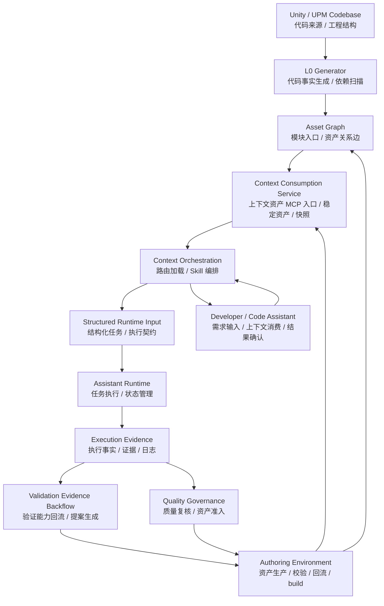
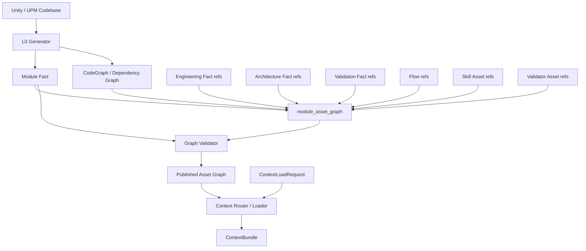
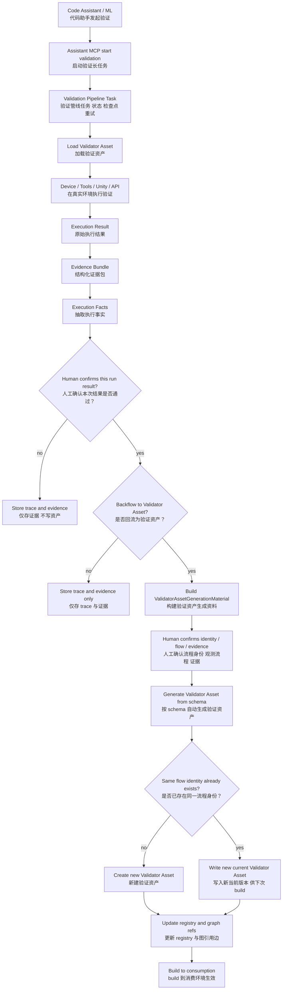
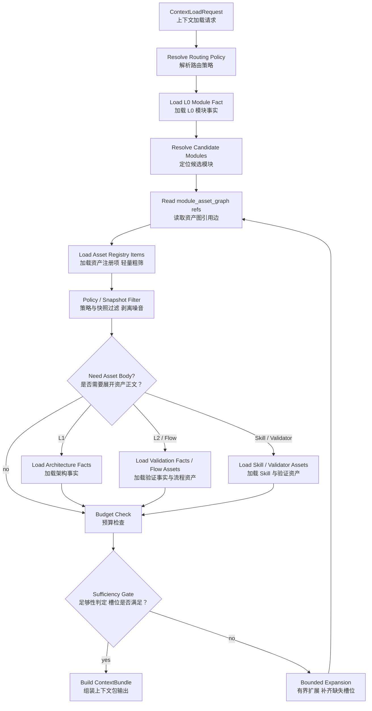

# UConnect：代码助手上下文管理设计

本文独立说明 `UConnect` 的上下文管理体系。`UConnect` 是面向 Unity 工程的代码助手上下文管理方案，关注代码助手如何稳定获取、消费、验证和沉淀上下文资产，而不是 `Assistant Runtime` 的执行编排，也不是软件工程管线、运维或版本治理平台。

## 1. 设计目标

上下文管理的目标，是让代码助手在大型 Unity 项目中具备更稳定的研发辅助能力：

- 可观测：知道代码助手使用了哪些上下文资产、生成了什么计划、产出了什么结果
- 可约束：通过 Skill、schema、词汇表和共享资产约束代码助手行为
- 可验证：让上下文资产和生成的执行计划能被真实执行结果反哺
- 可沉淀：把有效的架构事实、验证事实、流程资产和历史有效计划样本沉淀为稳定资产

这里的重点不是补足模型上下文窗口的短板，而是沉淀模型即使能够通读代码也无法稳定恢复出来的工程知识和验证知识。

## 2. 总体架构与运行时序

上下文管理体系先区分“系统模块”“资产对象”和“治理机制”。

- 系统模块
  - 可被调用、可测试，具备明确输入输出契约、状态或产物、职责边界，负责生成、校验、发布、加载或消费上下文
- 资产对象
  - 被系统模块读写的数据，例如 `Module Fact`、`Architecture Fact`、`Validation Fact`、registry
- 治理机制
  - 约束系统如何运转的规则或增强手段，例如 build gate、snapshot control、budget control、RAG / GraphRAG

### 2.1 系统模块

上下文管理中的系统模块保持最小集合，避免把内部子能力拆成过多“系统”：

- `Context Authoring & Build Toolchain`
  - 负责资产生产、编辑、检查、回流、`Module Fact` 自动生成、`Asset Graph` 构建、schema / 词表 / 引用校验，以及 build 到 consumption
- `Context Consumption Service`
  - 作为上下文资产消费侧的 MCP 对外入口，负责管理 build 后的稳定资产、registry index、Asset Graph、snapshot、trace、资源加载、资产查询和 Router / Loader API surface
- `Context Router / Loader`
  - 根据 query、diff、目标模块、Asset Graph、policy、当前消费快照和预算加载上下文，并输出 `ContextBundle`
- `Skill Execution`
  - 消费 `ContextBundle` 和按需加载的资产正文，生成上层运行时输入或分析结果
- `Validation Evidence Pipeline`
  - 由 `Assistant MCP` 启动和持有长任务状态，接入设备层、日志、数据、事件、callback、SQL/API 等证据来源，负责证据采集、归一化、执行事实生成和 `Validator Asset` 回流

### 2.2 资产对象

资产对象是系统模块读写、发布和消费的数据。它们不主动执行逻辑，也不直接调用外部工具。

基础关系如下：




`Registry Item` 和 `module_asset_graph` 负责在不打开资产正文的情况下完成候选召回；Router 再结合 policy、当前消费快照和 budget 完成过滤、裁剪和加载决策。`Asset Body` 才是被加载消费的资产本体；`Fact` 只指事实类资产中的事实内容。

上下文管理中的资产对象分为四类：

**事实描述资产**

- `Module Fact`
  - L0 代码与模块事实，用于模块定位、依赖缩圈和导航入口
- `Engineering Fact`
  - L0 工程事实，用于描述可从工程配置、依赖声明或构建配置恢复的 SDK 版本、插件版本、平台基线和兼容矩阵
- `Architecture Fact`
  - L1 设计与架构事实，用于约束调用方向、模块职责、设计边界和反设计经验
- `Validation Fact`
  - L2 验证事实，用于描述某个功能或链路应满足的验证口径、可采集证据、通过条件、失败信号、适用范围、兼容性、AB Test、fallback 和历史有效计划样本

**编排能力资产**

- `Flow Asset`
  - 流程资产，用于描述初始化、登录、账号同步、支付等跨模块关键链路
- `Skill Asset`
  - Skill 文件本体，用于约束代码助手如何消费上下文并生成结构化输出
- `Validator Asset`
  - 验证能力资产，可以是验证 Skill、工具调用、设备层操作和证据解析逻辑的组合，用于描述当前正确验证流程

**索引与注册项**

- `Asset Registry Item`
  - 所有资产的静态索引条目，包括资产类型、摘要、路径、适用场景、输入输出 schema 和预算信息
  - 它是资产的静态身份证，用于在不加载资产本体的情况下，快速、准确地判断资产对当前 query 的潜在价值
  - 它回答“这个资产是什么、在哪里、适用于什么、依赖什么 schema、预计占用多少预算”
- `module_asset_graph`
  - 以模块为主要入口的跨层资产图，把 `Module Fact`、`Engineering Fact`、`Architecture Fact`、`Validation Fact`、`Flow Asset`、`Skill Asset` 和 `Validator Asset` 连接起来；它表达“可能相关”，不表达“本次必须加载”

**治理辅助数据**

- `snapshot / trace`
  - 支撑 hash、路径、快照复现和审计解释的构建产物
- `registry`
  - 像资产目录，记录资产是什么、在哪里、适用于什么，用于在不打开资产正文的情况下发现候选资产
- `policy`
  - 像选择规则，决定当前 query intent 应沿哪些图边扩展、保留哪些资产、剔除哪些噪音
- `vocabulary`
  - 像统一词典，约束模块、能力、场景和证据通道命名，避免不同资产使用不同表达导致 Router 误判

资产固定为两件套：`Asset Body` 与 `Asset Registry Item`。系统不维护独立的动态指标文件。Router 在运行时把 `Asset Registry Item` 和当前加载原因融合成 `Runtime Asset Descriptor`，用于最终排序、过滤和裁剪。同优先级排序使用确定性 tie-breaker（显式边优先于推断边，再按 `confidence` 降序，最后按 `asset_id` 字典序），不依赖任何运行期累积指标，以保证同一快照下输出可复现。

### 2.3 治理机制

治理机制是约束资产如何生产、构建、发布、消费、回流和淘汰的规则。它不是单独的执行模块，而是由上述系统模块共同实现。

上下文管理中的治理机制包括：

- `Schema / Vocabulary / Quality`
  - 约束资产字段、命名、schema、quality checks 和受控词表
- `Build Gate / Snapshot`
  - 控制资产两件套、registry index、Asset Graph 和 trace 如何 build 到 consumption，并形成可复现快照
- `Asset Admission / Retention`
  - 通过人工准入标准和定期裁剪控制资产进入与留存，避免低价值资产稀释高价值上下文；它不依赖运行期使用指标
- `Routing / Budget / Explainability`
  - 约束 Router 沿哪些图边扩展、保留哪些资产、如何裁剪预算，以及如何解释选择和丢弃原因
- `Validation Evidence Backflow`
  - 约束真实执行证据如何生成 `Execution Facts`，并在人工确认后回流为新的 `Validator Asset`、registry item 和 Asset Graph 引用
- `RAG / GraphRAG`
  - 作为结构化加载达到规模瓶颈后的增强检索机制，不替代 Asset Graph 和 Router 主链路

治理机制的目标不是让系统完全自动维护知识库，而是把人工维护范围收敛到高价值架构事实、验证事实和关键流程资产。

### 2.4 全局架构图




这张图只表达全局主链路：`L0 Generator` 从代码库生成轻量代码事实，`Asset Graph` 把模块入口和跨层资产关系发布到消费环境，消费环境向代码助手提供上下文，代码助手借助 Router / Skill 生成运行时输入，`Assistant Runtime` 执行后产出执行证据。执行证据一方面进入质量治理和资产准入复核，另一方面通过 `Validation Evidence Backflow` 生成当前正确的 `Validator Asset`，再回到 authoring 环境完成确认、校验和 build。Router 加载策略、registry、snapshot 和回流 schema 的细节放在后文局部章节展开。

## 3. 资产分层

上下文资产分成三层：

- `L0：代码、模块与工程事实层`
  - 包边界
  - 关键入口
  - 配置触点
  - 资源触点
  - 依赖关系
  - SDK / 插件版本基线
  - 平台构建配置基线
  - 可从工程配置恢复的兼容矩阵
- `L1：设计与架构事实层`
  - 模块职责
  - 分层约束
  - 推荐链路与调用方向
  - 设计思路与利弊权衡
  - 历史反设计与高风险耦合点

`L1` 只沉淀模型无法从代码稳定恢复的设计性知识：设计意图、分层约束、调用方向、利弊权衡和反经验设计。版本基线、SDK 接入基线和版本兼容矩阵这类高频变动、且可从 `manifest.json` 或工程配置直接恢复的事实，不进入 `L1`；它们属于 `L0` 工程事实，由 `Engineering Fact` 承载，不享受 `L1` 的稳定权威待遇（见第 6 章和第 7 章）。

- `L2：验证事实层`
  - 向后兼容性要求
  - AB Test 分流行为
  - 容错和 fallback 约束
  - 环境差异和版本差异
  - 验证口径
  - 历史有效计划样本
  - QA checklist 和可复用检查模板

`L0` 是轻量导航层、模块缩圈基座和工程事实入口。真正值得长期重投入的是 `L1 + L2`，因为这些资产更难从纯代码中稳定恢复出来。

其中，历史有效计划样本来自已经执行并确认过的运行计划或手工验证流程。但它只是 `L2` 的沉淀物，`L2` 更核心的内容仍然是验证约束、验证口径、证据通道和可复用检查模板。真实执行证据保存在内部 evidence store 中，通过 `ValidatorAssetItem` 和 `Asset Registry Item` 摘要被引用，不作为默认上下文资产。

## 4. 生成环境与使用环境

上下文资产需要区分生成环境和使用环境。

**生成环境**

- 面向上下文资产生产和维护人员使用
- 负责事实提取、检查、build、同步和资产维护
- 包含生产类 Skill、check Skill、review Skill 和治理规则
- 可以存在未 build 的工作文件，但未 build 到 consumption 的资产不会被 Router 消费

**使用环境**

- 面向代码助手和项目研发使用
- 只暴露已整理、已发布、可消费的稳定资产
- 项目开发人员和代码助手原则上只使用 `Context Consumption Service` 这一层
- 不直接暴露生成环境中的中间态和治理流程

这个分层解决的是资产发布边界问题：生成环境承载复杂生产过程，使用环境只消费 build 产物，避免半成品资产污染 agent 召回。

## 5. 目录结构

上下文资产按 domain 组织。每个可消费资产在自己的资产目录下维护两件套：

- `asset.body.`*
  - 资产本体，回答“事实内容是什么、Skill 怎么执行、Validator 怎么验证、Flow 怎么走”
- `asset.registry.yaml`
  - 静态身份证，回答“这个资产是什么、在哪里、适用于什么、依赖什么 schema、预计占用多少预算”

`Asset Body` 和 `Asset Registry Item` 可以物理 colocate，但语义上仍然分离。系统不维护独立的动态指标文件；资产是否可见只由当前 build snapshot 决定。Router 不扫描 authoring 目录；只有 build 到 `consumption/context_service` 的产物才允许被 Router 和 Skill 消费。

```text
context/
├─ authoring/
│  ├─ domains/
│  │  └─ account/
│  │     ├─ module_facts/
│  │     │  └─ account_core/
│  │     │     ├─ asset.body.yaml
│  │     │     └─ asset.registry.yaml
│  │     ├─ engineering_facts/
│  │     │  └─ account_sdk_version_baseline/
│  │     │     ├─ asset.body.yaml
│  │     │     └─ asset.registry.yaml
│  │     ├─ architecture_facts/
│  │     │  └─ account_architecture_constraints/
│  │     │     ├─ asset.body.yaml
│  │     │     └─ asset.registry.yaml
│  │     ├─ validation_facts/
│  │     │  └─ cross_device_identity_sync/
│  │     │     ├─ asset.body.yaml
│  │     │     └─ asset.registry.yaml
│  │     ├─ flow_assets/
│  │     │  └─ account_login_flow/
│  │     │     ├─ asset.body.yaml
│  │     │     └─ asset.registry.yaml
│  │     ├─ skill_assets/
│  │     │  └─ account_integration_validation/
│  │     │     ├─ SKILL.md
│  │     │     └─ asset.registry.yaml
│  │     └─ validator_assets/
│  │        └─ google_play_games_sync/
│  │           ├─ asset.body.yaml
│  │           └─ asset.registry.yaml
│  ├─ shared_assets/
│  │  ├─ vocabularies/
│  │  ├─ diagrams/
│  │  ├─ architecture_notes/
│  │  ├─ version_baselines/
│  │  ├─ validation_constraints/
│  │  ├─ validation_touchpoints/
│  │  ├─ templates/
│  │  └─ policies/
│  ├─ asset_graph/
│  │  ├─ module_asset_graph.yaml
│  │  └─ diagnostics/
│  ├─ execution_evidence/
│  │  ├─ raw_artifact_refs/
│  │  ├─ evidence_bundles/
│  │  ├─ execution_facts/
│  │  └─ validator_asset_generation_materials/
│  └─ build/
│     ├─ diagnostics/
│     └─ snapshots/
└─ consumption/
   └─ context_service/
      ├─ domains/
      │  └─ account/
      │     ├─ module_facts/
      │     ├─ engineering_facts/
      │     ├─ architecture_facts/
      │     ├─ validation_facts/
      │     ├─ flow_assets/
      │     ├─ skill_assets/
      │     └─ validator_assets/
      ├─ asset_graph/
      │  └─ module_asset_graph.yaml
      ├─ snapshots/
      ├─ indexes/
      │  ├─ asset_registry.index.yaml
      │  ├─ by_domain/
      │  ├─ by_module/
      │  ├─ by_type/
      │  └─ module_asset_graph.diagnostics.yaml
      ├─ traces/
      │  └─ router/
      └─ adapters/
         └─ openviking/
```

其中：

- `authoring/` 对应生成环境，承接资产生产和维护
- `authoring/domains/<domain>/` 按功能域或业务域维护资产两件套，便于 review、回流、替换和删除
- `authoring/shared_assets/` 维护词汇表、图资产、模板和策略
- `authoring/asset_graph/` 维护以模块为入口的资产关系图和 graph validator 诊断结果
- `authoring/execution_evidence/` 存放验证长任务产出的 artifact 引用、证据包、执行事实和 `Validator Asset` 生成资料；它是内部 evidence store，不作为默认上下文资产暴露
- `authoring/build/` 存放 build 诊断和输入快照，不作为 Router 消费入口
- `consumption/context_service/` 对应使用环境，负责稳定资产、快照、registry index、Asset Graph、trace 和实现适配
  - build 到这一层的资产必须能被解析到稳定 ID、路径或 URI、版本或 hash
  - Router 和 Skill 只能消费这一层的 build 产物，不能直接消费 authoring 工作文件
- `consumption/context_service/domains/` 存放发布后的资产两件套
- `consumption/context_service/indexes/` 存放 build 生成的 `asset_registry.index.yaml`、分片索引和 graph diagnostics
- `consumption/context_service/adapters/openviking/` 表示 `OpenViking` 实现适配层

`authoring/asset_graph/` 包含以下资产图：

- `module_asset_graph`
  - 模块到 `Engineering Fact / Architecture Fact / Validation Fact / Flow Asset / Skill Asset / Validator Asset` 等资产的引用图，也可以表达跨模块、跨流程、跨验证能力的候选关系

`asset_registry` 不再作为独立人工维护目录存在。每个资产目录维护自己的 `asset.registry.yaml`，build 阶段汇总生成 `consumption/context_service/indexes/asset_registry.index.yaml` 和分片索引。

`authoring/shared_assets/policies/` 包含以下共享策略：

- `routing_policies`
  - query 类型到上下文加载策略的映射
- `budget_profiles`
  - 不同任务类型的 token / asset 数量预算

## 6. Shared Assets

共享资产用于让不同 Skill、不同模块和不同上下文资产使用同一套语言。

- `vocabularies`
  - 统一词汇表，约束 `module_tags`、`capabilities`、`dependency_edge_type` 等命名，并包含 `edge_ontology.yaml` 定义合法的引用边分组与来源取值
- `diagrams`
  - 总览架构图、包级依赖图、关键链路图等共享图资产
- `architecture_notes`
  - 模块职责、架构约束、推荐调用路径、反设计经验等共享架构知识
- `version_baselines`
  - SDK 接入基线版本、宿主工程基线和兼容矩阵；属于 `L0` 工程事实，作为可从工程配置半自动同步的 `Engineering Fact` 维护，不注册为 `Architecture Fact`，不享受 `L1` 稳定权威待遇
- `validation_constraints`
  - 向后兼容性、AB Test、fallback、环境差异等高阶验证约束
- `validation_touchpoints`
  - 数据、事件、日志、callback、UI、SQL/API 等验证证据通道说明
- `templates`
  - Skill 输出模板、流程资产模板等固定结构
- `policies`
  - build gate、routing、budget、review 等治理规则
- `registries`
  - 模块注册表、能力注册表等共享注册表。资产注册表由各资产目录的 `asset.registry.yaml` 在 build 阶段汇总生成

名字约束词汇表本身也是 shared assets。它不是附属文档，而是上下文资产能否稳定复用的基础。

`shared_assets` 下的内容分为两类：

- 作为治理输入的共享文件
  - 例如 `vocabularies`、`policies`、`templates`，通常由 build toolchain、Router 或 Skill 读取，不直接作为业务上下文资产进入 `ContextBundle`
- 作为上下文消费资产的共享知识
  - 例如 `validation_constraints`、`architecture_notes` 和关键 `diagrams`
  - 只要需要被 Router / Skill 作为上下文消费，就必须和 domain 资产一样提供 `asset.body.*` 和 `asset.registry.yaml`，并在 build 后进入 `asset_registry.index.yaml`

不新增 `refs.shared`。共享知识资产通过语义类型进入现有边：

- `architecture_notes` 中的架构约束、反设计经验和调用方向应注册为 `Architecture Fact`，并由相关模块通过 `refs.l1` 引用
- `version_baselines` 不注册为 `Architecture Fact`；它是易变且可从配置恢复的 `Engineering Fact`，由相关模块通过 `refs.l0` 引用
- `validation_constraints` 应注册为 `Validation Fact`，并由相关模块通过 `refs.l2` 引用
- 共享流程图如果用于说明验证或接入流程，应注册为 `Flow Asset` 或被对应 `Architecture Fact / Validation Fact` 正文引用

这样 Router 仍然从模块节点和标准 refs 出发，不需要维护额外 shared 边；shared assets 只是在物理目录上共享，在消费模型上仍是普通资产。

### 6.1 Asset Registry

`Asset Registry Item` 是每个资产目录下的 `asset.registry.yaml`。它不是集中手写的大注册表。它为所有可被 Router 独立发现、过滤、排序、裁剪和加载的资产提供静态身份证，包括 `Module Fact`、`Engineering Fact`、`Architecture Fact`、`Validation Fact`、`Flow Asset`、`Skill Asset` 和 `Validator Asset`。

`asset.registry.yaml` 只保存资产静态描述，不保存使用次数、helpful 结果或运行时指标。

build 阶段会扫描所有 `asset.registry.yaml`，生成 `consumption/context_service/indexes/asset_registry.index.yaml` 和按 domain / module / type 的分片索引。Router 默认先消费 build 后的 registry index 判断是否值得加载本体，只有需要展开细节、执行 Skill 或执行 Validator 时才读取 Asset Body。

这里的 `Asset Item` 指 `Asset Registry Item` 的具体类型，是资产本体的静态索引条目，不是资产正文。

所有 `Asset Registry Item` 至少回答：

- 这个资产是什么类型、在哪里
- 适用于哪些 intent、模块、平台、场景和能力
- 需要加载正文时应读取哪个 Asset Body
- 预计占用多少 token 或加载成本
- 依赖哪些 schema、资产或能力
- 为什么它可能和当前 query 有关

不同资产类型的 Item 还需要回答各自的关键问题：

- `ModuleFactItem`
  - 这个模块的包名、根路径、asmdef 和依赖关系是什么
- `EngineeringFactItem`
  - 这条工程事实描述哪些 SDK、插件、平台配置或兼容矩阵，来源路径是什么
- `ArchitectureFactItem`
  - 这条架构事实约束哪些模块、能力或设计边界
- `ValidationFactItem`
  - 这条验证事实约束哪些验证口径、证据通道和通过条件
- `FlowAssetItem`
  - 这个流程涉及哪些模块、入口和关键链路
- `SkillAssetItem`
  - 这个 Skill 适用于什么意图，需要哪些上下文，输出什么 schema
- `ValidatorAssetItem`
  - 这个验证资产验证什么任务目标和平台，执行本体在哪里，需要哪些工具、设备能力和证据通道，支撑证据位于哪个内部 evidence store

对 `Validator Asset` 而言，`Validator Asset Body` 只描述“当前正确验证流程”。可信摘要、最近验证结果、provenance 引用和 evidence store 引用由 `ValidatorAssetItem` 和 evidence store 共同表达。`ValidatorAssetItem` 只保存可用于发现和选择的静态引用；最近验证的证据指向由 `evidence_store_refs` 记录，在每次回流 build 时刷新，不再依赖独立的动态指标文件。

`Asset Registry Item` schema 如下。以下 TypeScript 只表达结构；落地到 YAML 时字段名使用 snake_case。

```ts
type AssetType =
  | "module_fact"
  | "engineering_fact"
  | "architecture_fact"
  | "validation_fact"
  | "flow_asset"
  | "skill_asset"
  | "validator_asset";

type RiskLevel = "low" | "medium" | "high" | "critical";

type AssetAppliesTo = {
  // 适用 query intent
  intents?: QueryIntent[];
  // 适用功能域或业务域
  domains?: string[];
  // 适用模块
  modules?: string[];
  // 适用平台
  platforms?: Array<"ios" | "android" | "unity_editor" | string>;
  // 适用场景
  scenarios?: string[];
  // 适用能力
  capabilities?: string[];
  // 适用验证触点
  validation_touchpoints?: string[];
};

type BaseAssetItem = {
  // 资产稳定 ID
  asset_id: string;
  // 资产类型
  asset_type: AssetType;
  // 资产可读标题
  title: string;
  // 资产摘要，用于不加载正文时做价值判断
  summary: string;
  // 资产正文在 consumption 环境中的相对路径
  body_path: string;
  // 稳定资源 URI
  uri: string;
  // schema 引用
  schema_refs?: {
    // 输入 schema
    input?: string;
    // 输出 schema
    output?: string;
    // quality checks schema
    quality_checks?: string;
  };
  // 适用条件
  applies_to: AssetAppliesTo;
  // 预估 token 成本
  token_estimate?: number;
  // 依赖资产列表
  dependencies?: string[];
  // Router 选择该资产时可用的检索标签
  search_tags?: string[];
  // 资产风险等级，用于跨模块预算分配和复核优先级
  risk_level?: RiskLevel;
};

type ModuleFactItem = BaseAssetItem & {
  asset_type: "module_fact";
  // UPM 包名或模块包名
  package_name: string;
  // 模块根路径
  package_root: string;
  // Unity asmdef 名称
  asmdef_name?: string;
  // 直接依赖模块
  declared_dependencies?: string[];
  // 下游依赖模块
  dependent_packages?: string[];
  // 模块入口点摘要
  entry_points?: string[];
  // 配置触点摘要
  config_touchpoints?: string[];
  // 资源触点摘要
  asset_touchpoints?: string[];
  // 对应 module_asset_graph 节点 ID
  graph_node_ref?: string;
};

type EngineeringFactItem = BaseAssetItem & {
  asset_type: "engineering_fact";
  // 工程事实主题，例如 sdk_version_baseline、platform_build_config、compatibility_matrix
  engineering_topics: string[];
  // 适用模块
  module_tags?: string[];
  // 事实来源路径，例如 Packages/manifest.json、Podfile.lock、Gradle 文件或 ProjectSettings
  source_paths: string[];
  // 关联 SDK、插件或包名
  package_refs?: string[];
  // 关联平台
  platforms?: string[];
  // 基线版本摘要
  baseline_summary?: string;
};

type ArchitectureFactItem = BaseAssetItem & {
  asset_type: "architecture_fact";
  // 被约束模块标签
  module_tags: string[];
  // 关联源码路径，用于绑定代码并支撑漂移复核
  source_paths?: string[];
  // 被约束能力标签
  capability_tags?: string[];
  // 架构事实主题，例如 layering、lifecycle、anti_pattern、tradeoff
  architecture_topics?: string[];
  // 架构约束标签
  architecture_constraints?: string[];
  // 该事实适用的风险点摘要
  risk_summary?: string;
};

type ValidationFactItem = BaseAssetItem & {
  asset_type: "validation_fact";
  // 被约束模块标签
  module_tags: string[];
  // 被验证能力标签
  capability_tags?: string[];
  // 验证触点
  validation_touchpoints: string[];
  // 证据通道，例如 log、callback、event、api、sql、ui、device_state
  evidence_channels?: string[];
  // 绑定的 Validator Asset
  validator_bindings?: string[];
  // 关键通过条件摘要
  pass_criteria_summary?: string;
  // 关键失败信号摘要
  fail_signal_summary?: string;
};

type FlowAssetItem = BaseAssetItem & {
  asset_type: "flow_asset";
  // 流程目标，例如 account_login、cross_device_sync
  flow_goal: string;
  // 流程涉及模块
  involved_modules: string[];
  // 流程入口
  entry_points?: string[];
  // 关键链路引用
  sequence_refs?: string[];
  // 流程触发条件摘要
  trigger_summary?: string;
  // 流程结束状态摘要
  terminal_state_summary?: string;
};

type SkillAssetItem = BaseAssetItem & {
  asset_type: "skill_asset";
  // Skill 名称
  skill_name: string;
  // Skill 支持的 query intent
  supported_intents: QueryIntent[];
  // Skill 需要的上下文类型
  required_context_asset_types: AssetType[];
  // Skill 推荐加载的上下文能力或主题
  preferred_context_tags?: string[];
  // Skill 输出 schema 引用
  output_schema_ref: string;
  // Skill 质量检查摘要
  quality_check_refs?: string[];
  // Prompt 缓存策略提示，例如 stable_header、context_append_only
  prompt_cache_profile?: string;
};

type ValidatorAssetItem = BaseAssetItem & {
  asset_type: "validator_asset";
  // 验证流程身份
  flow_identity: ValidatorFlowIdentity;
  // 该 Validator 验证的 Validation Fact 列表
  validates: string[];
  // 需要执行该 Validator 时加载的 Validator Asset Body 路径
  validator_asset_body_ref: string;
  // 需要的工具摘要，例如 midscene_cli、unity_editor、adb、sql、api
  required_tools?: string[];
  // 需要的设备能力摘要
  required_device_capabilities?: string[];
  // 证据来源摘要
  evidence_channels?: Array<"log" | "callback" | "event" | "api" | "sql" | "ui" | "device_state" | "screenshot">;
  // 内部 evidence store 命名空间引用
  evidence_store_refs?: string[];
};

type AssetRegistryItem =
  | ModuleFactItem
  | EngineeringFactItem
  | ArchitectureFactItem
  | ValidationFactItem
  | FlowAssetItem
  | SkillAssetItem
  | ValidatorAssetItem;
```

Router 在运行时会把 `AssetRegistryItem` 和当前加载原因融合为 `Runtime Asset Descriptor`。它不是注册表存储对象，只存在于本次 `ContextBundle` 或 trace 中。

```ts
type RuntimeAssetDescriptor = {
  // 本次使用的快照 ID
  snapshotId: string;
  // 静态资产条目
  item: AssetRegistryItem;
  // 本次加载该资产的原因
  loadReasons: string[];
  // Router 计算得到的相关度分数
  relevanceScore?: number;
  // Router 计算得到的信任分数
  trustScore?: number;
  // Router 计算得到的信息密度分数
  densityScore?: number;
  // 本次预算裁剪后的 token 上限
  tokenBudget?: number;
};
```

统一注册表是 build 产物，不要求物理上只有一个 YAML 文件。中大型工程中推荐使用以下分片结构：

- `asset_registry.index.yaml`
  - 全局轻量索引，只保存 `asset_id`、`asset_type`、`domain`、`module_tags`、`intent_tags`、`body_path` 和 `estimated_tokens`
  - Router 先读取它完成粗筛，不打开资产正文，也不扫描所有分片正文
- `by_domain/<domain>.yaml`
  - 主分片，按功能域或业务域组织，例如账号、支付、广告
  - 适合大多数从 query、功能域或模块推导出来的上下文加载
- `by_module/<module_id>.yaml`
  - 可选分片，按模块组织与该模块相关的 `Engineering Fact / Architecture Fact / Validation Fact / Flow Asset / Skill Asset / Validator Asset` 候选资产
  - 与 `module_asset_graph` 配合，用于大型 Unity / UPM 工程中的快速模块缩圈
- `by_type/<asset_type>.yaml`
  - 辅助索引，只在 query 明确要求列出某类资产时使用，例如列出所有 Skill 或 Validator
  - 不作为 Router 默认主路径，避免跨类型场景反复读取多份类型分片

Router 的默认访问路径是：先读 `asset_registry.index.yaml` 做轻量粗筛，再根据 `query intent / target module / domain / module_asset_graph refs` 读取必要的 `by_domain` 或 `by_module` 分片，最后结合 routing policy 和 budget 生成 `Runtime Asset Descriptor`。分片的目标不是单纯省 token，而是减少无关资产噪音、降低并发写入冲突，并让候选召回更贴近 Router 的真实导航路径。

YAML 示例：

```yaml
# 资产注册表条目列表
assets:
  # 单个资产的静态身份证
  - asset_id: validation:account/cross_device_identity_sync
    # 资产类型，用于 Router 判断本体类别
    asset_type: validation_fact
    # 资产可读标题
    title:
    # 资产摘要，用于不加载正文时做价值判断
    summary:
    # consumption 环境中的相对路径
    body_path:
    # 稳定资源 URI，可由 Context Consumption Service 解析
    uri:
    # 资产输入、输出或质量检查 schema 引用
    schema_refs:
    # 资产适用条件
    applies_to:
      # 适用的 query intent
      intents:
      # 适用模块
      modules:
      # 适用平台
      platforms:
      # 适用场景
      scenarios:
      # 适用能力标签
      capabilities:
      # 适用验证触点
      validation_touchpoints:
    # 预估 token 成本
    token_estimate:
    # 依赖的其它资产 ID
    dependencies:
```

### 6.2 Routing Policies

`routing_policies` 是共享策略。它定义不同 query intent 如何加载 `Module Fact / Engineering Fact / Architecture Fact / Validation Fact / Flow Asset / Skill Asset / Validator Asset` 等资产，以及每类请求的扩展深度、槽位要求和预算边界。

`module_asset_graph` 保存“模块连接了哪些可用候选资产”，`routing_policies` 决定“当前请求允许沿哪些边走、走多深、哪些候选资产应被保留或剔除”。它的目的不是把上下文压到最小，而是剥离噪音，形成更高质量的候选上下文。

### 6.3 Budget Profiles

`budget_profiles` 是共享策略。它约束 Router 每次加载的 token 预算、资产数量上限和各类资产优先级。预算控制服务于上下文质量：在候选资产过多时优先保留高相关、高可信、高信息密度资产，而不是单纯追求更少 token。

`BudgetProfile` 结构如下：

```ts
type BudgetProfile = {
  // 档位名称
  name: "small" | "normal" | "deep";
  // 本次加载最大 token 预算
  max_tokens: number;
  // 本次加载最大资产数量
  max_assets: number;
  // 各资产类型的数量上限
  max_assets_per_type?: Record<string, number>;
  // 各资产类型的优先级权重，用于超预算时的保留顺序
  type_priority?: Record<string, number>;
};
```

## 7. Fact 设计

`Fact` 是事实类资产的正文内容，回答“这个事实本身是什么”。它不负责资产发现或运行时排序；这些由 `Asset Registry Item`、`Asset Graph` 和 Router 完成。

事实类资产分布在三层：

- `Module Fact`
  - 属于 `L0`，描述代码模块事实，用于模块定位、依赖缩圈和 Asset Graph 入口生成
- `Engineering Fact`
  - 属于 `L0`，描述可从工程配置恢复的 SDK 版本、插件版本、平台构建配置和兼容矩阵，用于升级检查、环境约束和验证准备
- `Architecture Fact`
  - 属于 `L1`，描述架构事实，用于约束模块职责、调用方向、接入边界和反设计经验
- `Validation Fact`
  - 属于 `L2`，描述验证事实，用于约束验证口径、证据通道、通过条件、失败信号、兼容性、AB Test 和 fallback

事实类资产的共同边界：

- `Fact Body` 保存事实内容
- `asset.registry.yaml` 保存静态身份证和可发现摘要
- `module_asset_graph` 负责把 Fact 连接到模块、流程、Skill 和 Validator
- Router 默认先读 registry / graph，只有需要正文时才读取 `Fact Body`

### 7.1 Module Fact

`Module Fact` 是 `L0` 的主要资产形态。它的定位是导航和缩圈，不是重型知识库。

来源：

- Unity `asmdef`
- UPM package metadata
- package root
- AST / CodeGraph
- 配置扫描
- 资源引用扫描

主要消费者：

- `Asset Graph Builder`
- `Context Router / Loader`
- 影响面分析类 Skill

最小正文 schema：

```ts
type ModuleFactBody = {
  // Fact 稳定 ID，通常与 module asset ID 对齐
  fact_id: string;
  // 固定为 module_fact
  fact_type: "module_fact";
  // UPM 包名或模块包名
  package_name: string;
  // 模块根路径
  package_root: string;
  // Unity asmdef 名称
  asmdef_name?: string;
  // 当前包声明依赖的包列表
  declared_dependencies: string[];
  // 依赖当前包的下游包列表
  dependent_packages: string[];
  // 类级符号路径形式的入口点
  entry_points: Array<{
    // 类级符号路径，例如 Guru.Account.AccountService
    symbol: string;
    // 源码路径
    source_path: string;
    // 入口用途摘要
    purpose?: string;
  }>;
  // 配置文件路径触点
  config_touchpoints: Array<{
    // 配置文件路径
    path: string;
    // 配置用途摘要
    purpose?: string;
  }>;
  // 资源路径触点
  asset_touchpoints: Array<{
    // 资源路径
    path: string;
    // 资源用途摘要
    purpose?: string;
  }>;
  // 仅高价值模块维护，不作为所有模块强制字段
  capabilities?: {
    // 当前模块提供的能力
    provided?: string[];
    // 当前模块消费的能力
    consumed?: string[];
  };
};
```

`entry_points`、`config_touchpoints`、`asset_touchpoints` 都应优先路径化。`capabilities` 只面向项目核心能力模块、Skill 经常命中的包、复杂接入包、高风险包和经常参与影响面分析的包维护。

### 7.2 Engineering Fact

`Engineering Fact` 是 `L0` 的工程事实资产。它描述可以从 Unity / UPM 工程配置、依赖声明、构建配置或平台配置中恢复出来的事实，例如 SDK 版本基线、插件版本、宿主工程基线、平台构建参数和兼容矩阵。

来源：

- `Packages/manifest.json`
- UPM package metadata
- Unity ProjectSettings
- iOS `Podfile.lock`
- Android Gradle dependency
- SDK config / plugin config
- CI 或构建配置中可解析的版本基线

主要消费者：

- SDK 升级检查类 Skill
- 集成验证类 Skill
- `Context Router / Loader`
- `Validation Evidence Pipeline`

最小正文 schema：

```ts
type EngineeringFactBody = {
  // Fact 稳定 ID
  fact_id: string;
  // 固定为 engineering_fact
  fact_type: "engineering_fact";
  // 工程事实主题，例如 sdk_version_baseline、platform_build_config、compatibility_matrix
  topics: string[];
  // 事实适用范围
  scope: {
    // 适用模块
    modules?: string[];
    // 适用平台
    platforms?: string[];
    // 适用 SDK、插件或包
    packages?: string[];
  };
  // 工程事实来源
  source_paths: string[];
  // 基线条目
  baselines: Array<{
    // 基线 ID
    id: string;
    // 基线对象，例如 com.company.sdk.account、Google Play Games、Apple Game Center
    subject: string;
    // 当前版本或配置值
    value: string;
    // 值来源路径
    source_path: string;
    // 适用平台
    platform?: string;
    // 说明
    note?: string;
  }>;
  // 可从配置恢复的兼容矩阵
  compatibility_matrix?: Array<{
    // 被比较对象
    subject: string;
    // 版本或配置条件
    condition: string;
    // 兼容性结论
    compatible: boolean;
    // 证据路径
    evidence_path?: string;
  }>;
  // 本事实生成时依据的代码提交号
  source_commit?: string;
};
```

`Engineering Fact` 可以频繁重建，不需要像 `L1` 架构事实一样长期人工维护。它只回答“工程当前是什么状态”，不回答“为什么必须这样设计”。设计原因属于 `Architecture Fact`，验证口径属于 `Validation Fact`。

### 7.3 Architecture Fact

`Architecture Fact` 是 `L1` 的事实资产。它描述代码不一定能直接恢复出来的设计约束和工程经验，用于让代码助手理解“应该怎么接、不能怎么接、为什么不能这么接”。

来源：

- 项目架构设计
- 历史事故复盘
- 反设计经验
- 工程管线约束
- SDK 接入设计约束
- 兼容性设计原则

主要消费者：

- 集成方案生成类 Skill
- 影响面分析类 Skill
- SDK 升级检查类 Skill
- Router 的风险和预算分配逻辑

最小正文 schema：

```ts
type ArchitectureFactBody = {
  // Fact 稳定 ID
  fact_id: string;
  // 固定为 architecture_fact
  fact_type: "architecture_fact";
  // 架构事实主题，例如 layering、lifecycle、anti_pattern、tradeoff
  topics: string[];
  // 事实适用范围
  scope: {
    // 适用模块
    modules?: string[];
    // 适用能力
    capabilities?: string[];
    // 适用平台
    platforms?: string[];
    // 适用 SDK、插件或项目版本
    versions?: string[];
  };
  // 架构约束列表
  constraints: Array<{
    // 约束 ID
    id: string;
    // 约束正文
    statement: string;
    // 约束原因
    rationale?: string;
    // 推荐做法
    recommended_practice?: string;
    // 禁止或高风险做法
    prohibited_practice?: string;
    // 违反约束时可能造成的影响
    risk_if_violated?: string;
  }>;
  // 证据或来源引用，例如设计文档、事故复盘、历史 PR
  evidence_refs?: string[];
  // 漂移校验绑定：该事实生成时所依据的代码提交号
  source_commit?: string;
  // 漂移校验绑定：该事实约束的源码路径，用于触发复核
  source_paths?: string[];
  // 复核状态：current 表示与绑定代码一致，stale 表示关联路径已变更待人工复核
  review_status?: "current" | "stale";
};
```

`Architecture Fact` 不应写成泛泛的设计说明。它必须能被 Router 或 Skill 用于约束决策，例如影响面判断、接入方案生成、风险提示或反设计拦截。它不承载版本基线或兼容矩阵这类易变且可从配置恢复的事实。

`Architecture Fact` 通过 `source_commit` 和 `source_paths` 绑定到具体代码。build 时若发现 `source_paths` 命中的代码相对 `source_commit` 发生结构性变更，则把 `review_status` 标记为 `stale`。这里的结构性变更指路径存在性、文件移动、关键符号入口、包/asmdef 边界或声明依赖等可由扫描器稳定识别的结构差异，不包括“设计语义是否仍然正确”这类只能人工判断的问题。

`stale` 是复核信号，不是自动失效状态。默认策略是：Router 仍可返回 `stale` 的 `Architecture Fact`，但必须降低其排序权重，在 `ContextBundle` 或 diagnostics 中标明 `review_status: stale` 与触发原因；当某个 routing policy 或 Skill 要求 `architecture_fact` 必须是强约束事实时，policy 可以声明 `allow_stale_required: false`，此时 `stale` 资产只能作为参考上下文，不能单独满足 required slot。人工复核通过后刷新 `source_commit` 与 `review_status`。

这是 `L1` 的轻量防漂移机制：`L1` 是设计性软知识，无法像编译一样自动判定是否仍然成立，因此只标记待复核，由人确认后刷新 `source_commit` 与 `review_status`。

### 7.4 Validation Fact

`Validation Fact` 是 `L2` 的事实资产。它描述“什么才算验证通过”，不是某一次执行日志，也不是具体设备操作脚本。

来源：

- QA checklist
- 项目验证口径
- 已确认有效的历史验证计划样本
- 真实验证回流
- 兼容性要求
- AB Test / fallback / 容错要求

主要消费者：

- 集成验证类 Skill
- 回归预检类 Skill
- `Validator Asset`
- `Validation Evidence Pipeline`
- Router 的验证触点选择逻辑

最小正文 schema：

```ts
type ValidationFactBody = {
  // Fact 稳定 ID
  fact_id: string;
  // 固定为 validation_fact
  fact_type: "validation_fact";
  // 被验证目标
  target: {
    // 目标能力或业务语义
    capability: string;
    // 适用模块
    modules?: string[];
    // 适用平台
    platforms?: string[];
    // 适用场景
    scenarios?: string[];
  };
  // 验证口径
  validation_scope: {
    // 需要验证的行为
    expected_behaviors: string[];
    // 不属于本验证事实负责范围的行为
    out_of_scope?: string[];
  };
  // 证据通道
  evidence_channels: Array<"log" | "callback" | "event" | "api" | "sql" | "ui" | "device_state">;
  // 通过条件
  pass_criteria: string[];
  // 失败信号
  fail_signals: string[];
  // 兼容性要求
  compatibility?: {
    // 向后兼容要求
    backward_compatibility?: string[];
    // SDK、插件或项目版本要求
    version_constraints?: string[];
    // 系统版本或设备要求
    environment_constraints?: string[];
  };
  // AB Test 与 fallback 约束
  runtime_variants?: {
    // AB Test 分流行为
    ab_test?: string[];
    // fallback 或容错行为
    fallback?: string[];
  };
  // 可复用的历史计划样本引用，不保存原始执行证据
  historical_plan_refs?: string[];
  // 推荐绑定的 Validator Asset
  validator_bindings?: string[];
};
```

`Validation Fact` 只沉淀可复用验证事实。一次真实执行产生的原始日志、截图、callback 参数、SQL 查询结果和设备状态属于 evidence store；它们可以作为回流输入和审计依据，但不默认进入 `Validation Fact Body`。

### 7.5 Flow Asset

`Flow Asset` 是编排能力资产，不是 Fact，但其正文 schema 在此一并定义以保持完整。它描述初始化、登录、账号同步、支付等跨模块关键链路，用于让代码助手理解“这条链路怎么走、涉及哪些模块、入口和终态是什么”。

来源：

- 项目关键链路设计
- 跨模块时序
- 已确认的初始化、登录、同步、支付等流程

主要消费者：

- 集成方案生成类 Skill
- 影响面分析类 Skill
- Router 的流程相关度选择逻辑

最小正文 schema：

```ts
type FlowAssetBody = {
  // Flow 稳定 ID，对应 flow:<domain>/<flow_name>
  flow_id: string;
  // 固定为 flow_asset
  asset_type: "flow_asset";
  // 流程目标，例如 account_login、cross_device_sync
  flow_goal: string;
  // 流程涉及模块
  involved_modules: string[];
  // 流程入口
  entry_points: string[];
  // 关键链路步骤
  steps: Array<{
    // 步骤 ID
    id: string;
    // 步骤所属模块
    module?: string;
    // 步骤动作语义
    action: string;
    // 步骤产生的关键状态或事件
    outcome?: string;
  }>;
  // 流程触发条件
  trigger?: string;
  // 流程结束状态
  terminal_state?: string;
  // 关联的 Architecture Fact / Validation Fact 引用
  related_refs?: string[];
};
```

`Flow Asset` 只描述链路本身，不承载验证口径（属于 `Validation Fact`）和约束设计（属于 `Architecture Fact`）；需要时通过 `related_refs` 引用。

## 8. Asset Graph

`module_asset_graph` 是以模块为主要入口的资产图，不局限于 L0。`L0` 提供自动生成的模块事实、依赖事实和工程事实，是资产图的主要输入之一；资产图负责把模块入口连接到 `Engineering Fact / Architecture Fact / Validation Fact / Flow Asset / Skill Asset / Validator Asset` 等跨层资产，让 Router 能从一个 query、diff 或目标模块稳定走到可用候选资产。

### 8.1 设计原则

Asset Graph 要解决的不是“如何保存更多知识”，而是以下几个运行时问题：

- Skill 不知道从哪里开始读上下文，只能依赖代码助手临场搜索
- `Architecture Fact / Validation Fact` 即使质量很高，也缺少从模块入口到资产的稳定引用边
- 每次都把所有资产塞给 Skill 会造成 token 爆炸，并降低上下文质量
- 只靠自然语言标题或模糊匹配查找资产，会让召回结果不稳定
- 流程资产、验证口径和验证工具绑定无法跟具体模块建立明确关系
- `L0` 代码事实本身价值较低，但模块入口必须承担路由起点，因此模块事实维护成本必须由自动生成和轻量校验承担

因此，Asset Graph 的设计原则是：**代码事实自动生成，资产引用显式维护，运行时导航走确定性图边。**

### 8.2 局部架构




Asset Graph 局部架构分成两条链路：

- 生成链路
  - 从 Unity / UPM 工程自动生成 `Module Fact` 和代码依赖图
  - 由人工或半自动流程维护 `module_asset_graph` 中模块到所有可用上层资产的候选引用
  - 通过 graph validator 检查引用完整性、路径有效性和状态字段完整性
  - 通过 build gate 生成稳定 Asset Graph 到 `Context Consumption Service`
- 使用链路
  - Router 接收 `ContextLoadRequest`
  - Router 从已发布资源中读取 `Module Fact`、`module_asset_graph` 和相关索引
  - Router 组装 `ContextBundle`
  - Skill 通过 `ContextBundle` 间接消费 Asset Graph 导航结果

### 8.3 图节点与引用边

引用边统一维护在 `authoring/asset_graph/module_asset_graph.yaml` 中。

引用边统一使用 `refs.*` 概念路径表达，落地 YAML 时保存为 `refs` 下的分组键，例如 `refs.l0` 对应 `refs: { l0: [...] }`。后文提到的 `refs.l0 / refs.l1 / refs.validators` 均指这种概念路径，不表示 YAML 中存在带点号的物理字段名。

- `refs.l1`
  - 当前模块对应的设计与架构事实，例如模块职责、分层约束、调用方向、利弊权衡、反设计经验
- `refs.l0`
  - 当前模块对应的工程事实，例如 SDK 版本基线、插件版本、平台构建配置和兼容矩阵
- `refs.l2`
  - 当前模块对应的验证事实，例如验证约束、验证口径、兼容性要求、历史有效计划样本
- `refs.flows`
  - 当前模块参与的关键流程资产，例如初始化链路、登录链路、账号同步链路
- `refs.skills`
  - 当前模块适用的 Skill Asset，例如 smoke、impact、integration、regression 类 Skill
- `refs.validators`
  - 当前模块常用的 Validator Asset，例如日志、数据、事件、callback 校验

这组边的目标，是让 agent 能从模块入口稳定走到 `Engineering Fact / Architecture Fact / Validation Fact / Flow Asset / Skill Asset / Validator Asset` 等所有可用候选资产，而不是退回到模糊匹配。`module_asset_graph` 不负责最终上下文选择；它提供候选全集，`routing_policies`、build 后的 registry index 和 `Context Fuser` 再按 intent、平台、场景和预算修剪候选集合，以获得最大上下文信噪比。

边的类型不是隐式约定，而是受治理的本体（edge ontology）。它作为 shared asset 维护在 `vocabularies/edge_ontology.yaml` 中，定义合法的边分组、语义和来源取值。新增边类型属于本体扩展，必须先更新该词表并通过评审，再被资产引用；这样系统的可扩展性（把更多高价值关系挂成边）建立在受控词表之上，而不是散落的临时约定之上。

```yaml
# 边本体版本
version: 1
# 合法引用边分组及其目标资产类型与语义
edge_groups:
  - name: l0
    path: refs.l0
    target_asset_type: engineering_fact
    semantics: 模块到工程事实
  - name: l1
    path: refs.l1
    target_asset_type: architecture_fact
    semantics: 模块到设计与架构事实
  - name: l2
    path: refs.l2
    target_asset_type: validation_fact
    semantics: 模块到验证事实
  - name: flows
    path: refs.flows
    target_asset_type: flow_asset
    semantics: 模块到关键流程资产
  - name: skills
    path: refs.skills
    target_asset_type: skill_asset
    semantics: 模块到适用 Skill
  - name: validators
    path: refs.validators
    target_asset_type: validator_asset
    semantics: 模块到常用 Validator
# 合法来源取值（封闭集合）
edge_sources:
  - auto
  - registry
  - manual
  - policy
```

build gate 必须按 `edge_ontology.yaml` 校验所有 `refs` 下的分组键、目标资产类型和 `source` 取值；未在本体中声明的边分组或来源值一律阻断发布。Router 和文档可以使用 `refs.l0` 这类概念路径表达扩展方向，但实现读取时必须解析为 `refs["l0"]`。这是边可扩展性的治理边界：本设计当前不展开 tools 引入和业务事件类边（如临时复核、检查节点）的具体类型，但它们都应通过同一套本体扩展流程接入，而不是绕过词表新增隐式边。

引用值必须使用稳定资产 ID，而不是自然语言标题。资产 ID 统一成以下形式：

```text
module:<package_name>
engineering:<domain>/<asset_name>
arch:<domain>/<asset_name>
validation:<domain>/<asset_name>
flow:<domain>/<flow_name>
skill:<skill_name>
validator:<domain>/<platform>/<scenario>
index:<index_name>
```

`Validator Asset` 的 ID 统一使用 `validator:<domain>/<platform>/<scenario>`，因为同一验证口径在不同平台（如 iOS / Android）是各自独立的资产。`index:` 是索引对象的命名空间，例如 `index:module_asset_graph`。

资产 ID 字段命名约定：registry 项统一用 `asset_id`；资产正文内的主键沿用各自语义（事实正文用 `fact_id`、Validator 正文用 `validator_id`），这是有意区分，便于在正文层和索引层分别定位。

字段命名风格约定：落地为 YAML 的资产、索引与快照清单（如 `asset.registry.yaml`、`module_asset_graph.yaml`、`graph_snapshot.yaml`）统一使用 snake_case；运行时对象（如 `ContextLoadRequest`、`ContextBundle`、`RuntimeAssetDescriptor`）作为序列化 JSON 使用 camelCase。二者是有意区分，不是笔误。`ContextBundle.snapshots.graphSnapshotId` 是运行时字段，对应快照清单中的 `graph_snapshot_id`。

`Module Fact` 只保存自动生成的包级事实。`Engineering Fact` 保存可从工程配置恢复的版本、平台和兼容矩阵事实。`module_asset_graph` 保存人工维护或半自动维护的候选导航边，从而让 `L0` 保持轻量，同时让 `Engineering Fact / Architecture Fact / Validation Fact / Flow Asset / Skill Asset / Validator Asset` 等资产的绑定关系独立更新。

`L0` 由 `asmdef`、UPM package metadata、package root、AST/CodeGraph、配置扫描、资源引用扫描和版本基线扫描自动生成，再由轻量检查流程确认。

### 8.4 `module_asset_graph` 构建设计

`module_asset_graph` 是索引对象，不是执行模块。它本身不理解业务，也不生成验证计划。真正执行构建的是 `module_asset_graph builder`，它负责把自动生成的 `Module Fact`、人工维护的资产引用和 registry 类型字段合并成 Router 可消费的候选导航图。

#### 8.4.1 设计目标

`module_asset_graph` 解决的是“从代码模块稳定走到上下文资产”的问题。

它的目标是：

- 把 `module:<package_name>` 映射到对应的 `Engineering Fact / Architecture Fact / Validation Fact / Flow Asset / Skill Asset / Validator Asset` 等资产
- 为 Router 提供确定性的第一跳导航入口
- 记录每条引用边的来源、置信度和校验状态
- 让 `Module Fact` 保持自动生成和轻量，不把人工语义塞回代码事实层
- 让候选资产能在发布和 Router 加载阶段通过 snapshot、policy 和预算被确定性选择或剔除

它不负责：

- 判断某次验证是否通过
- 推理业务影响面
- 生成运行时输入
- 替代 `Engineering Fact`、`Architecture Fact` 或 `Validation Fact`

#### 8.4.2 文件结构

`module_asset_graph.yaml` 使用列表结构保存模块节点。文件级 metadata 用于版本和快照管理。

```yaml
# 图 schema 版本
version: 1
# Asset Graph 资产 ID
asset_id: index:module_asset_graph
# 本次图构建依据的代码提交号
source_commit:
# 发布后的图快照 ID
graph_snapshot_id:
# 自动生成时间
generated_at:
# 最近更新时间
updated_at:
# 模块节点列表
nodes:
  # 单个模块节点
  - module_id: module:<package_name>
    # UPM 包名或模块包名
    package_name:
    # 模块根路径
    package_root:
    # 对应 Module Fact 资产引用
    module_fact_ref: module:<package_name>
    # Unity asmdef 名称
    asmdef_name:
    # 当前模块声明依赖的模块
    declared_dependencies:
      - module:<package_name>
    # 依赖当前模块的下游模块
    dependent_packages:
      - module:<package_name>
    # 当前模块关联的候选资产引用
    refs:
      # L0 工程事实引用
      l0:
        - asset_id: engineering:<domain>/<asset_name>
          # 引用边来源
          source: registry
          # 绑定原因
          reason:
          # 引用边置信度
          confidence:
      # L1 架构事实引用
      l1:
        - asset_id: arch:<domain>/<asset_name>
          # 引用边来源
          source: manual
          # 绑定原因
          reason:
          # 引用边置信度
          confidence:
      # L2 验证事实引用
      l2:
        - asset_id: validation:<domain>/<asset_name>
          source: manual
          reason:
          confidence:
      # Flow Asset 引用
      flows:
        - asset_id: flow:<domain>/<flow_name>
          source: registry
          reason:
          confidence:
      # Skill Asset 引用
      skills:
        - asset_id: skill:<skill_name>
          source: policy
          reason:
          confidence:
      # Validator Asset 引用
      validators:
        - asset_id: validator:<domain>/<platform>/<scenario>
          source: registry
          reason:
          confidence:
    # 模块节点自身元信息
    metadata:
      # 最近更新时间
      updated_at:
```

`refs` 使用分组结构，而不是把所有资产放进一个数组。Router 按 query intent 直接选择资产类型，避免先加载无关资产再过滤。

`refs.*[]` 只保存导航所需的稳定资产 ID、引用来源、原因和置信度。Router 不在图里做最终排序，而是在运行时把 registry item 与加载原因融合为 `Runtime Asset Descriptor`，并用确定性 tie-breaker 排序。

#### 8.4.3 输入数据源

`module_asset_graph builder` 的输入分为三类。

自动生成输入：

- `Module Fact`
  - `package_name`
  - `package_root`
  - `asmdef_name`
  - `declared_dependencies`
  - `dependent_packages`
  - `entry_points`
  - `config_touchpoints`
  - `asset_touchpoints`
- CodeGraph
  - package 之间的依赖边
  - namespace / class / entry point 引用关系
  - 配置和资源触点映射
- `Engineering Fact`
  - `asset_id`
  - `engineering_topics`
  - `source_paths`
  - `package_refs`
  - `platforms`

人工维护输入：

- `ArchitectureFactItem`
  - `asset_id`
  - `module_tags`
  - `source_paths`
  - `confidence`
- `ValidationFactItem`
  - `asset_id`
  - `module_tags`
  - `validation_touchpoints`
  - `validator_bindings`
- `FlowAssetItem`
  - `asset_id`
  - `involved_modules`
  - `entry_points`

注册表和策略输入：

- `asset.registry.yaml`
  - 各资产目录中的静态身份证，包含 `asset_id`、`asset_type`、摘要、路径、适用意图、平台、场景、模块、能力标签、验证触点和预算信息
- `vocabularies`
  - `module_tags`
  - `capabilities`
  - `dependency_edge_type`
- `routing_policies`
  - query intent 到资产类型和扩展深度的映射

#### 8.4.4 构建算法

`module_asset_graph builder` 接收一组输入目录和当前代码提交号，输出一份可校验的 `module_asset_graph.yaml`。

输入：

```ts
type ModuleAssetGraphBuildInput = {
  // 本次构建依据的代码提交号
  sourceCommit: string;
  // Module Fact 输入目录
  moduleFactsDir: string;
  // Engineering Fact 输入目录
  engineeringFactsDir: string;
  // Architecture Fact 输入目录
  architectureFactsDir: string;
  // Validation Fact 输入目录
  validationFactsDir: string;
  // Flow Asset 输入目录
  flowAssetsDir: string;
  // 各资产目录的 asset.registry.yaml 输入目录
  registriesDir: string;
  // routing_policies 和 budget_profiles 输入目录
  policiesDir: string;
};
```

输出：

```ts
type ModuleAssetGraphBuildOutput = {
  // 输出的 module_asset_graph 文件路径
  graphPath: string;
  // 构建诊断信息
  diagnostics: Array<{
    // 诊断级别
    level: "error" | "warning" | "info";
    // 诊断码
    code: string;
    // 诊断说明
    message: string;
    // 相关资产 ID
    assetId?: string;
    // 相关模块 ID
    moduleId?: string;
  }>;
};
```

构建流程：

1. 读取所有 `Module Fact`，建立 `module_id -> Module Fact` 索引
2. 根据 `package_root`、`asmdef_name`、`declared_dependencies` 和 `dependent_packages` 生成基础模块节点
3. 读取 `Engineering Fact / Architecture Fact / Validation Fact / Flow Asset` 的 registry 类型字段
4. 使用 `module_tags`、`source_paths`、`involved_modules`、`entry_points` 将上层资产挂到候选模块
5. 读取各资产目录的 `asset.registry.yaml`，根据资产声明的 `asset_type`、`applies_to`、`module_tags`、`capabilities`、`validation_touchpoints` 生成 `refs.l0 / refs.l1 / refs.l2 / refs.flows / refs.skills / refs.validators`
6. 没有显式适用条件、无法通过 registry 类型字段或规则绑定到模块的资产，不生成模块引用边
7. 对每条引用边计算 `source / reason / confidence`
8. 使用 `confidence` 标记引用边可信度，不在候选图阶段提前裁剪可校验候选
9. 执行 graph validation，检查悬空引用、重复引用、非法 asset id、缺失 registry 类型字段和不可消费路径
10. 输出 `module_asset_graph.yaml` 和 diagnostics

引用边来源规则：

- `source: auto`
  - 来自 `Module Fact`、CodeGraph 或确定性扫描
- `source: registry`
  - 来自 `asset.registry.yaml` 显式声明，或 registry 类型字段中的 `module_tags`、`source_paths`、`involved_modules` 推断
- `source: manual`
  - 来自人工确认的显式绑定
- `source: policy`
  - 来自 routing policy 或能力词表规则

`source` 取值固定为 `auto | registry | manual | policy` 这一封闭集合。注意它与 `ContextBundle.intentResolution.source`（intent 来源）是不同字段，不要混用。

置信度规则：

- 人工确认的显式绑定高于 registry 类型字段推断
- registry 显式声明高于词表模糊匹配
- 路径命中高于自然语言标签命中
- 当前 build snapshot 中不存在的资产不可被 Router 看到；资产替换通过新的 build 产物表达，不通过运行时状态表达

#### 8.4.5 构建、校验与发布流程

`module_asset_graph` 的发布不是简单文件拷贝，而是一次带输入快照、校验门禁和产物冻结的 build 流程。authoring 环境中的工作图不得直接写入 `consumption/context_service`。

字段语义：

- `source_commit`
  - 本次 `module_asset_graph` 构建所依据的代码提交号
  - 它回答“这份 Asset Graph 是基于哪一个代码版本生成的”
  - `source_commit` 属于图构建产物。资产是否进入默认消费集合，不由 Router 在运行时判断，而由本次 build snapshot 的产物清单决定。发现资产不准时，应重新生成或替换该资产，并重新 build。

发布流程：

1. 固定输入快照
  - 记录当前代码提交号为 `source_commit`
  - 读取 `Module Fact`
  - 读取 `Engineering Fact / Architecture Fact / Validation Fact / Flow Asset` registry 类型字段
  - 读取各资产目录的 `asset.registry.yaml`
  - 读取 `routing_policies / vocabularies`
2. 构建候选图
  - 生成 `module_id -> Module Fact` 索引
  - 生成模块依赖边
  - 生成 `refs.l0 / refs.l1 / refs.l2 / refs.flows / refs.skills / refs.validators`
  - 为每条引用边写入 `source / reason / confidence`
3. 执行 graph validation
  - 校验所有 `module_id` 是否存在
  - 校验所有 `asset_id` 是否能解析到真实资产或 registry 项
  - 校验路径、registry 类型字段和引用边格式
4. 执行发布门禁
  - 存在 `error` 级 diagnostics 时阻断发布
  - required refs 缺失时阻断发布
  - 非 required refs 缺失时写入 diagnostics
5. 生成发布产物
  - 写入当前稳定 `module_asset_graph.yaml`
  - 写入 diagnostics
  - 写入 `graph_snapshot_id`
  - 写入 asset / policy / registry 快照引用
6. 发布到消费服务
  - 将通过门禁的资产两件套、`module_asset_graph`、registry index、Skill 摘要、validator 摘要和相关索引发布到 `consumption/context_service`
  - Router 只读取发布后的 graph snapshot

Asset Graph 发布产物结构：

```text
consumption/context_service/
├─ domains/
│  └─ <domain>/
│     └─ ...
├─ asset_graph/
│  └─ module_asset_graph.yaml
├─ indexes/
│  ├─ asset_registry.index.yaml
│  └─ module_asset_graph.diagnostics.yaml
└─ snapshots/
   └─ graph_snapshot.yaml
```

发布产物说明：

- `domains/<domain>/module_facts/`
  - 存放通过 build gate 的 `Module Fact`
  - Router 用它做 `changedPaths -> package_root -> module_id` 定位
  - Skill 不直接扫描该目录，只通过 Router 读取结果
- `asset_graph/module_asset_graph.yaml`
  - 存放已冻结的当前消费 Asset Graph
  - Router 用它读取 `refs.l0 / refs.l1 / refs.l2 / refs.flows / refs.skills / refs.validators`
  - 文件内必须包含 `source_commit`、`graph_snapshot_id` 和节点级 metadata
- `indexes/module_asset_graph.diagnostics.yaml`
  - 存放 graph validation 和发布门禁结果
  - Router 默认不加载 diagnostics 正文，但 `context:router:explain` 必须能引用其中的拒绝原因
  - CI 用它判断发布是否存在 warning / error
- `snapshots/graph_snapshot.yaml`
  - 存放本次默认稳定发布的快照清单
  - Router 输出 `ContextBundle.snapshots.graphSnapshotId` 时必须引用该快照
  - 快照用于保证同一输入在同一资产版本下可复现

`graph_snapshot.yaml` 最小结构：

```yaml
# 图快照 ID
graph_snapshot_id:
# 本次快照对应的代码提交号
source_commit:
# 发布时间
published_at:
# 发布人或发布任务
publisher:
# 快照输入来源
inputs:
  # Module Fact 快照 ID
  module_facts_snapshot:
  # 资产快照 ID
  asset_snapshot:
  # policy 快照 ID
  policy_snapshot:
  # registry index 快照 ID
  registry_snapshot:
# 本次发布输出
outputs:
  # 当前稳定 module_asset_graph 路径或 ID
  module_asset_graph:
  # diagnostics 输出路径或 ID
  diagnostics:
# 发布诊断摘要
diagnostics_summary:
  # 错误数量或错误列表
  errors:
  # warning 数量或 warning 列表
  warnings:
```

使用方式：

1. 读取 `graph_snapshot.yaml`，确认 `graph_snapshot_id`
2. 读取当前快照中的 `asset_graph/module_asset_graph.yaml`
3. 根据 `ContextLoadRequest.changedPaths / targetModules` 定位模块
4. 根据 `module_asset_graph.refs.*` 选择候选资产
5. 将 `graph_snapshot_id` 写入 `ContextBundle.snapshots.graphSnapshotId`
6. `context:router:explain` 使用同一个 `graph_snapshot_id` 解释资产选择和丢弃原因

Router 正常加载只读取 build 后的当前稳定 `module_asset_graph`。authoring 环境中的工作图不直接进入代码助手消费链路。人工复核使用 diagnostics、trace 或指定资产读取接口，不引入独立的运行时资产状态模型。

### 8.5 技术落地

L0 生成器由以下扫描器组成：

- `asmdef scanner`
  - 解析 Unity `asmdef`，生成 `asmdef_name`、`declared_dependencies` 和基础编译依赖
- `package scanner`
  - 解析 UPM package metadata、`Packages/manifest.json` 和包根路径，生成 `package_name`、`package_root`
- `code graph scanner`
  - 对 Unity C# 代码使用 Roslyn 或 tree-sitter-c-sharp 提取 namespace、class、public entry point 和引用关系
- `config scanner`
  - 扫描 JSON、YAML、plist、Gradle、Unity ProjectSettings、SDK 配置文件等配置触点
- `asset scanner`
  - 扫描 prefab、scene、asset、Addressables、meta guid 等资源触点
- `graph validator`
  - 检查资产 ID 是否存在、引用边是否悬空、路径是否存在、registry 类型字段是否完整

产物固定写入：

```text
context/
├─ authoring/
│  ├─ domains/
│  │  └─ <domain>/
│  │     ├─ module_facts/
│  │     ├─ architecture_facts/
│  │     ├─ validation_facts/
│  │     ├─ flow_assets/
│  │     ├─ skill_assets/
│  │     └─ validator_assets/
│  ├─ asset_graph/
│  │  ├─ module_asset_graph.yaml
│  │  └─ diagnostics/
│  └─ shared_assets/
│     └─ policies/
│        ├─ routing_policies.yaml
│        └─ budget_profiles.yaml
└─ consumption/
   └─ context_service/
      ├─ domains/
      │  └─ <domain>/
      ├─ asset_graph/
      │  └─ module_asset_graph.yaml
      ├─ snapshots/
      ├─ indexes/
      │  ├─ asset_registry.index.yaml
      │  ├─ by_domain/
      │  ├─ by_module/
      │  ├─ by_type/
      │  └─ module_asset_graph.diagnostics.yaml
      ├─ traces/
      │  └─ router/
      └─ adapters/
         └─ openviking/
```

Asset Graph 落地命令由 8.4.5 的发布流程定义，最小能力包括：

```text
context:asset-graph:scan
context:asset-graph:check
context:asset-graph:build
```

- `context:asset-graph:scan`
  - 从工程生成 authoring 侧 `Module Fact` 和基础依赖图
- `context:asset-graph:check`
  - 校验 `module_asset_graph`、registry 类型字段、路径和引用边，不写入 consumption
- `context:asset-graph:build`
  - 通过 build gate 后同步资产两件套、`module_asset_graph`、diagnostics 和 graph snapshot 到 `consumption/context_service`

### 8.6 边界约束

- `L0` 不做最终业务判断
- `L0` 不保存完整代码摘要
- `L0` 工程事实不替代 `Architecture Fact / Validation Fact`
- `L0` 不直接面向项目研发暴露 authoring 中间态
- `L0` 的核心价值是自动提供模块事实、依赖事实和缩圈入口；跨层导航由 Asset Graph 承担

## 9. Context Router / Loader

资产分层只解决“知识放在哪里”，还需要 `Context Router / Loader` 解决“运行时怎么消费这些知识”。

### 9.1 定位与边界

`Context Router / Loader` 是上下文消费链路的确定性控制层。它不生成运行时输入，不执行 Skill，不判断业务是否通过，只负责把一次请求转成高信噪比、可审计、受预算约束、在同一消费快照内可复现的 `ContextBundle`。

`ContextBundle` 是资产 manifest，不是最终 prompt。它提供被选中资产的摘要、路径、hash、选择原因和预算信息，让代码助手根据目标 Skill 自行组织 prompt 和运行时输入。

它负责：

- 识别 query intent
- 定位候选模块
- 按策略遍历 `module_asset_graph`
- 从当前 build snapshot 中加载 `Module Fact / Engineering Fact / Architecture Fact / Validation Fact / Flow Asset / Skill Asset / Validator Asset` 的 registry item、摘要和必要片段
- 剥离低相关或低可信资产，并在预算约束内保留高质量上下文
- 输出带 reason 的 `ContextBundle` manifest

它不负责：

- 生成运行时输入
- 生成最终 prompt
- 直接调用 `Assistant Runtime`
- 直接读取 authoring 中的工作文件
- 让 LLM 自由决定加载全部上下文
- 管理资产生命周期或替换关系
- 替代 Skill 的输出质量检查

### 9.2 输入输出契约

Router 的输入是结构化加载请求。`query` 允许来自自然语言，但必须经过 `Intent Resolver` 归一化为稳定 intent 后才能选择 policy：

```ts
type ContextLoadRequest = {
  // 原始查询文本，可以来自自然语言或上层工具
  query: string;
  // 已明确指定并需要 Router 校验的 query intent
  queryIntent?: QueryIntent;
  // 代码助手或 Skill 给出的 intent 提示，不能直接信任
  queryIntentHint?: QueryIntent;
  // 当前代码变更路径，用于定位候选模块
  changedPaths?: string[];
  // 显式目标模块
  targetModules?: string[];
  // 上层希望优先使用的 Skill
  preferredSkills?: string[];
  // 本次 bundle 将要交给的目标 Skill；Sufficiency Gate 据此读取该 Skill 的 required_context 计算必需槽位
  targetSkill?: string;
  // token 和资产数量预算档位
  budgetProfile?: "small" | "normal" | "deep";
  // 指定使用的消费快照；未传时使用当前默认快照
  snapshotId?: string;
};

type QueryIntent =
  | "smoke_test"
  | "impact_analysis"
  | "integration_validation"
  | "regression_precheck"
  | "sdk_upgrade_check";
```

`snapshotId` 未提供时，Router 使用 `Context Consumption Service` 当前默认消费快照，并把实际使用的快照写入 `ContextBundle.snapshots.snapshotId`。Router 只读取该快照中存在的资产；不在当前快照中的资产对 Router 不可见。

Router 的输出是交给 Skill 的上下文包：

```ts
type ContextBundle = {
  // 一次 Router load 的稳定输出 ID
  bundleId: string;
  // 归一化后的 query intent
  intent: QueryIntent;
  // intent 解析过程和置信度
  intentResolution: {
    // intent 来源
    source: "explicit" | "skill" | "rule" | "classifier" | "fallback";
    // intent 解析置信度
    confidence: "high" | "medium" | "low";
    // 支撑该 intent 的规则、关键词或证据
    evidence: string[];
  };
  // Router 选中的模块集合
  selectedModules: string[];
  // 最终交给 Skill 的资产摘要列表
  assets: Array<{
    // 资产 ID
    id: string;
    // 资产类型
    type: AssetType;
    // 资产可读标题
    title?: string;
    // 资产摘要
    summary: string;
    // 稳定资源 URI
    uri: string;
    // consumption 环境中的相对路径
    path: string;
    // 资产输入、输出或质量检查 schema 引用
    schemaRefs?: {
      // 输入 schema
      input?: string;
      // 输出 schema
      output?: string;
      // quality checks schema
      qualityChecks?: string;
    };
    // 当前 bundle 内返回正文的粒度
    payloadMode: "summary" | "excerpt" | "full";
    // 被选择进入 bundle 的原因
    reason: string;
    // Router 排序后的优先级
    priority: number;
    // 预估 token 成本
    tokenEstimate?: number;
    // 资产正文或摘要 hash
    contentHash?: string;
    // 资产关联的来源模块
    sourceModules?: string[];
    // 引用边置信度，用于排序，越高越靠前
    confidence?: number;
    // 去重合并后被折叠的资产引用
    mergedRefs?: Array<{
      // 被合并资产 ID
      id: string;
      // 被合并资产类型
      type: AssetType;
      // 被合并资产 URI
      uri: string;
      // 被合并资产路径
      path: string;
      // 被合并资产原始选择原因
      reason: string;
      // 被合并资产关联模块
      sourceModules: string[];
    }>;
  }>;
  // 被丢弃或裁剪的候选资产
  droppedAssets: Array<{
    // 被丢弃资产 ID
    id: string;
    // 丢弃原因
    reason:
      | "duplicate"
      | "budget_exceeded"
      | "low_priority"
      | "policy_blocked"
      | "not_in_snapshot"
      | "low_relevance";
  }>;
  // 本次上下文预算使用情况
  budget: {
    // 最大 token 预算
    maxTokens: number;
    // 已使用 token 预估
    usedTokensEstimate: number;
  };
  // 本次加载使用的快照集合
  snapshots: {
    // 消费快照 ID
    snapshotId: string;
    // 资产快照 ID
    assetSnapshotId: string;
    // policy 快照 ID
    policySnapshotId: string;
    // Asset Graph 快照 ID
    graphSnapshotId: string;
    // registry index 快照 ID
    registrySnapshotId: string;
  };
  // 上下文是否足够的判定结果
  sufficiency: {
    // 足够性状态
    status: "sufficient" | "partial" | "insufficient";
    // 确定性覆盖率分数
    score: number;
    // 缺失槽位
    missingSlots: Array<{
      // 缺失槽位名称
      slot: string;
      // 谁要求该槽位
      requiredBy: "routing_policy" | "skill" | "manual";
      // 缺失原因
      reason: string;
      // 允许继续扩展的方向
      allowedExpansion?: string[];
    }>;
    // Router 停止加载的原因
    stopReason:
      | "enough_context"
      | "token_budget"
      | "max_depth"
      | "direct_request"
      | "low_relevance"
      | "missing_refs"
      | "blocked";
  };
};
```

`bundleId` 是一次 Router load 的稳定输出 ID。`context.router.expand` 和 `context.router.explain` 必须通过它定位原始快照、trace 和已加载资产集合。

`ContextBundle.assets` 返回的是资产摘要和消费路径，不要求返回完整正文。每个条目来自 `Asset Registry Item` 的运行时融合视图，`type` 表示资产本体类型。`uri` 是面向 `Context Consumption Service` 的稳定资源标识，`path` 是消费环境中的相对路径，禁止指向 authoring 目录。代码助手需要正文时，必须通过受控资产读取接口获取。

Router 依赖的基础资产包括：

- `module_asset_graph`
- build 后的 registry index
- `routing_policies`
- `budget_profiles`

### 9.3 Intent Resolver

`Intent Resolver` 负责把自然语言请求、Skill 调用和代码变更归一化为稳定的 `QueryIntent`。代码助手或 Skill 提交 `queryIntentHint` 时，Router 必须重新校验，不接受未验证的 intent 直接进入 policy 选择。

分类顺序固定如下：

1. 显式命令优先
  - 用户或上层工具明确指定 `queryIntent` 时，先校验该 intent 是否存在对应 policy
2. Skill 绑定优先
  - `preferredSkills` 命中 registry index 中唯一 Skill Asset 的 intent 时，使用该 intent
3. 规则匹配
  - 根据 query 关键词、目标模块、changed paths、touchpoints 和文件类型匹配 intent
4. 轻量分类器兜底
  - 规则无法唯一命中时，使用本地规则分类器或 LLM 分类器生成候选 intent
5. 低置信度阻断
  - intent 置信度为 `low` 且候选数大于 1 时，Router 返回 `ambiguous_intent`，不得静默选择 policy

规则匹配不是全文搜索替代品。它只负责把请求导向正确 policy；真正的资产选择仍由 `module_asset_graph`、`routing_policies` 和 `Context Fuser` 完成。

### 9.4 Routing Policy 契约

`RoutingPolicy` 只定义加载策略，不保存资产内容，也不替代 `module_asset_graph`。

```ts
type RoutingPolicy = {
  // policy 稳定 ID
  id: string;
  // policy 适用的 query intent
  intent: QueryIntent;
  // 默认预算档位
  defaultBudgetProfile: "small" | "normal" | "deep";
  // 资产类型加载顺序
  loadOrder: AssetType[];
  // 每类资产最多保留数量
  maxAssetsPerType: Record<string, number>;
  // 当前 policy 必须依赖的索引
  requiredIndexes: string[];
  // 判定 sufficient 必须满足的槽位
  requiredSlots: Array<
    | "target_module"
    | "module_fact"
    | "engineering_fact"
    | "architecture_fact"
    | "validation_fact"
    | "flow_asset"
    | "skill_asset"
    | "validator_asset"
  >;
  // 可以提升上下文质量的可选槽位
  optionalSlots?: Array<
    | "engineering_fact"
    | "architecture_fact"
    | "validation_fact"
    | "flow_asset"
    | "skill_asset"
    | "validator_asset"
  >;
  // sufficient 所需最小覆盖率
  sufficiencyThreshold: number;
  // stale 的 Architecture Fact 是否允许满足 required architecture_fact 槽位
  allowStaleRequired?: boolean;
  // 槽位覆盖率权重
  sufficiencyWeights?: Record<string, number>;
  // 允许从某类资产沿哪些 refs 扩展
  expansionRules: Array<{
    // 扩展起点资产类型
    from: "module_fact" | "engineering_fact" | "architecture_fact" | "validation_fact" | "flow_asset";
    // 扩展使用的 refs 边
    via: "refs.l0" | "refs.l1" | "refs.l2" | "refs.flows" | "refs.validators" | "refs.skills";
    // 最大扩展深度
    maxDepth: number;
  }>;
};
```

`allowStaleRequired` 是运行时字段名；落地到 `routing_policies.yaml` 时使用 `allow_stale_required`。未声明时默认按 `true` 处理，即 `stale` 的 `Architecture Fact` 可以满足 required slot，但必须在 diagnostics 中暴露复核状态；高风险 policy 应显式设为 `false`。

不同 query intent 的默认加载策略：

- `smoke_test`
  - 优先加载 `Module Fact`、必要的 `Engineering Fact`、少量 `L1`、必要的 `validation_touchpoints`
- `impact_analysis`
  - 加载 `L0` 依赖图、相关 `L1` 架构事实、必要的历史验证事实
- `integration_validation`
  - 加载接入基线、关键流程资产、验证约束和 Validator Asset
- `regression_precheck`
  - 加载历史有效计划样本、QA checklist、验证口径和相关 Validator Asset 摘要
- `sdk_upgrade_check`
  - 加载 `Engineering Fact` 中的 SDK 接入基线、版本兼容矩阵、受影响模块的 `L1` 架构事实、相关 `L2` 验证事实和 Validator Asset

### 9.5 标准路由算法

标准算法：

1. 标准化请求
  - 调用 `Intent Resolver` 解析并校验 `queryIntent`
  - 归一化 `changedPaths`
  - 归一化 `targetModules`
  - 读取 `preferredSkills`
2. 选择 routing policy
  - 优先使用请求显式指定的 policy
  - 否则按 `queryIntent` 选择默认 policy
  - 未命中时使用 fallback policy，并记录 warning
3. 固定消费快照
  - 读取 `snapshotId` 指定快照，或使用当前默认快照
  - 后续所有 registry、graph、asset body 和 trace 都必须来自同一快照
4. 定位候选模块
  - 使用 `targetModules` 直接定位
  - 使用 `changedPaths -> package_root` 定位
  - 使用 `entry_points / config_touchpoints / asset_touchpoints` 补充定位
5. 读取 Asset Graph
  - 加载候选模块的 `Module Fact`
  - 加载候选模块在 `module_asset_graph` 中的 `refs`
6. 按 policy 扩展资产
  - 根据 `loadOrder` 决定资产类型顺序
  - 根据 `expansionRules` 决定沿哪些 refs 走
  - 根据 `maxDepth` 控制遍历深度
7. 执行候选过滤
  - 当前快照中不存在的资产直接丢弃为 `not_in_snapshot`
  - 不符合 intent、平台、场景、模块、能力或验证触点的资产丢弃为 `policy_blocked`
8. 执行排序
  - 当前模块资产优先
  - 显式引用优先于 registry 类型字段推断
  - required slots 高于 optional slots
  - 引用边 `confidence` 高者优先
  - 仍同序时按 `asset_id` 字典序作确定性 tie-breaker，不依赖任何运行期累积指标
9. 执行预算控制
  - 按 `budget_profiles` 控制 token
  - 按 `maxAssetsPerType` 控制资产数量
  - 超预算时保留高优先级资产，丢弃低优先级资产并记录 diagnostics
10. 执行 Context Sufficiency Gate
  - 计算上下文是否满足 policy 和 Skill 的最小要求
    - 输出 `sufficient / partial / insufficient`
    - 输出缺失槽位和允许扩展方向
11. 执行 Context Fuser
  - 输出资产列表、去重结果、预算使用、snapshots 和 sufficiency 结果

### 9.6 Context Sufficiency Gate

“上下文是否足够”由 Router 判断，不由 LLM 主观判断。Router 使用 `Context Sufficiency Gate` 把“够不够”转成可检查的槽位满足问题。

为避免 Router 的足够性判定与 Skill 的接收条件各自为政，两者共享同一份必需槽位定义：当 `ContextLoadRequest.targetSkill` 存在时，Gate 读取该 Skill registry item 的 `required_context_asset_types` 作为必需槽位来源，并把对应缺失项标记为 `requiredBy: "skill"`；不存在 `targetSkill` 时，仅按 `routing_policy` 的必需槽位判定，标记为 `requiredBy: "routing_policy"`。因此 Skill 拒绝 `ContextBundle` 的条件与 Gate 计算 `missingSlots` 的条件是同一处定义，不是两套独立规则。

这里的 Skill registry item 即 `SkillAssetItem`，是 Skill 资产在 `asset.registry.yaml` 中的静态索引视图。Skill 文件 frontmatter 中的 `required_context` 是 authoring 源字段；build 阶段必须把它归一化为 `SkillAssetItem.required_context_asset_types`，并校验两者一致。Router 只读取 build 后的 `SkillAssetItem`，不直接解析 authoring 侧 Skill 文件。

判定责任：

- Router 负责给出 `sufficient / partial / insufficient`，并按 `targetSkill` 的 `required_context_asset_types` 与 `routing_policy` 共同计算必需槽位
- Skill 的接收条件不再独立判定，而是复用 Gate 基于其 `required_context_asset_types` 得到的结果；Gate 判定为 `sufficient` 即代表满足该 Skill 的 `required_context`
- LLM 只能基于 `missingSlots` 发起扩展请求
- 人工只能显式放行 `partial`，不能把 `insufficient` 当成稳定上下文

标准槽位：

```text
target_module
module_fact
engineering_fact
architecture_fact
validation_fact
flow_asset
skill_asset
validator_asset
```

`score` 不是 LLM 打分，而是确定性加权覆盖率：

```text
score = weighted_filled_slots / weighted_total_slots
```

Skill 只能消费 `sufficient` 或被人工允许的 `partial` `ContextBundle`。`insufficient` 不得进入运行时输入生成。

### 9.7 Context Fuser

`Context Fuser` 负责把 Router 已加载的候选资产合并成最终 `ContextBundle`。它解决的是跨类型排序、去重、裁剪和可解释输出问题，不重新检索资产，也不绕过 policy 加载新资产。

融合算法：

1. 建立强制保留集合
  - `target_module` 对应的 `Module Fact`
  - policy required slots 对应的最小资产
  - Skill `required_context` 对应的最小资产
  - 显式 asset id 请求命中的资产
2. 去重
  - 先按 `asset_id` 去重
  - 再按 `contentHash` 去重
  - 再按 `evidenceRefs + source_paths` 去重
  - 任意去重阶段都必须把被合并资产的 `reason`、`sourceModules`、`asset_id` 和 `asset type` 追加到保留资产的 `mergedRefs`
  - 按 `contentHash` 去重时，保留排序更靠前的资产正文；其它资产不得直接丢弃，必须把它们的 `reason`、`sourceModules` 和引用身份合并进保留资产的 `mergedRefs`
3. 计算优先级
  - 显式请求命中最高
  - required slots 高于 optional slots
  - 当前模块高于依赖扩展模块
  - `refs.*` 显式边高于 registry 类型字段推断
  - 引用边 `confidence` 高者优先
  - L2 历史计划样本按 intent、模块、验证触点、平台和环境匹配度排序
  - 仍同序时按 `asset_id` 字典序作确定性 tie-breaker
4. 分配预算
  - 先保留强制集合
  - 再按 `RoutingPolicy.loadOrder` 和 `budget_profiles` 分配各类型预算
  - 超预算时按 `priority / tokenEstimate` 选择信息密度更高的资产
  - 强制集合（required slots）超预算时不直接返回 `insufficient`，按以下顺序降级：先尝试升档 `budget_profile`（small → normal → deep）；仍超预算则把 required 资产的 `payloadMode` 降为 `summary` 以压缩占用；摘要后仍超预算才返回 `insufficient`，并在 diagnostics 中写明是哪些 required 资产、哪一档预算下无法容纳
  - 任何阶段都不得静默丢弃 required slots
5. 生成裁剪记录
  - 重复资产标记为 `duplicate`
  - 超预算资产标记为 `budget_exceeded`
  - 低优先级被裁剪资产标记为 `low_priority`
  - policy 禁止资产标记为 `policy_blocked`
  - 当前快照不存在的资产标记为 `not_in_snapshot`
  - 相关性不足的资产标记为 `low_relevance`
6. 输出 `ContextBundle`
  - 资产顺序固定为 `module_fact -> engineering_fact -> architecture_fact -> validation_fact -> flow_asset -> skill_asset -> validator_asset`
  - 同类型内按 priority 降序排列
  - 每个资产必须保留 `summary`、`uri`、`path`、`payloadMode`、`reason`、`sourceModules`、`contentHash` 和 `tokenEstimate`
  - 发生去重合并的资产必须保留 `mergedRefs`

L2 历史计划样本的相关度计算固定为结构化匹配，不使用自由文本打分：

```text
relevance =
  intent_match * 0.35 +
  module_overlap * 0.25 +
  validation_touchpoint_overlap * 0.20 +
  platform_environment_match * 0.20
```

其中 `module_overlap` 和 `validation_touchpoint_overlap` 使用 Jaccard 系数，结果必须归一化到 `[0,1]`，空集合结果为 `0`。

### 9.8 LLM 与 Router 的通信策略

LLM / 代码助手不直接读上下文资产。它通过 `Context Consumption Service` 暴露的结构化工具请求上下文。

在 VS Code、Codex、Claude Code、Kilo Code、GitHub Copilot 等代码助手场景中，`Context Consumption Service` 对外优先以 MCP Server 暴露。`Context Router / Loader` 是这个 MCP Server 下的核心能力之一；本地调试和 CI 提供 CLI / library API。MCP 是交互协议，CLI / API 是实现和测试入口。

MCP 工具：

```text
context.assets.search
context.assets.get
context.snapshot.get
context.router.load
context.router.expand
context.router.explain
context.router.resolveIntent
context.router.fetchAsset
```

其中，`context.assets.* / context.snapshot.*` 是资产和快照的基础读取接口；`context.router.*` 是基于 intent、Asset Graph、policy、当前 snapshot 和 budget 的受控上下文加载接口。代码助手生成运行时输入时应优先使用 `context.router.load`，只有在调试、审计或已获得 bundle 授权时才按需读取具体资产正文。

`context.router.load` 的工作原理：

1. 接收 `ContextLoadRequest`
2. 通过 `Intent Resolver` 得到稳定 `QueryIntent`
3. 选择 `routing_policy`
4. 固定消费快照并读取对应的 `graph_snapshot.yaml`
5. 读取同一快照下的 `module_asset_graph.yaml`
6. 根据 `changedPaths / targetModules` 定位模块
7. 沿 `refs.*` 加载候选资产摘要、registry 类型字段和消费路径
8. 执行 policy filter、budget manager、sufficiency gate 和 `Context Fuser`
9. 输出 `ContextBundle` manifest
10. 保存一份轻量 `bundle trace`

`context.router.expand` 用于在已有 bundle 基础上按缺失槽位做有界扩展，输入为 `ContextRouterExpandInput`：

```ts
type ContextRouterExpandInput = {
  // 上一次 load 返回的 bundle ID，用于继承快照和已加载集合
  previousBundleId: string;
  // 本次希望补齐的缺失槽位，取自上一次 ContextBundle.sufficiency.missingSlots
  targetSlots: string[];
  // 允许扩展的方向，必须落在 policy 允许范围内
  allowedExpansion?: string[];
  // 本次扩展的额外预算上限，不得突破 policy 上限
  expandBudgetProfile?: "small" | "normal" | "deep";
};
```

`context.router.expand` 默认继承 `previousBundleId` 对应的快照集合，不刷新快照；它只能沿 policy 允许的方向扩展，Router 必须重新校验请求是否越界。

`context.router.fetchAsset` 不执行新一轮路由，不允许读取 bundle 之外的资产，不允许跨 snapshot 读取正文。

`bundle trace` 是 `explain` 的依据，不是上下文资产正文。它至少记录：

```yaml
# bundle trace 主键
bundleId:
# 原始请求 hash
requestHash:
# intent 解析结果
intentResolution:
# 被选中资产列表
selectedAssets:
  - assetId:
    reason:
    selectedBy:
# 被丢弃资产列表
droppedAssets:
  - assetId:
    reason:
    stage:
# 本次 load 使用的快照集合
snapshots:
  snapshotId:
  assetSnapshotId:
  policySnapshotId:
  graphSnapshotId:
  registrySnapshotId:
```

`context.router.explain` 不重新执行完整 Router 加载流程，也不使用最新资产重新解释。它解释的是某次 `load` 已经发生过的选择结果。

通信规则：

- LLM 只能提交 `ContextLoadRequest` 或 `ContextRouterExpandInput`
- Router 返回 `ContextBundle`，并明确 sufficiency 状态
- `ContextBundle` 不是最终 prompt，代码助手必须根据 Skill instructions、资产摘要和按需获取的正文自行组织 prompt
- LLM 基于 `missingSlots` 发起扩展请求
- Router 必须校验扩展请求是否符合 policy、budget 和当前快照
- LLM 只能通过 `context.router.fetchAsset` 获取当前 bundle 内资产正文
- `context.router.expand` 默认继承 `previousBundleId` 对应的 snapshots；需要刷新快照时必须重新执行 `context.router.load`
- LLM 不得直接指定“加载所有相关资产”
- Router 拒绝的扩展必须返回 diagnostics

最终 prompt 和运行时输入由代码助手结合 Skill 自己组织。Router 提供稳定 asset id、summary、path、hash 和 snapshot，帮助代码助手复用缓存；Router 不输出单体 prompt，也不规定模型内部如何拼接上下文。如果上层运行时输入是 RunPlan，它由代码助手按 Skill 输出，不由 `ContextBundle` 直接承载。

### 9.9 技术落地

Router / Loader 拆成以下内部组件：

- `request normalizer`
  - 标准化 `ContextLoadRequest`
- `intent resolver`
  - 解析或校验 `queryIntent`
- `policy resolver`
  - 从 `routing_policies` 选择加载策略
- `snapshot resolver`
  - 固定本次加载使用的 consumption snapshot
- `module resolver`
  - 基于 `targetModules`、`changedPaths` 和 touchpoints 定位模块
- `graph walker`
  - 从 `module_asset_graph` 读取 refs 并按规则扩展
- `asset loader`
  - 从 `Context Consumption Service` resources 加载资产 registry item、摘要、消费路径和按需正文
- `policy filter`
  - 根据 intent、平台、场景、模块、能力和验证触点剥离噪音资产
- `budget manager`
  - 控制 token 和资产数量
- `sufficiency gate`
  - 判断 required slots 是否满足
- `context fuser`
  - 执行跨类型排序、去重、预算裁剪和 `ContextBundle` 组装
- `diagnostics reporter`
  - 输出加载原因、丢弃原因、风险提示

### 9.10 使用规范

- Router 只读取 `Context Consumption Service` 当前消费快照中的资产
- Router 输出必须在同一快照内可复现：同一输入、同一 asset snapshot、同一 policy snapshot、同一 graph snapshot、同一 registry snapshot，应得到同一组资产
- 排序使用确定性 tie-breaker（显式边 > 推断边 → `confidence` 降序 → `asset_id` 字典序），不依赖任何运行期累积指标，以保证可复现
- Skill 不得绕过 Router 直接扫描 `Context Consumption Service` 全量资产
- token 预算由 `budget_profiles` 控制，不由单个 Skill 自由决定

## 10. Skill 模板

Skill 不只是 prompt，而是带输入、输出、上下文依赖和质量约束的结构化资产。

### 10.1 定位与边界

Skill 是代码助手侧的结构化执行规范，不是上下文检索器，也不是设备执行器。它消费 Router 产出的 `ContextBundle`，再生成上层运行时输入或分析结果。

这里的“消费 `ContextBundle`”不是把 `ContextBundle` 原样塞进模型 prompt，而是读取其中的 asset summary、path、hash 和 reason，再按 Skill 自己的 instructions 组织 prompt。完整资产正文只在需要时通过 Router 的受控读取接口获取。

它负责：

- 读取受控上下文
- 按固定 instructions 组织输出
- 按 `output_schema` 生成结构化结果
- 执行输出前质量检查
- 声明交接边界

它不负责：

- 自由检索 `Context Consumption Service` 全量资产
- 绕过 Router 选择上下文
- 执行设备动作
- 直接执行验证工具
- 修改上下文资产正文
- 替代 `Assistant Runtime` 的状态机和生命周期管理

### 10.2 上下文职责与质量边界

Skill 只声明自身需要什么上下文、如何消费上下文、输出什么 schema、用哪些 quality checks 约束输出。它不携带团队、人员或维护责任字段。

Skill 的上下文职责包括：

- 声明触发条件
- 声明输入字段
- 声明必需上下文类型
- 声明建议使用的 routing policy 和 budget profile
- 声明输出 schema
- 声明 quality checks
- 声明交接目标和契约

Router 只根据 registry index 中的 Skill Asset 条目选择和返回 Skill 摘要，不判断 Skill 内容是否“写得好”。Skill 的质量由 `output_schema`、`quality_checks`、示例和 build gate 约束。

### 10.3 文件结构

每个 Skill 必须包含以下部分：

```md
# Skill 稳定 ID
id:
# Skill 可读名称
name:
# Skill 用途说明
description:
# Skill 触发条件
when_to_use:
# Skill 输入字段
inputs:
# Skill 必需上下文
required_context:
# Skill 上下文加载策略
context_loading:
# Skill 执行说明
instructions:
# Skill 输出 schema
output_schema:
# Skill 质量检查
quality_checks:
# Skill 交接边界
handoff:
```

Skill 文件的最终形态如下：

```md
---
# Skill 稳定 ID
id: skill:<skill_name>
# Skill 可读名称
name:
# Skill 用途说明
description:
# Skill 触发条件
when_to_use:
# Skill 输入列表
inputs:
  - user_goal
  - diff_summary
  - context_bundle
# Skill 运行所需上下文类型
required_context:
  - module_fact
  - architecture_fact
  - validation_fact
# Skill 建议使用的上下文加载策略
context_loading:
  # 路由策略 ID
  routing_policy:
  # 预算档位
  budget_profile:
# Skill 输出结构
output_schema:
# Skill 输出质量检查规则
quality_checks:
# Skill 输出交接目标和契约
handoff:
  # 交接目标
  target:
  # 交接契约
  contract:
---

## Instructions

## Output Rules

## Quality Checks
```

字段含义：

- `id`
  - Skill 稳定 ID，对应 `skill:<skill_name>`
- `name`
  - Skill 可读名称
- `description`
  - Skill 的用途说明
- `when_to_use`
  - 触发条件，供代码助手和 Router 判断是否适用
- `inputs`
  - Skill 所需输入，例如用户意图、diff、目标模块、上下文包
- `required_context`
  - 需要的上下文类型，例如 `module_fact`、`architecture_fact`、`validation_fact`、`flow_asset`
- `context_loading`
  - 加载策略，例如使用哪个 `routing_policy` 和 `budget_profile`
- `instructions`
  - 约束代码助手如何处理输入和上下文
- `output_schema`
  - 输出结构，对齐上层运行时输入契约
- `quality_checks`
  - 输出前必须满足的检查项
- `handoff`
  - 交给 Assistant、Router 或人工复核的边界说明

Skill 生成运行时输入前，应消费 `ContextBundle` manifest，并按需读取 bundle 内已授权资产正文，而不是直接自由检索 `Context Consumption Service` 中的全部资产。

Skill 文件是 `skill_asset` 的资产本体；`SkillAssetItem` 是它对应的 registry item。build gate 必须校验 Skill frontmatter 与 `asset.registry.yaml` 一致，尤其是 `id`、`when_to_use / supported_intents`、`required_context / required_context_asset_types`、`output_schema` 和 `quality_checks`。消费环境中的 Router 只依赖 `SkillAssetItem` 做发现、过滤和 Sufficiency Gate 判定；Skill 执行层在真正运行该 Skill 时才读取 `SKILL.md` 正文。

### 10.4 Skill 执行算法

Skill 执行必须按固定流程进行：

1. 校验输入
  - 必须存在 `user_goal`
  - 必须存在 `context_bundle`
  - 必须存在 `output_schema`
2. 校验上下文
  - 检查 `required_context` 是否满足
  - 检查关键资产是否存在于当前 `ContextBundle`
  - 检查关键资产是否来自同一消费快照
3. 执行 instructions
  - 只使用 `ContextBundle` 中的资产摘要和通过受控接口获取的资产正文
  - 不自行扩展上下文范围
  - 不把缺失上下文伪造成确定事实
4. 生成结构化输出
  - 输出必须匹配 `output_schema`
  - 输出必须包含来源资产引用
  - 输出必须区分事实、推断和待验证项
5. 执行 quality checks
  - 检查 schema
  - 检查必要字段
  - 检查是否引用了不存在的资产
  - 检查是否越权做出最终业务判定
6. handoff
  - 交给代码助手继续处理
  - 或交给 `Assistant Runtime`
  - 或交给人工复核

### 10.5 Quality Checks

每个 Skill 必须有 3 到 6 条可检查的质量规则。规则必须是明确的 yes/no 检查，不能是模糊评价。

示例：

```yaml
# Skill 输出质量检查列表
quality_checks:
  # 输出 schema 检查
  - id: output_schema_valid
    question: 输出是否符合声明的 output_schema
  # 上下文引用边界检查
  - id: uses_only_context_bundle
    question: 输出是否只引用 ContextBundle 中存在的资产或 fetchAsset 返回的资产正文
  # 业务最终判定越权检查
  - id: no_final_business_judgement
    question: 输出是否避免替上层做最终业务判定
  # 缺失上下文标记检查
  - id: missing_context_marked
    question: 缺失上下文是否被明确标记为待确认
```

Quality Checks 的作用是拦截明显失控的 Skill 输出，不负责自动优化 Skill prompt。

### 10.6 技术落地

Skill 执行层至少需要以下能力：

- `asset registry resolver`
  - 根据 `skill:<skill_name>` 等资产 ID 找到 Skill 文件或其它资产本体
- `frontmatter parser`
  - 解析 Skill metadata
- `context requirement checker`
  - 检查 `required_context`
- `schema validator`
  - 校验输出结构
- `quality checker`
  - 执行 yes/no 质量规则
- `handoff adapter`
  - 把输出交给代码助手、Assistant Runtime 或人工复核

落地命令固定为：

```text
context:skill:validate
context:skill:run
context:skill:check-output
```

- `context:skill:validate`
  - 校验 Skill 文件结构和 metadata
- `context:skill:run`
  - 使用给定 `ContextBundle` manifest 和按需获取的资产正文执行 Skill
- `context:skill:check-output`
  - 对 Skill 输出执行 schema 和 quality checks

### 10.7 使用规范

- Skill 必须作为 `skill_asset` 提供 `asset.registry.yaml`，并 build 进 registry index 后才能被 Router 或代码助手引用
- Skill 必须声明 `output_schema` 和 `quality_checks`
- Skill 必须声明 `required_context`
- Skill 必须消费 `ContextBundle`
- Skill 必须自己组织 prompt 和运行时输入
- Skill 不得直接读取 authoring 环境
- Skill 不得直接读取 `Context Consumption Service` 全量资产
- Skill 不得把推断结果写成代码事实
- Skill 不得替 `Assistant Runtime` 执行状态管理

## 11. Validation Evidence Pipeline 与验证回流

`Validation Evidence Pipeline` 解决的是“真实验证结果如何回流为可复用验证能力”的问题。`Assistant MCP` 负责启动和执行长任务，上下文治理系统负责定义 schema、资产写入规则、证据记录和审计边界。

核心关系：

```text
Validator Asset
  -> Assistant MCP long-running task
  -> Execution Result
  -> Evidence Bundle
  -> Execution Facts
  -> Human Result Confirmation
  -> ValidatorAssetGenerationMaterial
  -> Validator Asset
```

### 11.1 定位与边界

- `Assistant MCP`
  - 负责启动验证任务、持有任务状态、调度设备和工具、处理中断、恢复、重试、取消和审计日志
- `Validator Asset`
  - 是可执行验证 Pipeline 资产，描述某个平台、场景、工具和证据通道下如何验证某个 `Validation Fact`
- `Validation Evidence Pipeline`
  - 按 `Validator Asset` 执行验证，采集证据，生成 `Execution Facts`、生成资料和最终可沉淀的 `Validator Asset`
- `Context Governance`
  - 定义 schema、证据结构、`Validator Asset` 写入规则、`asset.registry.yaml` 写入规则和审计要求

### 11.2 Validator Asset Schema

`Validator Asset` 是可执行验证 Pipeline，不是单个校验函数。Android 和 IOS 平台可以是两个独立 `Validator Asset`，但引用同一个 `Validation Fact`。

```yaml
# Validator Asset 稳定 ID
validator_id: validator:<domain>/<platform>/<scenario>
# 资产类型固定为 validator_asset
asset_type: validator_asset
# 验证流程身份，对应 ValidatorFlowIdentity，用于判定是否同一验证流程
flow_identity:
  normalized_task_goal:
  platform:
  scenario:
  capability:
  validation_fact_ids:
  identity_hash:
# 当前 Validator 验证的 Validation Fact 列表
validates:
  - validation:<domain>/<validation_fact_name>
# 适用平台
platform:
# 适用验证场景
scenario:
# Validator 执行所需组件
components:
  # 关联 Skill Asset
  skill: skill:<skill_name>
  # 执行时需要调用的工具
  tools:
    - assistant.device.launch
    - assistant.logs.collect
    - assistant.callback.capture
  # 执行时需要的资源
  resources:
    - resource:<name>
  # 执行配置
  config:
    # 设备数量和设备类型要求
    devices_required:
    # 网络环境配置
    network_profiles:
# 设备侧要求
device_requirements:
  # 支持平台
  platforms:
  # 最低系统版本
  min_os_versions:
  # 需要设备数量
  device_count:
# 验证执行步骤
execution_steps:
  # 单个执行步骤
  - step_id:
    # 动作语义
    action:
    # 执行动作的工具
    tool:
    # 工具输入
    inputs:
    # 该步骤预期采集到的证据
    expected_evidence:
# 证据提取器
evidence_extractors:
  # 单个证据提取器
  - extractor_id:
    # 证据来源
    source: log | callback | event | api | sql | ui | device_state
    # 证据选择器
    selector:
    # 提取后的执行事实类型
    output_fact_type:
# 结果解释规则
result_interpretation:
  # 判定通过条件
  pass_when:
  # 判定失败条件
  fail_when:
# 输出 schema
outputs:
  # Execution Fact schema 引用
  execution_fact_schema:
  # 证据摘要 schema 引用
  evidence_summary_schema:
```

`Validator Asset` 必须提供 `asset.registry.yaml`，并通过 `module_asset_graph.refs.validators` 与相关模块建立候选引用；只有 build 进 registry index 后，Router 才能默认发现它。

### 11.3 长任务状态 Schema

长任务状态由 `Assistant MCP` 持有。上下文治理系统要求它能导出稳定 task trace，用于证据回放、审计和资产回流。

```ts
// Validation Evidence Pipeline 的长任务状态枚举
type ValidationPipelineTaskState =
  // 任务已创建
  | "created"
  // 任务已进入队列
  | "queued"
  // 任务运行中
  | "running"
  // 等待外部 artifact 或设备结果
  | "waiting_artifacts"
  // 正在提取证据
  | "extracting_evidence"
  // 正在生成 Execution Facts
  | "building_execution_facts"
  // 等待人工确认本次执行结果
  | "waiting_result_confirmation"
  // 本次执行结果已人工确认
  | "result_confirmed"
  // 等待是否回流到 Validator Asset 的决策
  | "waiting_backflow_decision"
  // 正在生成 Validator Asset 生成资料
  | "building_validator_asset_material"
  // 等待人工确认生成资料
  | "waiting_material_confirmation"
  // 正在生成最终 Validator Asset
  | "generating_validator_asset"
  // Validator Asset 已写入
  | "validator_asset_written"
  // 任务完成
  | "completed"
  // 任务失败
  | "failed"
  // 任务取消
  | "cancelled"
  // 任务中断，可从 checkpoint 恢复
  | "interrupted";

type ValidationPipelineTask = {
  // 长任务 ID
  taskId: string;
  // 单次验证 run ID
  runId: string;
  // 上层 RunPlan 引用
  runPlanId?: string;
  // 本次执行使用的 Validator Asset ID
  validatorAssetId: string;
  // 本次验证关联的 Validation Fact ID 列表
  validationFactIds: string[];
  // 当前任务状态
  state: ValidationPipelineTaskState;
  // 当前阶段名称
  currentPhase?: string;
  // 本次任务使用的上下文快照
  contextSnapshots: {
    // 资产快照 ID
    assetSnapshotId?: string;
    // 图快照 ID
    graphSnapshotId?: string;
    // policy 快照 ID
    policySnapshotId?: string;
  };
  // 任务输入引用
  inputs: {
    // RunPlan 引用
    runPlanRef?: string;
    // Validator 配置引用
    validatorConfigRef: string;
    // 设备会话引用列表
    deviceSessionRefs: string[];
  };
  // 任务输出引用
  outputs: {
    // ExecutionResult 引用
    executionResultRef?: string;
    // EvidenceBundle 引用
    evidenceBundleRef?: string;
    // ExecutionFact 引用列表
    executionFactRefs?: string[];
    // Validator Asset 生成资料引用
    validatorAssetMaterialRef?: string;
    // 最终写入的 Validator Asset 引用
    validatorAssetRef?: string;
    // 证据摘要引用
    evidenceSummaryRef?: string;
  };
  // 可恢复 checkpoint 列表
  checkpoints: Array<{
    // 阶段名称
    phase: string;
    // 阶段输入 hash
    inputHash: string;
    // 阶段输出引用
    outputRefs: string[];
    // 阶段完成时间
    completedAt: string;
  }>;
  // 重试次数
  attempts: number;
  // 是否请求取消
  cancelRequested?: boolean;
  // 错误信息
  error?: {
    // 错误码
    code: string;
    // 错误消息
    message: string;
    // 是否可恢复
    recoverable: boolean;
  };
};
```

任务只在阶段边界安全中断。恢复时必须从最近 checkpoint 继续，不得重复执行已经完成的写入动作。已确认的 `Execution Facts` 作为不可变执行证据保留；如果验证流程、需求或通过条件发生变化，应基于新的执行 run 生成新的 `Execution Facts` 和新的 `Validator Asset`，再通过下一次 build 让当前消费快照指向新的正确资产，而不是覆盖旧证据。

### 11.4 执行证据 Schema

`Execution Result` 是 Assistant MCP 对一次验证执行的原始结果摘要。

```ts
type ExecutionResult = {
  // 单次验证 run ID
  runId: string;
  // 长任务 ID
  taskId: string;
  // 使用的 Validator Asset ID
  validatorAssetId: string;
  // 关联的 Validation Fact ID 列表
  validationFactIds: string[];
  // 本次执行状态
  status: "passed" | "failed" | "partial" | "blocked";
  // 执行环境
  environment: {
    // 执行平台
    platform: "ios" | "android" | "unity_editor";
    // 设备 ID 列表
    deviceIds: string[];
    // 系统版本列表
    osVersions?: string[];
    // App 版本
    appVersion?: string;
    // SDK 版本
    sdkVersion?: string;
    // 网络配置
    networkProfile?: string;
  };
  // 原始 artifact 列表
  artifacts: Array<{
    // artifact ID
    artifactId: string;
    // artifact 类型
    type: "log" | "screenshot" | "callback" | "event" | "sql" | "api" | "ui" | "device_state";
    // artifact 存储 URI
    uri: string;
    // 采集时间
    capturedAt: string;
    // artifact 内容 hash
    contentHash?: string;
  }>;
};
```

`Evidence Bundle` 是一次执行的证据清单，保证后续 `Execution Facts` 可以追溯到原始证据。

```ts
type EvidenceBundle = {
  // 证据包 ID
  evidenceBundleId: string;
  // 单次验证 run ID
  runId: string;
  // 使用的 Validator Asset ID
  validatorAssetId: string;
  // 原始 artifact 引用列表
  artifactRefs: string[];
  // 证据提取结果
  extractorResults: Array<{
    // 证据提取器 ID
    extractorId: string;
    // 来源 artifact ID
    sourceArtifactId: string;
    // 提取时间
    extractedAt: string;
    // 提取后的输出引用
    outputRefs: string[];
  }>;
};
```

`Execution Fact` 是从证据中提取出来的结构化执行事实。

```ts
type ExecutionFact = {
  // 执行事实 ID
  factId: string;
  // 单次验证 run ID
  runId: string;
  // 使用的 Validator Asset ID
  validatorAssetId: string;
  // 关联的 Validation Fact ID 列表
  validationFactIds: string[];
  // 事实来源通道
  source: "log" | "callback" | "event" | "api" | "sql" | "ui" | "device_state";
  // 事实主体
  subject: string;
  // 事实谓词
  predicate: string;
  // 观测值
  observedValue: unknown;
  // 观测时间
  timestamp?: string;
  // 支撑该事实的证据引用
  evidenceRefs: string[];
  // 提取置信度
  confidence: number;
  // 关联模块
  modules?: string[];
  // 关联验证触点
  validationTouchpoints?: string[];
};
```

### 11.5 Validator Asset 回流 Schema

人工确认本次验证符合预期后，Assistant MCP 可以发起交互式回流。回流最终必须落到 `Validator Asset`：`Execution Facts`、`Evidence Bundle` 和 artifacts 是输入证据，`Validation Fact` 是被引用或按需修订的验证口径，真正给 ML 和 Router 消费的是最终 `Validator Asset`。

回流不做“更新旧流程”的语义。每次回流都生成一份新的 `Validator Asset`。如果系统判定已经存在同一个验证流程，则在 authoring 中保留新资产，并由下一次 build 决定当前消费快照包含哪一个 `Validator Asset`。ML 不需要知道旧流程改了什么，只需要拿到当前快照中的正确流程。

判断“同一个验证流程”的核心依据是 `flowIdentity`：默认使用规范化后的任务目标和验证平台作为主键；当任务目标过宽或存在冲突时，再用场景、能力、验证事实等字段做消歧。设备型号、网络配置、SDK 版本通常属于验证范围或资源要求，不默认参与流程身份，除非它们本身就是任务目标的一部分。

```ts
type ValidatorFlowIdentity = {
  // 规范化后的任务目标，例如 account_cross_device_sync
  normalizedTaskGoal: string;
  // 验证平台
  platform: "ios" | "android" | "unity_editor";
  // 场景消歧字段，例如 google_play_games 或 apple_game_center
  scenario?: string;
  // 能力消歧字段，例如 account_sync 或 sdk_login
  capability?: string;
  // 关联验证事实 ID，用于目标过宽时消歧
  validationFactIds?: string[];
  // 基于上述字段生成的稳定 hash
  identityHash: string;
};

type ValidatorAssetGenerationMaterial = {
  // 生成资料 ID
  materialId: string;
  // 单次验证 run ID
  runId: string;
  // 原始任务目标
  taskGoal: string;
  // 验证流程身份
  flowIdentity: ValidatorFlowIdentity;
  // 关联 Validation Fact ID 列表
  validationFactIds: string[];
  // 执行环境
  environment: ExecutionResult["environment"];
  // 本次人工确认结果
  manualConfirmation: {
    // 确认人
    confirmedBy: string;
    // 确认时间
    confirmedAt: string;
    // 人工确认的结果
    result: "passed" | "failed" | "partial";
    // 人工确认覆盖的范围
    scopeConfirmed: {
      // 确认平台
      platform: string;
      // 确认场景
      scenario: string;
      // 确认设备列表
      deviceIds: string[];
      // 确认 SDK 版本
      sdkVersion?: string;
      // 确认 App 版本
      appVersion?: string;
    };
    // 人工备注
    notes?: string;
  };
  // 支撑生成 Validator Asset 的证据
  supportingEvidence: {
    // ExecutionResult 引用
    executionResultRef: string;
    // EvidenceBundle 引用
    evidenceBundleRef: string;
    // ExecutionFact 引用列表
    executionFactRefs: string[];
    // 原始 artifact 引用列表
    artifactRefs: string[];
  };
  // 从执行过程归纳出的验证流程材料
  observedFlow: {
    // 执行步骤材料
    executionSteps: unknown[];
    // 需要的工具
    tools: string[];
    // 需要的资源
    resources: string[];
    // 设备要求
    deviceRequirements: unknown;
    // 证据来源
    evidenceSources: Array<"log" | "callback" | "event" | "api" | "sql" | "ui" | "device_state">;
    // 通过信号
    passSignals: string[];
    // 失败信号
    failSignals: string[];
  };
  // 人工确认检查项，只确认生成资料是否正确
  confirmationChecklist: Array<{
    // 检查项 ID
    id: string;
    // 检查对象
    objectRef: "flowIdentity" | "observedFlow" | "supportingEvidence";
    // yes/no 检查问题
    question: string;
    // 是否必须确认
    required: boolean;
  }>;
};

type ValidatorAsset = {
  // Validator Asset ID
  validator_id: string;
  // 资产类型
  asset_type: "validator_asset";
  // 验证流程身份
  flow_identity: ValidatorFlowIdentity;
  // 引用的 Validation Fact 列表
  validates: string[];
  // 适用平台
  platform: "ios" | "android" | "unity_editor";
  // 适用场景
  scenario?: string;
  // 执行组件
  components: unknown;
  // 设备要求
  device_requirements: unknown;
  // 执行步骤
  execution_steps: unknown[];
  // 证据提取器
  evidence_extractors: unknown[];
  // 结果解释规则
  result_interpretation: unknown;
  // 输出 schema
  outputs: unknown;
};

type ValidatorAssetBuildMaterial = {
  // 生成资料 ID
  materialId: string;
  // 验证流程身份
  flowIdentity: ValidatorFlowIdentity;
  // 新 Validator Asset ID
  validatorAssetId: string;
  // 最终 Validator Asset 正文写入
  validatorAssetBody: ValidatorAsset;
  // asset.registry.yaml 写入
  registryWrite: unknown;
  // module_asset_graph 写入
  moduleAssetGraphWrite?: unknown;
  // 验证 provenance 写入；合并进 ValidatorAssetItem 的静态引用，不写独立指标文件
  provenanceWrite?: {
    // 单次验证 run ID
    runId: string;
    // 最近人工确认结果
    lastConfirmedResult: "passed" | "failed" | "partial";
    // 最近确认范围摘要
    lastConfirmedScope: string;
    // 内部 evidence store 引用
    evidenceStoreRefs: string[];
  };
};
```

Schema 含义：

- `ValidatorFlowIdentity`
  - 定义“是不是同一个验证流程”
  - 默认主键是 `normalizedTaskGoal + platform`，其它字段只用于消歧
- `ValidatorAssetGenerationMaterial`
  - 人工需要确认的生成资料
  - 它不是最终资产，只用于生成 `Validator Asset`
- `Validator Asset`
  - 最终沉淀资产，也是 ML 和 Router 消费的验证能力
  - 它只描述当前正确验证流程，不暴露旧流程差异，也不承载可信摘要或完整证据引用
- `ValidatorAssetBuildMaterial`
  - 写入阶段的内部资料
  - 它描述最终要写入的 `Validator Asset Body`、`asset.registry.yaml` 和 `module_asset_graph` 引用；验证 provenance（run、确认结果、evidence store 引用）合并进 `ValidatorAssetItem` 的静态字段，不写独立指标文件
  - 如果 `flowIdentity` 命中已有同流程资产，build 工具用新的当前资产覆盖消费快照中的旧引用；Router 不感知替换过程

同一 `flowIdentity` 的旧资产是否保留在 authoring audit、git history 或 trace 中，由审计策略决定，不暴露给 ML 默认消费链路。

### 11.6 回流流程图




### 11.7 安全规则

- 人工确认“本次验证通过”只证明本次 `environment / platform / scenario` 范围内成立。
- 人工只确认生成 `Validator Asset` 的资料，包括 `flowIdentity`、`observedFlow` 和 `supportingEvidence`。
- 系统按 `ValidatorAsset` schema 自动生成最终资产，不要求人工确认 diff、patch 或旧版本变化。
- 同一个验证流程由 `flowIdentity` 判定；默认主键是规范化任务目标和验证平台，场景、能力和验证事实只用于消歧。
- 命中同一 `flowIdentity` 的旧 `Validator Asset` 时，不在运行时写替换状态；由下一次 build 决定当前消费快照指向新资产。
- 如果回流扩大验证范围，必须通过新的 `Validation Fact / Validator Asset` 明确表达新的适用范围，不得把未验证范围写成已验证流程。
- 已确认的 `Execution Facts` 不做原地覆盖；验证流程或需求变化时，通过新的 run、证据链和新的 `Validator Asset` 表达当前正确流程。
- 所有回流产生的 `ValidatorAssetItem` 必须保留 `runId`、`validatorAssetId`、`executionFactRefs`、`artifactRefs`、确认人和确认时间等摘要引用。
- `Validation Evidence Pipeline` 可以生成资料和最终资产，但不能绕过人工确认写入 `Validator Asset`。

## 12. 渐进式遍历

规模变大后，不允许一次性把所有资产塞给相关Skill。上下文应该按照当前需求采用渐进式加载，让 Router 先用低成本资产缩小范围，再按需加载高成本资产。

渐进式遍历解决的是现实中的时效性问题：

- 大型项目中资产数量多，全量加载会直接消耗上下文窗口
- Architecture Fact / Validation Fact 质量高但体积大，必须按需加载
- 代码助手临场搜索不稳定，容易遗漏关键验证事实
- Router 需要在有限时间和有限 token 内给 Skill 提供“够用且可信”的上下文
- 当前快照之外的旧资产或中间态资产不能进入加载过程，避免污染 Skill 输出

### 12.1 流程图




### 12.2 哪些场景使用渐进式遍历

必须使用渐进式遍历：

- `impact_analysis`
  - 需要沿模块依赖和架构事实扩展影响面
- `integration_validation`
  - 需要同时读取接入基线、流程资产、验证事实和验证工具绑定
- `regression_precheck`
  - 需要查找历史验证事实、QA checklist 和 Validator 状态摘要
- 模块归属不明确的 query
  - 需要先用 `changedPaths`、entry points 和 touchpoints 缩小模块范围
- 高风险模块
  - 例如账号、支付、存档、AB Test、登录态、跨设备同步

不使用渐进式遍历，直接请求结果：

- 用户明确指定了单个资产 ID
  - 例如 `validation:account/cross_device_sync`
- 用户明确指定了单个 Skill
  - 例如 `skill:account_smoke_validation`
- query 只需要读取一个已知 `Module Fact`
- query 是 registry 查询
  - 例如“列出 account 模块可用 Skill 或 validator”
  - 例如“这个资产的 schema 和适用条件是什么”

直接请求结果时，Router 仍然必须执行 snapshot 边界和权限边界检查。

### 12.3 标准遍历算法

输入：

```ts
type ProgressiveTraversalInput = {
  // 原始上下文加载请求
  request: ContextLoadRequest;
  // 当前使用的路由策略
  policy: RoutingPolicy;
  // Module Fact 与 Asset Graph 输入
  moduleGraph: ModuleAssetGraph;
  // 当前预算配置
  budgetProfile: BudgetProfile;
};
```

输出：

```ts
type ProgressiveTraversalOutput = {
  // 遍历后选中的模块
  selectedModules: string[];
  // 遍历后选中的资产
  selectedAssets: Array<{
    // 资产 ID
    assetId: string;
    // 资产类型
    assetType: string;
    // 选择原因
    reason: string;
    // 资产优先级
    priority: number;
  }>;
  // 上下文足够性判定
  sufficiency: ContextBundle["sufficiency"];
  // 遍历停止原因，与 ContextBundle.sufficiency.stopReason 取同一枚举
  stopReason:
    | "enough_context"
    | "token_budget"
    | "max_depth"
    | "direct_request"
    | "low_relevance"
    | "missing_refs"
    | "blocked";
  // 诊断信息
  diagnostics: string[];
};
```

算法：

1. 初始化候选模块
  - 从 `targetModules` 读取显式模块
  - 从 `changedPaths -> package_root` 反推模块
  - 从 `entry_points / config_touchpoints / asset_touchpoints` 补充模块
2. 加载 L0
  - 读取候选模块的 `Module Fact`
  - 读取候选模块的 `module_asset_graph` 节点
3. 按 query intent 决定第一批资产类型
  - `smoke_test` 先取 `Module Fact + refs.flows + refs.validators`
  - `impact_analysis` 先取 `Module Fact + refs.l1`
  - `integration_validation` 先取 `refs.l1 + refs.l2 + refs.flows + refs.validators`
  - `regression_precheck` 先取 `refs.l2 + refs.validators`
  - `sdk_upgrade_check` 先取 `refs.l0` 中的版本基线和兼容矩阵，再取 `refs.l1 + refs.l2 + refs.validators`
4. 读取 `Asset Registry Item`
  - 不打开资产本体，只读取摘要、适用条件、schema、路径和预算信息
  - 根据 intent、平台、场景、模块、验证触点和能力标签判断候选价值
5. 执行 policy / snapshot 筛选
  - 只保留当前消费快照中存在的资产
  - 跳过不匹配 intent、平台、场景、模块、能力或验证触点的资产
6. 按需加载资产本体
  - 只加载通过筛选且满足 policy 的资产正文、摘要或片段
  - `refs.validators` 对应的是 Validator Asset
7. 执行 Context Sufficiency Gate
  - 检查 required slots 是否满足
  - 检查 Skill `required_context` 是否满足
  - 检查资产是否来自同一消费快照
  - 输出 `sufficient / partial / insufficient`
8. 不足时执行有界扩展
  - 按 `declared_dependencies` 扩展上游
  - 按 `dependent_packages` 扩展下游
  - 按 `refs.flows` 扩展关键流程参与模块
  - 扩展深度不得超过 policy 的 `maxDepth`
9. 执行预算裁剪
  - 超过 token 预算时，优先保留当前模块资产和显式引用资产
  - 丢弃低 confidence、低相关性资产
  - 同优先级内按 `confidence` 降序、再按 `asset_id` 字典序作确定性 tie-breaker
10. 输出 `ContextBundle`

- 所有资产必须带 `reason`
- 所有被丢弃资产必须进入 diagnostics

### 12.4 跨模块遍历

跨模块 query 不走“先合并模块再遍历”的模糊路径，而是走多根遍历。每个模块先独立完成 L0 缩圈，再由 `Context Fuser` 合并共享资产和裁剪预算。

触发条件：

- `targetModules` 数量大于 1
- `changedPaths` 命中多个 `package_root`
- query 中出现多个明确业务域，例如账号、支付、存档、广告、AB Test
- `module_asset_graph` 的 flow refs 显示多个模块共同参与同一关键流程

输入：

```ts
type MultiModuleTraversalInput = {
  // 原始上下文加载请求
  request: ContextLoadRequest;
  // 当前使用的路由策略
  policy: RoutingPolicy;
  // 跨模块遍历根模块列表
  rootModules: string[];
  // Module Fact 与 Asset Graph 输入
  moduleGraph: ModuleAssetGraph;
  // 当前预算配置
  budgetProfile: BudgetProfile;
};
```

输出：

```ts
type MultiModuleTraversalOutput = {
  // 每个根模块的独立遍历结果
  perModuleResults: Array<{
    // 模块 ID
    moduleId: string;
    // 该模块选中的资产 ID 列表
    selectedAssets: string[];
    // 该模块缺失的上下文槽位
    missingSlots: string[];
    // 该模块 token 预估
    tokenEstimate: number;
  }>;
  // 多模块共享资产 ID 列表
  sharedAssets: string[];
  // 跨模块冲突诊断
  conflictDiagnostics: Array<{
    // 冲突类型
    type: "version_conflict" | "policy_conflict" | "validation_binding_conflict" | "flow_conflict";
    // 涉及模块
    modules: string[];
    // 涉及资产
    assetIds: string[];
    // 冲突原因
    reason: string;
  }>;
};
```

算法：

1. 建立 root module 集合
  - 从 `targetModules`、`changedPaths`、flow refs 和 touchpoints 得到根模块
  - 根模块去重后保持稳定排序
2. 单模块并行遍历
  - 每个 root module 独立执行 L0 读取、refs 扩展、snapshot 过滤和 sufficiency 初判
  - 单模块结果只产生候选资产，不直接写入最终 `ContextBundle`
3. 识别共享资产
  - 多个模块共同引用的 L1 架构事实进入共享候选
  - 多个模块共同引用的 L2 验证事实进入共享候选
  - 多个模块共同参与的 flow asset 进入共享候选
4. 分配预算
  - 先预留全局 required slots 预算
  - 再为每个 root module 分配基础预算
  - 高风险模块、当前 diff 命中模块、显式目标模块获得更高预算权重
  - 共享资产只计一次 token，不按模块重复计费
5. 合并与冲突诊断
  - 相同 asset id 合并 reasons 和 sourceModules
  - 不同版本基线、不同验证工具绑定口径或不同 flow 解释进入 `conflictDiagnostics`
  - 冲突不由 Router 判定业务对错，只作为 Skill 和人工复核的输入
6. 交给 Context Fuser
  - `Context Fuser` 对跨模块候选资产执行最终去重、排序、裁剪和输出

跨模块预算分配公式：

```text
module_budget_weight =
  explicit_target * 0.35 +
  changed_path_hit * 0.30 +
  risk_level * 0.20 +
  flow_centrality * 0.15
```

字段来源：

- `explicit_target`
  - 模块来自 `targetModules` 时为 `1`，否则为 `0`
- `changed_path_hit`
  - 模块被 `changedPaths -> package_root` 命中时为 `1`，否则为 `0`
- `risk_level`
  - 来自 `ModuleFactItem` 或 `ArchitectureFactItem` 中的受控字段
  - 取值必须来自统一词表：`low / medium / high / critical`
  - 映射为 `low=0.25`、`medium=0.5`、`high=0.75`、`critical=1`
  - 字段缺失时默认 `medium=0.5`，并写入 diagnostics
- `flow_centrality`
  - 来自 `module_asset_graph.refs.flows` 的参与度
  - 计算为 `module_flow_count / max_flow_count_in_root_modules`
  - 分母为 `0` 时结果为 `0`
- `flow_centrality` 只影响预算分配，不替代业务判断

### 12.5 加载效率策略

渐进式遍历通过以下方式提升加载效率和上下文质量：

- 先读 L0
  - `Module Fact` 和 `module_asset_graph` 体积小，能快速完成模块缩圈
- 延迟加载 Architecture Fact / Validation Fact
  - 只有 query intent 需要时才读取大体积架构事实和验证事实
- 先固定 snapshot
  - 当前消费快照之外的资产不进入排序和预算计算
  - authoring 中间态不进入 Router 候选集合
- 有界扩展
  - 依赖扩展必须受 `maxDepth` 和 `budget_profiles` 控制
- 先返回够用上下文
  - Sufficiency Gate 达到 `sufficient` 后停止，不追求完整加载
- 可解释裁剪
  - 所有未加载或被丢弃的资产必须记录 diagnostics，便于人工复核

### 12.6 停止条件

停止条件包括：

- 已定位到明确模块和对应 `Architecture Fact / Validation Fact`
- 已找到足够的验证口径和校验工具
- 已满足 Skill 的 `required_context`
- Sufficiency Gate 返回 `sufficient`
- token 预算达到阈值
- 扩展深度达到 `maxDepth`
- 继续加载的资产和 query 相关性不足
- 当前 query 属于直接请求结果场景

### 12.7 收益

渐进式遍历带来的直接收益：

- 降低无关上下文污染
- 提高上下文信噪比
- 提高 Skill 输出稳定性
- 提高 Router 结果可审计性
- 更快隔离旧资产、未发布资产和 authoring 中间态
- 控制 token 消耗
- 让大型 Unity 工程中的上下文加载具有可控延迟
- 为 RAG / GraphRAG 提供结构化入口，而不是直接依赖向量召回

### 12.8 使用规范

- 遍历过程由 Router 执行，不由 Skill 自行执行
- LLM 不得自由决定每一跳扩展
- 每一跳都必须来自 `routing_policies` 或 `module_asset_graph`
- 每一跳都必须记录 `reason`
- 每次扩展都必须先经过 snapshot 边界检查
- 直接请求结果仍必须经过 snapshot 边界检查
- 超预算裁剪必须保留 diagnostics

## 13. Asset Registry

上下文资产固定为两件套：`Asset Body` 和 `Asset Registry Item`。系统不维护独立的动态指标文件，避免字段归属出现二义性，也避免引入“更新需重新 build 才生效”的伪动态机制。

两件套边界：

- `asset.body.*`
  - 资产正文，保存事实内容、Skill 指令、Validator 流程或 Flow 内容
- `asset.registry.yaml`
  - 静态身份证和类型扩展字段，保存 Router 发现、过滤、排序、裁剪和加载决策所需的一切静态信息

`Asset Registry Item` 是所有资产共有的静态入口，对应资产目录中的 `asset.registry.yaml`。本章字段清单以第 6.1 章的 TypeScript schema 为准；落地到 YAML 时字段名使用 snake_case。`asset.registry.yaml` 至少包含：

```yaml
# 资产稳定 ID
asset_id:
# 资产类型
asset_type:
# 资产可读标题
title:
# 资产摘要
summary:
# 资产正文在 consumption 环境中的相对路径
body_path:
# 稳定资源 URI
uri:
# schema 引用
schema_refs:
# 适用条件
applies_to:
# token 预估
token_estimate:
# 依赖资产列表
dependencies:
```

按类型扩展字段也必须写入 `asset.registry.yaml`，不得拆到额外文件。以下字段名与第 6.1 章 schema 保持一致：

- `ModuleFactItem`
  - `package_name`
  - `package_root`
  - `asmdef_name`
  - `entry_points`
  - `config_touchpoints`
  - `asset_touchpoints`
- `EngineeringFactItem`
  - `engineering_topics`
  - `source_paths`
  - `package_refs`
  - `platforms`
  - `baseline_summary`
- `ArchitectureFactItem`
  - `module_tags`
  - `source_paths`
  - `capability_tags`
  - `architecture_topics`
  - `architecture_constraints`
- `ValidationFactItem`
  - `module_tags`
  - `validation_touchpoints`
  - `evidence_channels`
  - `validator_bindings`
- `FlowAssetItem`
  - `involved_modules`
  - `entry_points`
  - `sequence_refs`
- `SkillAssetItem`
  - `supported_intents`
  - `required_context_asset_types`
  - `output_schema_ref`
  - `quality_check_refs`
- `ValidatorAssetItem`
  - `flow_identity`
  - `validates`
  - `validator_asset_body_ref`
  - `required_tools`
  - `required_device_capabilities`
  - `evidence_channels`

高风险路由相关资产还应携带可选受控字段：

- `risk_level`
  - 取值来自统一词表：`low / medium / high / critical`
  - 用于跨模块预算分配和人工复核排序
- `validation_touchpoints`
  - 当前资产涉及的日志、事件、callback、SQL/API、UI 或设备证据通道
  - 用于 L2 相关度计算和 `Validation Fact.validator_bindings` 选择

资产是否可见只由当前 build snapshot 决定；如果资产不准，应重新生成或替换该资产，并重新 build。排序只使用确定性 tie-breaker（显式边 > 推断边 → `confidence` 降序 → `asset_id` 字典序），不依赖任何运行期累积指标。Router 承诺同一输入、同一 asset snapshot、同一 policy snapshot、同一 graph snapshot、同一 registry snapshot 下输出可复现。

## 14. Build Gate 与 Snapshot 治理

上下文管理不单独设计复杂时效性机制。资产是否能进入默认消费集合，由 build snapshot 控制。如果资产不准，应重新生成或替换该资产，并重新 build 当前消费快照，而不是让 Router 在运行时判断资产生命周期。

`build` 是唯一发布门禁。authoring 中的资产两件套只有通过 schema、词表、引用、registry 和 graph 校验后，才会被复制或编译到 `consumption/context_service`。

### 14.1 Build Gate 检查项

build gate 至少检查：

- 每个资产目录是否同时具备 `asset.body.* / asset.registry.yaml`
- `asset.registry.yaml` 是否符合 schema
- `asset.registry.yaml.body_path` 是否能解析到资产本体
- `Architecture Fact` 的 `source_paths` 命中代码相对 `source_commit` 是否发生结构性变更，若变更则把 `review_status` 标记为 `stale`
- `module_asset_graph.refs.*` 是否引用存在的资产 ID
- `module_asset_graph.refs.*` 的边分组、目标资产类型和 `source` 取值是否符合 `vocabularies/edge_ontology.yaml`
- registry index 是否能解析到 schema、summary 和 body path
- required refs 是否存在
- shared assets 中被消费的资产是否已注册为普通资产，并通过 `refs.l0 / refs.l1 / refs.l2 / refs.flows` 被引用

### 14.2 Build 输出

build 输出至少包括：

- `consumption/context_service/domains/`
- `consumption/context_service/indexes/asset_registry.index.yaml`
- `consumption/context_service/indexes/by_domain/`
- `consumption/context_service/indexes/by_module/`
- `consumption/context_service/indexes/by_type/`
- `consumption/context_service/asset_graph/module_asset_graph.yaml`
- `consumption/context_service/snapshots/`
- `consumption/context_service/traces/`

### 14.3 局部 Build

局部 build 的目标是用更小的输入影响面生成一个新的完整消费快照，让 Router 仍然只消费一致的 `snapshotId`。

局部 build 输入：

- `source_commit`
  - 本次局部 build 基于的代码提交号
- `changed_paths`
  - pull、PR merge 或人工指定的变更路径
- `previous_snapshot`
  - 上一次完整消费快照
- `authoring_roots`
  - 本次允许读取的 authoring 资产目录

局部 build 算法：

1. 根据 `changed_paths -> package_root -> module_id` 定位直接受影响模块
2. 沿 `declared_dependencies / dependent_packages / refs.flows` 找到需要重新校验的相关模块
3. 重建受影响模块的 `Module Fact`
4. 重新读取受影响模块相关的 `asset.registry.yaml`
5. 重建受影响模块在 `module_asset_graph` 中的节点和 refs
6. 重新生成受影响的 `by_domain / by_module / by_type` registry index 分片
7. 从 `previous_snapshot` 继承未受影响资产、索引和图节点
8. 对合并后的完整快照执行 build gate
9. 发布新的 `snapshotId`

局部 build 输出仍然必须是完整快照：

- 完整 `asset_registry.index.yaml`
- 完整 `module_asset_graph.yaml`
- 完整 `snapshots/<snapshotId>.yaml`
- 受影响分片的更新结果
- build diagnostics

Router 不知道也不关心该 snapshot 是全量 build 还是局部 build 生成的。只要 `snapshotId` 固定，Router 的选择、过滤、裁剪和 explain 都必须可复现。

### 14.4 全量 Build

全量 build 用于重大版本迭代、资产结构调整、词表调整、schema 调整或局部 build 多次累积后需要重新校准的场景。

全量 build 会重新扫描全部 authoring 资产和全部自动生成输入，重新生成完整 `Module Fact`、registry index、Asset Graph、snapshot manifest 和 diagnostics。

### 14.5 资产准入与裁剪

系统不维护运行期使用指标，资产的进入与留存由人工准入和定期裁剪控制：

- 新资产进入消费集合前，应满足准入标准：属于模型无法从代码恢复的高价值知识、有明确适用条件、通过 build gate
- 定期裁剪低价值、长期未被引用或已被更优资产替代的条目，避免低价值资产稀释高价值上下文
- 验证回流确认某个 Validator Asset 有效时，其 provenance（run、确认结果、evidence store 引用）合并进 `ValidatorAssetItem` 静态字段，并在下一次 build 生效
- 资产准入和裁剪都通过重新 build 当前消费快照表达，Router 不在运行时判断资产生命周期

### 14.6 使用边界

- build gate 只保证结构和引用正确，不保证资产语义一定正确
- 排序使用确定性 tie-breaker，不依赖运行期累积指标，也不据此自动淘汰资产
- 语义错误通过重新生成、验证回流或替换资产处理
- Router 只消费当前 build snapshot，不读取 authoring 中间态

## 15. Context Consumption Service、OpenViking 与 RAG

`Context Consumption Service` 位于使用环境，是上下文资产消费侧的 MCP Server / API 边界。它不生产资产，也不执行 `Assistant Runtime` 任务；它负责承载 build 后的稳定资产、事实资产管理、资源加载、索引查询、Router / Loader API、trace 和快照版本管理。

`OpenViking` 是这一层的实现方式之一。它的作用不是替代代码助手已有的检索能力，而是把探索过程中真正有效的知识固化为私有上下文资产，供 Skill 和计划生成持续复用。

演进路径是：

- 先沉淀高质量上下文资产
- 再做结构化组织和层级化加载
- 资产规模达到结构化加载瓶颈后，引入 RAG 或 GraphRAG 作为增强检索层

RAG 的前提不是“材料很多”，而是“材料值得被召回”。资产质量不足时，RAG 只会更快地召回不可靠材料。

GraphRAG 用于增强 `Engineering Fact / Architecture Fact / Validation Fact` 的跨资产关联检索，例如模块、能力、工程事实、架构事实、验证事实、版本基线、流程资产和验证工具绑定之间的关系检索。它不应替代当前的 `L0` 自动生成和 `Context Consumption Service` 主路径。

## 16. 落地计划

上下文管理按以下顺序推进：

1. 建立最小 registry、schema 和目录结构
2. 自动生成轻量 `L0`，并补充 `Module Fact -> Engineering Fact / Architecture Fact / Validation Fact / Flow Asset / Skill Asset / Validator Asset` 等资产的导航边
3. 建立 `Context Router / Loader`
4. 建立 `Validation Evidence Pipeline` schema、Validator Asset schema 和执行证据回流结构
5. 打通 Assistant MCP 长任务到 `Validator Asset / Execution Facts / Evidence Bundle` 的最小闭环
6. 建立资产准入裁剪、局部 build 和 snapshot build gate 流程
7. 在 `Context Consumption Service` 中 build 当前稳定消费快照
8. 沉淀重点 `Architecture Fact / Validation Fact` 资产，包括架构事实、验证事实、Validator Asset 和流程资产
9. 当资产规模扩大且结构化加载无法满足召回效率时，引入 RAG / GraphRAG

这套机制的关键不是构建一个重型知识治理平台，而是让代码助手在任何大型 Unity 项目中更稳定地找到、使用和沉淀高价值上下文。
